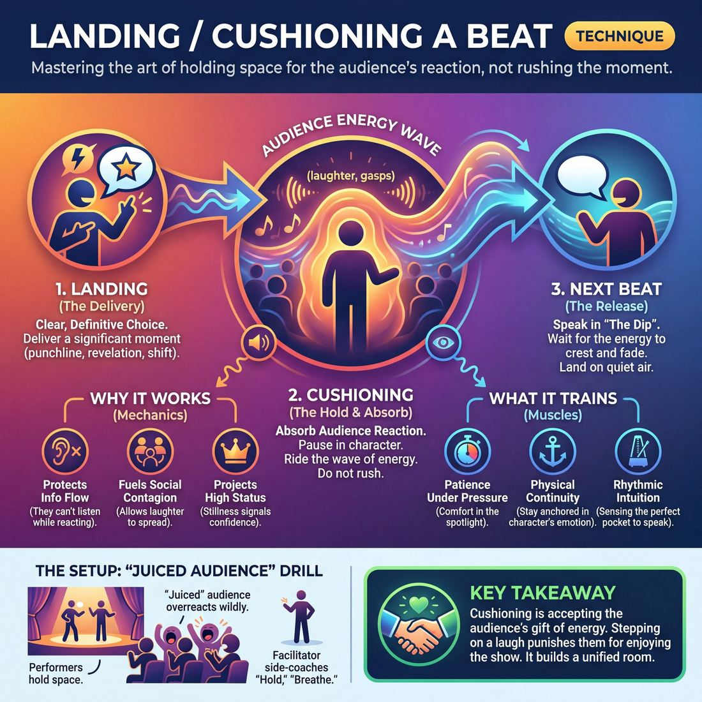

# 🎯 Landing/cushioning a beat

> *A drillable muscle that trains **Audience-Energy Management**.*

{ .infographic }

## 🎯 The essence

**Landing (or cushioning) a beat** is the deliberate physical and vocal technique of holding space immediately after a significant moment—such as a punchline, a major revelation, or a sharp emotional shift—to allow the audience time to fully react. 

While often spoken of as a single action, it is actually two distinct motions: **landing** is the clear, definitive delivery of the choice, and **cushioning** is the act of absorbing the room's response. By isolating this exact moment, the technique forces a player to practice one vital skill: pausing in character to ride the audience's energy (whether that is laughter, a gasp, or stunned silence) instead of nervously rushing into the next line and trampling the scene's momentum.

## 🎓 What it trains

This technique isolates and strengthens **Audience-Energy Management**—the ability to read, ride, and utilize the live energy of the room. 

At its core, cushioning a beat solves one of the most common and destructive habits in early improvisation: **stepping on a laugh**. When an improviser delivers a great line or executes a brilliant physical move, the audience responds with an audible release. Novices, fueled by adrenaline or a fear of dead air, will often immediately launch into their next line. This forces the audience to abruptly choke off their laughter so they don't miss the dialogue. Over the course of a show, this subtly trains the crowd *not* to laugh, flattening the room's momentum.

!!! warning "Watch out: Punishing the audience"
    If you talk while the audience is laughing, you are effectively punishing them for enjoying your show. Because they want to hear what happens next, they will suppress their natural, vocal reactions to accommodate your rushed pacing.

By practicing how to land and cushion a beat, you train three specific muscles:

*   **Patience under pressure:** Learning to stand comfortably in the spotlight while the audience reacts, without feeling the anxious need to fill the space with words.
*   **Physical continuity:** Staying fully anchored in your character's emotion and physicality while the laugh happens. You learn to "cushion" the reaction by reacting internally, rather than dropping character or freezing like a mannequin.
*   **Rhythmic intuition:** Sensing the exact moment a wave of laughter crests and begins to recede. This creates the perfect pocket to deliver the next line, catching the audience's attention just as they are ready to listen again.

## 💡 Why it works

Landing or cushioning a beat works because it respects the biological and social mechanics of an audience's reaction. When a crowd laughs, gasps, or applauds, they are experiencing an involuntary physical release of tension. During this release, their cognitive bandwidth is entirely consumed by the reaction—meaning they temporarily lose the ability to listen. 

By pausing and holding space, you exploit three underlying dynamics of live performance:

*   **Protecting the information flow:** If you speak while the audience is reacting, you force them to choose between enjoying the current moment and listening to the next one. Because they cannot hear you over their own noise, they will miss the new information. Cushioning ensures your next line of dialogue lands on clean, quiet air, preventing the scene from becoming confusing.
*   **Fueling social contagion:** Laughter is a herd behavior. It takes a fraction of a second to ripple from the people who got the joke immediately to the rest of the house. By holding the beat, you give the audience time to infect each other with amusement. This shared, swelling reaction is the exact mechanism that unifies the room, turning a fragmented group of strangers into a single organism breathing together.
*   **Projecting high status:** Rushing to the next line signals panic; it suggests the improviser is afraid the audience will get bored if there is a second of silence. Conversely, stillness in the face of a massive reaction signals absolute confidence. It tells the crowd, "I am in control, you are safe, and I have plenty more where that came from."

!!! abstract "The Performer-Audience Contract"
    When an audience reacts audibly, they are fulfilling their end of the theatrical contract by giving you a gift of energy. Cushioning the beat is how you accept that gift. If you talk over the laugh, you implicitly tell the audience that their reaction is an interruption. Cushioning trains them that it is safe to let go.

## 🧩 The setup

To isolate and drill this muscle, we use a classic exercise often called the **"Juiced Audience"** or **"Laugh Track"** drill. This setup artificially inflates audience reactions so performers are forced to practice holding space.

*   **Players & Arrangement:** The full group participates. Two players are on stage, while the rest of the class sits in the "house" as the audience. Arrange the audience chairs tightly together to simulate a packed house, encouraging the performers to naturally cheat out and project.
*   **Time:** 2–3 minutes per scene; 15–20 minutes total to ensure everyone gets at least one repetition on stage.
*   **Roles:**
    *   **Performers:** Play a grounded, standard two-person scene. When the audience reacts, they must pause their dialogue, hold their physical intention, and wait for the energy to crest and begin to fade before speaking again.
    *   **The "Juiced" Audience:** The rest of the class. They are instructed to wildly overreact to almost everything the performers do—delivering huge laughs, loud gasps, or spontaneous applause at even mildly interesting moments.
    *   **Facilitator:** Stands offstage and side-coaches the performers. Be ready to call out *"Hold,"* *"Breathe,"* or *"Wait for the dip"* the moment a performer tries to rush their next line.
*   **Prerequisites:** Basic two-person scene work. Players should already be comfortable with cheating out and projecting (Stage 2 Adv. Beginner) so they don't have to juggle basic stagecraft while focusing on comedic timing.

!!! tip "On stage: The physical cushion"
    Instruct performers that "holding" does not mean dropping character or freezing like a robot. They should maintain eye contact, hold their facial expression, or continue a silent physical action (like wiping a glass) while the audience laughs. 

!!! quote "How to introduce it"
    "Have you ever delivered a great line, the audience erupted, and your scene partner immediately started talking—meaning the crowd missed the next line entirely? Today, we are going to fix that by isolating the muscle of 'cushioning a beat.' 
    
    Two of you will do a scene. The rest of us are going to be the most easily entertained, overly-reactive audience in the world. We will laugh uproariously at everything. Performers, your only job is to *never talk over our noise*. When we laugh, you hold your physical pose, stay in character, breathe, and wait for the wave of sound to recede before you speak. Let the laugh land, ride the wave, and then continue."

## ⚙️ The mechanics

Once the room is set up, the drill forces improvisers to experience the physical sensation of pausing for a massive audience reaction without panicking or losing the scene's momentum.

!!! abstract "Core Objective"
    To deliver a significant moment clearly (**the landing**), hold space for the audience to react (**the cushion**), and resume play at the exact moment the energy crests and begins to subside (**the re-entry**).

### The Flow of Play

1. **The Setup:** Two players begin a standard, grounded scene center stage.
2. **The Landing (The Beat):** One player delivers a strong, definitive choice—a punchline, a dramatic confession, or a heightened physical action. To "land" it, they must **plant** (cease all incidental movement to draw focus) and deliver the line with absolute vocal clarity.
3. **The Artificial Reaction:** The moment the beat lands, the coach and the rest of the class intentionally erupt into a loud, sustained, exaggerated reaction.
4. **The Cushion (The Hold):** Both players on stage must instantly stop speaking. They hold the silence by maintaining their character's physical posture, emotional expression, and eye contact. They let the noise wash over them, staying entirely inside the reality of the scene. 
5. **The Re-entry:** The audience lets their reaction naturally decay. As the noise drops from its peak, the next player takes a visible breath and delivers their line, riding the tail-end of the energy without being drowned out.

### Rules & Constraints

* **No talking over the noise:** If a player speaks while the audience is still at peak volume, the coach calls "Hold!" and they must repeat the re-entry. 
* **No breaking:** Players cannot smile, break eye contact, or acknowledge the audience's reaction (unless breaking the fourth wall is a deliberate stylistic choice). The cushion belongs to the character, not the actor.
* **Hold the picture:** Incidental shuffling, pacing, or adjusting clothing kills the tension. The physical tableau must remain still.

!!! tip "On stage: The Re-entry Breath"
    The secret to a perfect re-entry is the in-breath. Taking a deep, visible breath just as the laughter begins to decay signals to the audience, *"I am about to speak."* This acts as a subconscious cue that naturally quiets the room down for your next line.

### Ending and Resetting
The scene continues until the players successfully land, cushion, and re-enter three distinct beats. Once they demonstrate they can ride the wave of the audience's energy rather than fighting it, the coach calls "Scene," and a new pair rotates in.

## 🎬 Sample round

!!! example "Sample round: The Breakroom Bell"
    **Context:** Brenda and Tom are coworkers discussing a bizarre new HR policy. The scene has been building tension around what exactly the policy entails.

    **Brenda:** "I don't mind the mandatory overtime, Tom. But I draw the line at wearing a bell."  
    *(The audience chuckles at the reveal. The improvisers let the chuckle happen, but keep the pace moving.)*

    **Tom:** "It's for morale, Brenda. And so we know when you're near the snacks."  
    *(**Step 2: The Landing** — Tom delivers the punchline cleanly, projecting to the back row, and immediately stops speaking.)*

    **[The audience erupts in heavy laughter]**

    *(**Step 4: The Cushion** — Both improvisers completely freeze their dialogue. Tom holds a deadpan, earnest stare at Brenda. Brenda looks down at her imaginary collar in horror. They do not drop character, but they hold the physical tableau so the audience can enjoy the joke without fear of missing the next line.)*

    *(**Step 5: The Re-entry Preparation** — The laughter hits its peak and begins its natural decay. The improvisers actively listen to the room's volume. As the laughter drops to about 30% of its peak, Tom slowly, deliberately takes a sip from his empty coffee mug. This silent physical action bridges the gap between the audience's high energy and the scene's grounded reality.)*

    **Brenda:** *(Sighing, giving her shoulders a tiny shake so the imaginary bell 'jingles')* "I feel like a prize-winning heifer."  
    *(**Step 5: The Re-entry Execution** — Brenda speaks her line just as the room quiets down, ensuring every word is heard. The scene's momentum continues seamlessly.)*

## 🎚️ Variations & progressions

To build the muscle of Audience-Energy Management, improvisers must move from mechanically stopping for laughs to organically surfing the room's energy. These variations ramp up the difficulty, guiding players from basic awareness to masterful control.

**1. The Freeze-and-Count (Advanced Beginner)**
*   **The Goal:** Break the habit of talking over laughs and killing momentum.
*   **The Drill:** Two players run a scene while the rest of the class acts as a hyper-responsive audience. When the laugh hits, the speaking improviser must physically freeze, make eye contact with their scene partner, and count to three internally before delivering their next line. 
*   **Why it works:** It forces the improviser to tolerate the "empty" space of a reaction without panicking.

**2. The Active Cushion (Competent)**
*   **The Goal:** Transition from a mechanical pause to riding the laugh while staying in character.
*   **The Drill:** Similar to the above, but instead of freezing, the improviser must execute a silent, character-driven physical action that lasts exactly as long as the laughter. 
*   **Examples:** Taking a slow sip of coffee, adjusting a necktie, letting out a heavy sigh, or giving a knowing nod. The scene continues only when the action—and the laugh—concludes.

!!! tip "On stage"
    **Object work is your best shock absorber.** If you deliver a punchline and the audience erupts, returning to your mimed task (chopping onions, wiping the bar) gives you a natural, grounded way to hold the space without looking like a stand-up comedian waiting for applause.

**3. Surfing the Decay (Proficient)**
*   **The Goal:** Learn to re-engage the audience at the exact right millisecond to build a set's momentum.
*   **The Drill:** The improviser must listen to the shape of the laughter. Instead of waiting for total silence, they must begin their next line *just* as the laughter crests and begins its downward slope (the decay). They must match the volume of the fading laugh with their first word, then bring their volume down to draw the audience back in.

**4. Cushioning the Pin-Drop (Master)**
*   **The Goal:** Unify the room by conducting tension, not just comedy.
*   **The Drill:** Players run a grounded, dramatic scene. When a heavy emotional revelation occurs (the moment the audience gasps or falls dead silent), the improviser must "cushion" the silence. They hold the tension for three full seconds, resisting the urge to break the discomfort with a joke or a quick line. 

!!! abstract "Key idea: The Step-On Variant"
    Once players master cushioning, you can introduce **The Step-On**. This is the deliberate, advanced choice to *intentionally* talk over a laugh to create a rapid-fire, chaotic, or overwhelming energy. The progression is: learn to pause (Level 2), learn to ride (Level 3), and finally, learn exactly when to break the rules to manipulate the room's tempo (Level 4/5).

## 🧑‍🏫 Coaching notes

!!! tip "Coaching: The Golden Cue"
    **"Hold the picture."**  
    When a big laugh or gasp hits, improvisers instinctively want to relax, often dropping their physical and emotional state to wait for the noise to die down. "Hold the picture" reminds them to freeze their character's reaction—whether it's a look of shock, a smug grin, or a raised eyebrow—keeping the scene's reality alive while the audience processes the beat.

When coaching improvisers to land and cushion a beat, your primary job is to act as their external metronome. Because adrenaline distorts an improviser's sense of time, three seconds of audience laughter can feel like an agonizing minute of silence on stage. You must give them permission to wait.

### High-Impact Side-Coaching

Use short, punchy directives from the sidelines to manipulate their timing in real-time:

*   **"Breathe."** Use this the moment a laugh hits. It gives the improviser a physical action to perform while waiting, preventing them from rushing the next line.
*   **"Stay in the eyes."** Use this when an improviser breaks eye contact with their scene partner to look at the floor (or the audience) during a laugh. 
*   **"Let it crest..."** Use this as the audience's energy is building. It stops the improviser from stepping on the peak of the reaction.
*   **"Catch the tail."** Say this just as the laughter begins to decay. This trains them to speak on the *downslope* of the laugh, rather than waiting for dead, awkward silence.

### What 'Good' Looks and Sounds Like

When observing a drill or scene, look for these specific, observable markers of success:

| Observable Behavior | What it indicates |
| :--- | :--- |
| **Physical Stillness** | The improviser is absorbing the energy without fidgeting, shifting weight, or "breaking" (laughing at their own joke). |
| **Sustained Connection** | The actors remain locked in their character dynamics. The tension between them does not drop just because the audience is making noise. |
| **The "Overlap" Delivery** | The next line begins exactly as the laughter fades to a murmur. The improviser does not wait for absolute silence, which kills momentum, nor do they speak over the loudest part of the roar. |

!!! warning "Watch out for the 'Polite Waiter'"
    A common intermediate mistake (Stage 2 in the maturity progression) is the mechanical pause. The improviser delivers a punchline, drops their character's intention, and stands neutrally like a polite waiter until the audience finishes laughing, before suddenly "turning the character back on." Coach them to **cushion** the beat by letting the audience's reaction actively affect their character in the silence.

## 🧭 Debrief & reflection

After running the drill, circle up and focus the conversation on the *sensation* of time, tension, and energy. Landing and cushioning a beat often feels deeply unnatural to newer improvisers because it requires them to stand confidently in a moment of suspended action. 

Use these questions to help players articulate their internal experience and lock in the muscle memory:

*   **"How long did that pause feel in your body, versus how long it actually was?"** 
    This highlights the time dilation improvisers experience. A three-second hold for a laugh can feel like an eternity on stage, but feels perfectly natural to the audience.
*   **"What specific cue told you it was time to speak again?"** 
    Push players to identify the "decay curve" of the laugh. You want them listening for the moment the audience's energy crests and just begins to roll back, rather than waiting for dead silence.
*   **"What were you doing *during* the laugh?"** 
    Cushioning is active, not passive. Players should realize they were still playing the scene—holding a facial expression, maintaining eye contact, or shifting their weight—rather than dropping character to wait.
*   **"Did you feel the urge to rush or talk over the reaction? Where did that panic come from?"** 
    Acknowledge the vulnerability of holding space. Naming the fear of "losing the audience" helps players let it go.

!!! note "What a successful debrief surfaces"
    A great debrief shifts the player's mindset from **Stage 2 (Advanced Beginner)**, where they are mechanically pausing because they know they are "supposed to," to **Stage 3 (Competent)**, where they actually feel the room's temperature. Listen for players having the "aha" moment that silence during a laugh isn't empty space—it is a shared, active connection with the crowd. They should recognize that riding a laugh is a gift to the audience, allowing the room to fully enjoy the joke before being asked to listen to the next line.

## ⚠️ Common pitfalls

!!! warning "Watch out: Stepping on the laugh"
    As a reminder, the ultimate novice trap is **stepping on the laugh**—delivering a great line, triggering a massive audience reaction, and immediately talking over it. 
    
    **The fix:** When the wave of laughter hits, close your mouth, hold your physical position, and let the wave crest before you speak again.

When improvisers are under cognitive load—usually because they are panicking about what to say next—their awareness of the room vanishes. They bulldoze through natural beats. Here is how this technique breaks down in practice, and how to correct it:

*   **The "Deer in Headlights" Freeze (Mechanical Pausing)**
    *   *The Trap:* An advanced beginner remembers they are supposed to wait for the laugh, so they stop talking, drop their character's physical intention, and stare blankly at the audience until the noise dies down. It breaks the reality of the scene.
    *   *The Fix:* Cushioning is an *active* state, not a pause button. Stay in character. If your partner just insulted you and the audience gasps, use that cushion time to actively process the insult. Let your face react while the audience makes noise. 

*   **The Presumptive Pause (Milking)**
    *   *The Trap:* Pausing *before* a punchline to telegraph that a joke is coming, or holding a smug silence for a laugh that never arrives. This feels like pandering and violates the performer–audience contract by demanding a reaction rather than earning it.
    *   *The Fix:* Play the reality of the scene at the speed of the scene. You only cushion a beat *if* the audience gives you energy to cushion. If they don't, the scene moves forward seamlessly.

*   **Rushing the Cushion (Impatience)**
    *   *The Trap:* You let the laugh start, but the silence makes you anxious. You jump back in while the laughter is still building, cutting the energy wave in half.
    *   *The Fix:* Treat the audience's laughter as a scene partner who is currently speaking. You wouldn't interrupt your partner; don't interrupt the room. 

!!! tip "On stage: The 'Breathe and Blink' rule"
    If you struggle with rushing, give yourself a physical anchor. When a big reaction hits, take one slow, deep breath through your nose and blink deliberately. By the time you finish that physical circuit, the peak of the laugh will have passed, and you can safely deliver your next line on the downslope.

## 🌟 What mastery looks like

At the highest level of execution, landing and cushioning a beat transcends simply "pausing for laughs." A master improviser treats the audience's reaction—whether it is a roaring laugh, a shocked gasp, or a pin-drop silence—as an active scene partner. They do not merely wait for the noise to die down; they **conduct the audience's energy like an instrument**.

When observing a master perform this technique, you will see several distinct, observable behaviors:

*   **The Active Hold (Cushioning):** The improviser never goes dead behind the eyes while waiting for the audience. They cushion the beat by staying entirely rooted in their character's emotional reality. They might use a slow blink, a tightening of the jaw, or a deliberate exhalation to absorb the audience's energy, keeping the scene visually and emotionally alive even when no words are spoken.
*   **Surfing the Crest (Landing):** Instead of stepping on a laugh or waiting awkwardly in a vacuum, the master resumes speaking at the exact millisecond the audience's energy crests and begins to roll back. They catch the wave, using the residual energy of the room to propel their next line with perfect momentum.
*   **Unifying the Room:** Through precise timing and commanding presence, the master converts a fragmented crowd into a single, breathing organism. You can observe this physically in the house: the audience's laughter or gasps become synchronized, swelling and fading in unison because the improviser is holding them in a shared, deliberate rhythm.

!!! example "In a scene"
    Two improvisers are playing a tense breakup scene. Player A drops a devastating, unexpected confession: *"I didn't sell the dog, I lost him."*
    
    *   **The Novice** rushes the next line out of nervousness, talking over the audience's shocked gasp and killing the tension.
    *   **The Competent Improviser** pauses mechanically, waits for the gasp to finish, and then Player B speaks.
    *   **The Master** delivers the line and holds absolute stillness. Player B *cushions* the beat by physically absorbing the blow—their shoulders drop, their eyes widen, and they let the audience's gasp wash over them. Only when the room's collective breath begins to settle does Player B whisper their response, perfectly riding the descending energy.

Ultimately, mastery looks effortless and honest. The seams between the performers' dialogue and the audience's reactions disappear, creating a continuous, unbroken loop of shared energy where the proscenium seems to vanish entirely.

## 🔗 Why it matters

Improvisation is a three-way conversation: you, your scene partner, and the audience. Landing and cushioning a beat is how you hold up your end of the dialogue with the crowd. 

At its core, this technique is the foundational muscle for Audience-Energy Management. You cannot surf a wave of energy if you do not allow the wave to form. When improvisers fail to land a beat, they typically rush out of panic—talking over laughs, stepping on emotional reveals, and killing the scene's natural momentum. By deliberately cushioning a moment, you create the necessary space for the audience's reaction to peak and settle, allowing you to ride that energy rather than fight it.

!!! abstract "Key idea"
    Music is defined as much by the rests as by the notes. Cushioning a beat provides the "rests" in your scene, transforming a frantic stream of dialogue into a rhythmic, dynamic performance.

Mastering this technique serves the broader goal of the domain: honoring the performer–audience contract. When you give a beat room to breathe, you send a powerful, subconscious signal to the crowd that they are in safe hands. It proves you are listening to them. This builds immense trust, which is the prerequisite for moving an audience from a fragmented group of strangers into a unified organism that breathes and laughs together.

Zooming out to the wider craft, landing a beat connects directly to:

*   **Pacing and Musicality:** It prevents the dreaded "monotone drone" of rapid-fire improv, introducing tempo changes that keep the audience engaged.
*   **Editing and Transitions:** A well-landed beat often serves as the perfect, undeniable signal for a teammate to sweep the stage or initiate a transition. 
*   **Emotional Weight:** Comedy requires timing, but drama requires space. Cushioning a beat allows the reality of a grounded, emotional discovery to actually sink in for both the performers and the house. 

!!! note "The path to mastery"
    A novice views a pause as terrifying "dead air" and rushes to fill it. A master views that same pause as a lever, using it to conduct the room's energy like an instrument.

## 📚 References & Further Reading

### Foundational sources
*   **Keith Johnstone, *Impro: Improvisation and the Theatre*, Routledge (1979)** — Explores the performer-audience relationship and status dynamics. Johnstone's theories on physical presence explain why holding space and remaining still during a massive reaction projects high status and absolute confidence to the audience, whereas rushing signals panic.
*   **Charna Halpern, Del Close, and Kim "Howard" Johnson, *Truth in Comedy: The Manual for Improvisation*, Meriwether Publishing (1994)** — Discusses the "performer-audience contract" and the philosophy that genuine audience reactions should be respected. The authors emphasize that improvisers must play scenes with complete integrity and patience, rather than rushing over moments with contrived jokes or nervous chatter.

### Practitioner guides & manuals
*   **Matt Besser, Ian Roberts, and Matt Walsh, *The Upright Citizens Brigade Comedy Improvisation Manual*, UCB Comedy (2013)** — Covers the mechanics of comedic timing and playing at the top of your intelligence. The manual stresses the importance of trusting the base reality of the scene and committing to the moment, rather than rushing dialogue out of a fear of dead air or a desperate need to get to the next laugh.
*   **Mick Napier, *Improvise: Scene from the Inside Out*, Heinemann Drama (2004)** — Emphasizes pacing, timing, and the importance of listening to the audience's energy. Napier advises improvisers to use their "subconscious" awareness of the room to maintain dynamic flow, allowing them to pause and ride the audience's reaction without losing the scene's momentum.

### Lineage & teachers
*   **The Annoyance Theatre** — Founded by Mick Napier in Chicago, this theater and training center's philosophy heavily emphasizes holding onto a character's emotional point of view and physical continuity. Their training directly addresses the need to stay anchored in the scene while the audience is reacting, rather than dropping character.
*   **Stand-up Comedy Open Mic Culture** — While improv focuses on ensemble scene work, the specific terminology and discipline of "not stepping on laughs" originates heavily from stand-up comedy traditions. It is universally taught in stand-up as the most common technical error amateurs make when fueled by adrenaline.

### Research & theory
*   **Robert Provine, *Laughter: A Scientific Investigation*, Viking (2000)** — Foundational psychological research on the social contagion of laughter. Provine's observational studies prove that laughter is an involuntary, herd behavior and that people are 30 times more likely to laugh in a group than alone, underscoring why holding the beat is necessary to let the contagion spread through the house.
*   **Sophie Scott, "The Science of Laughter," *The Journal of Physiology* (2016)** — Neuroscientific research demonstrating that contagious laughter is a vital tool for social cohesion. Scott's work shows that the human brain actively prepares facial muscles to join in when hearing laughter, explaining the biological mechanism behind unifying a room of strangers.

### Talks, videos & courses
*   **Sophie Scott, *Why We Laugh* (TED Talk, 2015)** — A highly viewed lecture breaking down the evolutionary purpose of laughter. Scott explains how shared, contagious laughter physically reduces stress and unifies a group into a single organism, reinforcing the importance of giving the audience time to react and infect one another.

### Communities & adjacent reading
*   **Steve Martin, *Born Standing Up: A Comic's Life*, Scribner (2007)** — A masterclass memoir from the stand-up world on the rhythm, timing, and pace of live comedy. Martin details how he learned to observe the audience, manage his own adrenaline, and hold space for their reactions without letting them know if he was bombing or succeeding.
*   **Greg Dean, *Step by Step to Stand-Up Comedy*, Heinemann Drama (2000)** — Breaks down the exact mechanics of "riding the laugh." Dean explicitly teaches the rhythm of breathing with the audience and the technical discipline required to avoid stepping on laughs, which translates perfectly to the "cushioning" phase of an improv beat.
*   **Judy Carter, *The Comedy Bible*, Simon & Schuster (2001)** — Provides practical exercises from the stand-up perspective on comedic timing, conquering stage fright, and learning to comfortably pause. Carter's methods help performers build the patience required to stand in the spotlight and let the audience laugh without rushing to fill the silence.

## 💬 Quotes & Anecdotes

!!! quote "— Michael Shurtleff, *Audition* (1978)"
    "Hold the moment. Shoot your arrow, let it land, then hold the moment until someone else takes it over."

!!! quote "— Stephen Rosenfield, *Mastering Stand-Up* (2017)"
    "Hold for laughs. Pausing for laughter and reacting to the audience can generate additional laughs and maintain control."

!!! quote "— Mick Napier, *Improvise: Scene from the Inside Out* (2004)"
    "Alleviating the burden of getting a laugh opens up a whole new universe. Suddenly, a moment that would have been joked out is played through. All moments in the scene appear more honest, and points of view and characters are upheld effortlessly."

### Where it comes from
The warning against "stepping on a laugh" originates in early vaudeville, theater, and stand-up comedy, where performers learned that speaking over an audience's reaction effectively trained the crowd to suppress their own enjoyment. In improvisational theater, this concept was adapted into "cushioning" or "riding the laugh wave." Because improv scenes are unscripted, players lack the luxury of pre-planned pauses. Acting teachers like Michael Shurtleff emphasized the need to stay anchored in character and "hold the moment" so the audience could safely release their tension without missing the next piece of narrative information.

### A telling example
**The "Mystery Laugh"**
In a 2013 interview, iO Theater co-founder Charna Halpern discussed the phenomenon of the "Mystery Laugh"—when an improviser does something truthful that elicits a massive, unexpected audience reaction. Novice improvisers often panic in these moments, either dropping character or rushing to speak because they don't understand *why* the audience is laughing. Halpern's advice for these moments is the essence of cushioning the beat: "AH, THE MYSTERY LAUGH!!! Yep. No explanation for it. It happens a lot... Just accept it." By holding still and accepting the reaction without rushing past it, the improviser allows the scene to breathe, even if the laugh was entirely unearned or surprising.

**The Stand-Up Crossover**
In stand-up comedy, the mechanics of cushioning a beat are often referred to as "riding the wave." If a comedian delivers a punchline and immediately starts the next setup while the audience is still roaring, the audience is forced to abruptly choke off their laughter to hear the new information. Over a 10-minute set, this exhausts the crowd. By planting their feet, maintaining their stage persona, and waiting for the laughter to crest and begin its natural fade, the performer signals absolute confidence and control, ensuring the next line lands on clean air.

## 🧭 Explore the framework

- ⬆️ **Skill it trains:** [Audience-Energy Management](05_S2__audience-energy-management.md)
- 🎭 **Domain:** [The Audience](05_D__the-audience.md)
- 🔁 **Sibling techniques:** [Tag-running (riding a laugh wave)](05_S2_T1__tag-running-riding-a-laugh-wave.md), [Breaking the 4th Wall / Direct Address](05_S2_T3__breaking-the-4th-wall-direct-address.md)
