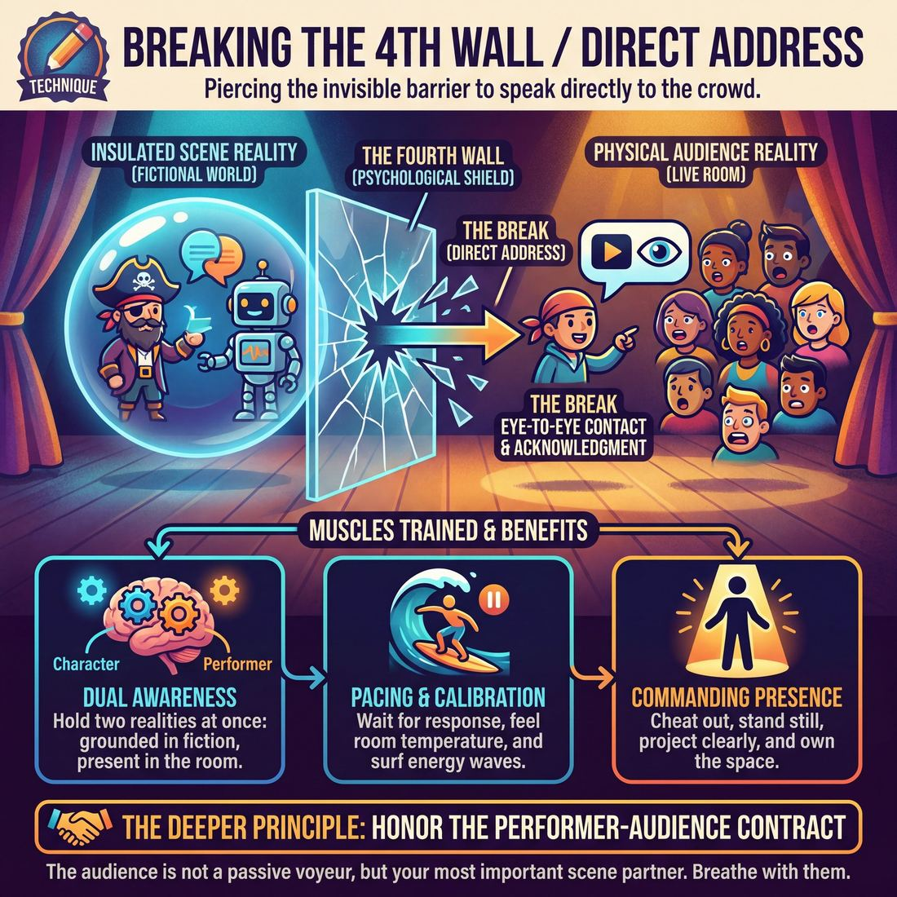

# 🎯 Breaking the 4th Wall / Direct Address

> *A drillable muscle that trains **Audience-Energy Management**.*

{ .infographic }

## 🎯 The essence

**Breaking the 4th Wall** (or **Direct Address**) is the deliberate act of piercing the invisible barrier between the stage and the seats to speak directly to the crowd. Whether deployed as a stylistic scenic device or drilled as an isolated exercise, it forces a player to step out of the insulated reality of the scene and make genuine, eye-to-eye contact with the room. At its core, it makes the improviser practice a single, vital muscle: **Audience-Energy Management**—the ability to actively read the crowd's temperature, acknowledge their presence, and bridge the gap between the fictional world and the physical theater without losing the momentum of the show.

## 🎓 What it trains

For many improvisers, the imaginary "fourth wall" at the front of the stage acts as a psychological shield. It feels safe to stay trapped in a closed-off bubble, pretending the audience isn't there. This technique strips away that shield. It solves the problem of the "isolated scene" by forcing the performer to look the crowd dead in the eye and manage their energy directly.

By practicing direct address, improvisers actively build several distinct muscles:

*   **Dual Awareness:** You train the brain to hold two realities at once. You must remain grounded in the fictional reality of the scene (you are a 19th-century pirate) while simultaneously acknowledging the physical reality of the room (you are an actor talking to fifty people in a basement). 
*   **Pacing and Calibration:** When you speak directly to the room, you are forced to wait for their response. This cures the novice habit of talking over laughs or rushing through moments of tension. It trains you to feel the room's temperature, pause mechanically at first, and eventually surf the audience's energy waves.
*   **Commanding Presence:** You cannot hide behind busy object work or turn your back to the crowd when you are addressing them directly. It builds the physical muscle of "cheating out" (angling your body toward the audience), standing still, projecting clearly, and owning the space.

!!! abstract "The Deeper Principle: The Audience as Scene Partner"
    Improv is not television; it is a live, shared, and highly permeable event. The deeper principle at play here is honoring the **performer–audience contract**. When you break the fourth wall, you acknowledge that the audience is not a group of passive voyeurs, but the most important scene partner in the room. You train yourself to stop performing *at* them, and start breathing *with* them.

## 💡 Why it works

This technique cashes in on the unique, unscripted contract of improv: the audience already knows you are making this up. 

In traditional theater, the **proscenium**—the imaginary, invisible wall separating the actors from the audience—is a rigid boundary used to maintain the illusion of a fictional world. In improv, that wall is inherently porous. The audience gave you the suggestion; they are already in the room with you. Direct address exploits this shared reality through three powerful mechanisms:

*   **Neurological Engagement (The Eye-Contact Spike):** When a performer turns their gaze directly to the house, it triggers an immediate, hardwired physiological response in the audience. Passive observers suddenly feel seen. This spike in attention instantly pulls a drifting room back into the palm of your hand.
*   **The Complicity Effect:** By stepping out of the scene to speak to the crowd, you elevate them from spectators to co-conspirators. Whether you are delivering a Shakespearean soliloquy about your secret motives, or simply shooting a deadpan look to the front row after your scene partner says something absurd, you are telling the audience, *"We are in this together."* 
*   **Tension Release:** Improv often generates accidental tension—a missed cue, a bizarre physical choice, or a scene that has painted itself into a corner. Direct address acts as a pressure valve. By turning to the audience and acknowledging the absurdity of the moment, you release the tension of pretending everything is fine, converting awkwardness into a massive, unified laugh.

!!! abstract "The Engine: Dual Realities"
    Direct address works because it allows the improviser to exist in two realities at once. You are simultaneously the **character** (experiencing the fictional stakes of the scene) and the **performer** (managing the energy of the physical theater). When you break the fourth wall, you briefly merge these two worlds, allowing the audience to enjoy the magic trick while also hanging out with the magician.

## 🧩 The setup

To effectively isolate and drill this technique, you need to create a clear physical boundary between the "world of the scene" and the "world of the room," so players can practice intentionally crossing it. 

Here is how to set up the foundational drill, often called the **Direct Address Call-Out**:

*   **👥 Players & Arrangement:** Split the class in half. One half acts as the **active audience** (seated in a block or rows), while the other half waits in the wings. Performers will take the stage in pairs.
*   **🎭 Roles:**
    *   **Performers:** Play a grounded, two-person scene. When prompted, one player turns out to speak directly to the audience, then seamlessly returns to the scene.
    *   **The Audience:** Must remain engaged, visible, and reactive. When a performer breaks the wall to look at them, they must hold eye contact. 
    *   **The Facilitator:** Acts as the side-coach, calling out the trigger word (e.g., "Address!" or "Wall!") to force the technique, and managing scene edits.
*   **📐 Space & Materials:** A clearly defined stage area with a hard proscenium line. Place two chairs on stage. Ensure the audience is seated close enough for performers to make actual eye contact, but far enough back to establish a clear "stage" versus "house" dynamic.
*   **⏱️ Time:** 2–3 minutes per scene; 20–25 minutes total to ensure every player gets reps on stage and in the audience.
*   **✅ Prerequisites:** Comfort with basic two-person scene work, object work, and a working understanding of cheating out. Players should already know how to project their voices.

!!! tip "Setting the space"
    Do not let the audience sit in a wide, scattered semi-circle. Push their chairs together into a tight block facing the stage. Direct address requires the performer to feel the concentrated energy of a unified crowd, not a loose smattering of classmates.

!!! quote "How to introduce it"
    "We spend a lot of time pretending the audience isn't there, safely behind the invisible fourth wall at the front of the stage. Today, we are going to break that glass. 
    
    You will start a normal, grounded two-person scene. Every so often, I will call out *'Address!'* Whoever is speaking—or whoever is about to speak—must immediately turn out, make direct eye contact with someone in the audience, and deliver their next line, thought, or confession directly to them. As soon as the line is done, snap right back into the reality of your scene partner as if nothing happened. 
    
    Audience: you are scene partners now. If they look at you, look back. Don't look away. Let's practice letting the room in."

## ⚙️ The mechanics

To isolate and train this muscle, we use a targeted drill often called **Scene / Aside / Scene**. This exercise forces improvisers to practice the physical and energetic toggle between the closed reality of the scene and the open reality of the room.

### The Core Loop
The objective is to establish a grounded reality, cleanly puncture it to share a secret or internal monologue with the audience, and then seamlessly snap back into the scene without losing momentum. 

### The Flow of Play

1. **Establish the Proscenium:** Two improvisers begin a standard, grounded scene. Their focus is 100% on each other and their shared environment. The 4th wall is solid.
2. **The Pivot:** One improviser hits a moment of internal conflict, realization, or strong unspoken opinion. They physically break their stance, turn completely downstage, and step slightly forward. 
3. **The Address (The "Aside"):** The improviser speaks directly to the crowd. They must make actual eye contact with individual audience members. 
    * *The Partner's Role:* The moment the pivot happens, the scene partner must instantly freeze in place, holding their physical and emotional state.
4. **The Snap-Back:** The improviser finishes their thought, physically turns back to their partner, and steps back into the reality of the scene. 
5. **The Resumption:** The frozen partner unfreezes the exact millisecond the active player re-engages. The scene continues exactly where it left off, but the active player's behavior is now informed by the secret they just shared.

A round ends after both players have successfully executed at least one direct address and the coach sees how the shared information alters the scene's dynamic. The coach calls "Scene," and a new pair steps up.

!!! example "In a scene"
    **Player A (washing dishes):** "I just think it's great that your mother is staying with us for another three weeks."  
    **Player B (drying):** "She loves your cooking, honey."  
    *(Player A stops washing, turns directly to the audience. Player B freezes mid-wipe.)*  
    **Player A (to the audience):** "If that woman critiques my meatloaf one more time, I am going to fake my own death and move to Albuquerque."  
    *(Player A turns back to the sink. Player B unfreezes.)*  
    **Player A (smiling tightly):** "I'll make meatloaf tonight."

### Rules & Constraints

To keep the technique sharp and prevent it from becoming a crutch, enforce these strict boundaries during the drill:

* **Real Eye Contact:** Do not look at the back wall or the lighting grid. Look directly into the eyes of specific people in the audience. You are talking *to* them, not *at* them.
* **No Bailing:** You cannot break the 4th wall because you don't know what to say to your partner. The address must heighten the existing scene, not escape it.
* **The Partner Must Commit to the Freeze:** The partner cannot react to the aside, roll their eyes, or adjust their posture. They are paused in time. 
* **Physical Clarity:** The transition must be a sharp, observable physical choice. A half-turn or a muttered comment over the shoulder doesn't count. The audience needs a clear visual cue that the rules of engagement have temporarily changed.

!!! tip "On stage"
    **Treat the audience as your confidant.** When you break the 4th wall, you are pulling the audience into your inner circle. Speak to them with the intimacy and urgency of a best friend sharing a juicy secret in a crowded room.

## 🎬 Sample round

!!! example "Sample round: The Bad Date"
    Here is how the mechanics of a direct address play out in a standard two-person scene. Notice how the physical and vocal shifts clearly delineate the boundary between the scene's reality and the audience's reality.

    **The Setup:** Mark and Sarah are seated at a table, miming drinks. Mark is leaning in, highly animated. Sarah is sitting rigidly.

    **Mark:** "So the thing about Ethereum is, it's not just a coin, it's a decentralized ecosystem. I actually minted my own NFT of my cat, Mr. Whiskers. It's on the blockchain forever."
    
    **Sarah:** *(Nodding, smiling tightly)* "Wow. That sounds... really complicated."
    
    > **Mechanic 1: The Base Reality.** The performers establish a clear, grounded proscenium scene. The 4th wall is fully intact, and the audience is simply observing the awkwardness.

    **Sarah:** *(Freezes her body, turns her head sharply downstage, and makes direct eye contact with a specific audience member in the second row. Her tight smile drops completely into a deadpan stare.)* 
    
    > **Mechanic 2: The Pivot.** Sarah uses a sharp, deliberate physical shift to signal the break. By locking eyes with the crowd, she changes the audience's role from passive observers to active confidants.

    **Sarah:** *(Speaking in a lower, flatter, completely honest tone)* "I have been sitting here for forty-five minutes. He hasn't asked me a single question. I am going to fake a stomach bug in exactly three minutes."
    
    > **Mechanic 3: The Address.** The delivery is distinct from her character's "scene voice." She shares a specific, heightened internal truth that contrasts with her external polite behavior. 

    **Sarah:** *(Snaps her head back to Mark, the tight smile instantly returning, her voice pitching back up)* "So, how does the blockchain actually *work*?"
    
    **Mark:** "I am so glad you asked! Okay, imagine a digital ledger..."
    
    > **Mechanic 4: The Return.** Sarah cleanly snaps the 4th wall back into place. She doesn't linger in the transition. She uses the comedic tension built with the audience to fuel her next line, driving the base reality forward.

## 🎚️ Variations & progressions

Breaking the fourth wall is not a binary switch; it is a dial. To build the muscle of Audience-Energy Management, improvisers must move from mechanically executing an aside to fluidly using the audience as an energetic lever. 

Here is how to ramp the difficulty of this technique, aligned with the improviser's maturity.

### 1. The Freeze & Confess (Advanced Beginner)
At this stage, improvisers are learning the raw mechanics of the physical turn and the vocal shift. They try direct address "on cue."
*   **The Drill:** Two improvisers play a standard scene. A coach periodically calls out "Aside!" The improviser currently speaking must immediately turn full-front to the audience, deliver a one-line internal monologue or secret, and then snap back into the scene exactly where they left off.
*   **The Focus:** Crisp, observable physical transitions. The actor must clearly delineate the "scene reality" from the "audience reality."

### 2. The Audience as Confidant (Competent)
Once the physical mechanic is clean, the improviser must learn *when* to choose to break the wall. Instead of treating the audience as an empty void, they assign the room a specific role.
*   **The Drill:** The improviser initiates a scene by addressing the audience as a specific collective entity—a jury, a congregation, a diary, or a trusted best friend. The scene partner then enters, forcing the improviser to juggle the private conversation with the audience and the public conversation with their partner.
*   **The Focus:** Reading the room's temperature and using the audience to raise the stakes of the scene, rather than using them as a lifeline out of a difficult moment.

!!! example "In a scene"
    **Character A (to the audience):** "I’ve hidden the diamonds in the potato salad. He’ll never look there."  
    *(Character B enters)*  
    **Character B:** "Boy, I am starving! Pass the sides!"  
    **Character A (glaring at B, then shooting a panicked look to the audience):** "Have a breadstick instead, Paul."

### 3. The Tension Valve (Proficient)
Proficient improvisers use direct address as a deliberate lever to surf the energy waves of a set, venting or spiking tension as needed.
*   **The Drill:** Play a highly absurd or high-emotion scene. The "voice of reason" character is tasked with finding the exact peak of the audience's comedic tension and breaking the fourth wall—often with just a silent, deadpan look (the "Jim Halpert look")—to release that tension.
*   **The Focus:** Timing. The improviser must align perfectly with the audience's perspective, acknowledging the absurdity of the scene right as the audience feels it, thereby validating the crowd's reaction.

!!! tip "On stage: The 'Lighthouse' Sweep"
    When addressing the audience, don't just stare into the dark middle distance. Pick three specific faces—house left, center, and house right. Deliver one thought to each. Making actual eye contact turns a monologue into a dialogue.

### 4. The Seamless Weave (Master)
At the highest level, the improviser conducts audience energy like an instrument, knowing precisely when to include the room and when to play strictly behind the proscenium.
*   **The Drill:** "The Narrator's Control." A single improviser acts as both the narrator of a story (speaking directly to the crowd) and a character within it. They must seamlessly slide between narrating the action, playing the scene, and reacting to the audience's live responses (gasps, laughs, silence) without ever breaking the reality of the world they are building.
*   **The Focus:** Unifying the room. The master uses direct address to convert a fragmented audience into a single organism that breathes, laughs, and focuses together.

## 🧑‍🏫 Coaching notes

When coaching Direct Address, your primary goal is to help improvisers find the physical and vocal clarity required to step out of the scene, connect with the room, and step back in without shattering the reality they’ve built. 

!!! tip "Coaching: The Golden Cue"
    **"See their eyes!"**  
    The most common mistake improvisers make when breaking the 4th wall is staring at a vague, middle-distance point just above the audience's heads. Side-coach them to make actual, fleeting eye contact with specific individuals in the front rows. If the performer doesn't *see* the audience, the audience won't feel seen.

### Active Side-Coaching
Use these short, punchy prompts from the sidelines to shape the technique in real-time:

*   **"Plant your feet."** — Grounds the improviser. Direct address loses its power if the performer is pacing nervously or shifting their weight.
*   **"Who are they to you?"** — Forces the improviser to define the audience's role. Are they a jury? A confidant? A mob? 
*   **"Keep your point of view."** — Reminds the performer not to drop their character's emotional state just because they are talking to the crowd.
*   **"Hold the silence."** — Encourages the improviser to wait a beat after breaking the wall before speaking, allowing the audience to realize they are being addressed.
*   **"Snap back."** — Cues a sharp, deliberate physical return to the reality of the scene.

!!! note "Coaching the Partner"
    Don't forget the improviser who is *not* breaking the wall! Side-coach them with: **"Hold your reality."** They must either freeze completely (if the address stops time) or continue their baseline activity (if the address is an aside), ensuring they don't pull focus or break character.

### What 'Good' Looks and Sounds Like
As a coach, watch for these observable markers of success:

*   **A clear physical threshold:** You should see a distinct change in posture, staging (often stepping downstage), and eye line when the wall is broken. 
*   **Vocal contrast:** The performer’s voice shifts. They might drop to an intimate (but projected) stage whisper, or boom like a carnival barker, contrasting sharply with the conversational tone of the scene.
*   **Audience synchronization:** You will physically see the audience shift—leaning in, sitting up, or laughing collectively—because the performer has actively invited them into the space.
*   **A seamless return:** The moment the address ends, the performer instantly resumes the exact emotional and physical stakes of the scene, treating the break as a surgical insertion rather than a destructive interruption.

## 🧭 Debrief & reflection

After the adrenaline of the exercise fades, the debrief is where players convert raw experience into conscious Audience-Energy Management. Because breaking the fourth wall is inherently vulnerable, players often experience a rush of nervous energy. The goal of this reflection is to help them unpack the difference between a cheap laugh and a genuine connection.

Use these questions to guide the discussion:

*   **"When you made direct eye contact with the audience, did the room feel larger or smaller?"** 
    *   *Listen for:* Players often note that the room suddenly feels intimate. The abstract "crowd" dissolves into specific, breathing individuals.
*   **"Did breaking the wall feel like a release of tension, or did it add pressure?"**
    *   *Listen for:* It usually acts as a release valve. Acknowledging the elephant in the room—whether it's a mistake, a weird silence, or a bizarre scene dynamic—instantly relieves the pressure of pretending everything is normal.
*   **"For the partner who stayed in the scene: Did you feel abandoned, or did you feel like a co-conspirator?"**
    *   *Listen for:* This highlights the danger of using direct address to throw a partner under the bus. A good break includes the partner in the joke; a bad one isolates them.
*   **"Did you feel yourself asking for a laugh, or simply sharing a truth?"**
    *   *Listen for:* The distinction between pandering and connecting. Pandering feels needy; sharing feels generous and grounded.

!!! abstract "The Core Realization"
    A successful debrief should lead players to a vital epiphany: **the audience is not an adversary to be tricked, nor a judge to be appeased.** When an improviser breaks the fourth wall honestly, the audience realizes they are safe in the hands of a performer who is fully aware of the room. The proscenium is just a convention; the shared reality of the theater is the actual truth.

!!! tip "On stage"
    Encourage players to notice their physical posture during the debrief. Did they physically lean forward to "beg" for the audience's approval during the exercise, or did they stand tall and invite the audience into their world? Physical awareness is the first step toward mastering stage presence.

## ⚠️ Common pitfalls

!!! warning "Watch out: The Escape Hatch"
    The single most destructive trap is using the 4th wall as an **escape hatch to bail on a struggling scene**. When cognitive load spikes and a scene feels muddy, a panicked improviser will often turn to the audience with a knowing eye-roll or a sarcastic comment. This breaks trust with your partner, shatters the reality of the scene, and trains the audience to laugh *at* the performers rather than *with* the characters.

When learning to manage audience energy, improvisers frequently stumble into a few predictable traps. Here is how they manifest under pressure and how to fix them:

*   **The Apologetic Commentary**
    *   *The Trap:* Stepping out of the scene to comment on the improv itself (e.g., "I guess we're doing a scene about mops now, folks"). This is a symptom of Stage 1 Novice panic, where the performer tries to distance themselves from a failing idea.
    *   *The Fix:* If you break the wall, do it **in character**. Heighten the *character's* point of view, not the *actor's* insecurity. Let the character complain about the mops to the audience, treating the crowd as their confidant.

*   **The Blurry Boundary**
    *   *The Trap:* Shifting focus to the audience without a clear physical or vocal change. The audience (and your scene partner) is left confused about who you are actually talking to, resulting in a muddy, low-energy moment.
    *   *The Fix:* Make the transition undeniable. Plant your feet, shift your eye contact deliberately from your partner to the house, and alter your vocal volume. The audience needs a clear, observable cue that the proscenium has temporarily vanished.

*   **Stranding the Partner**
    *   *The Trap:* One player turns into a solo stand-up comedian, leaving their scene partner frozen, awkward, or entirely irrelevant to the moment.
    *   *The Fix:* Direct address should serve the scene's dynamic, not pause it. If your partner breaks the wall, **react to it**. Maintain the base reality by asking, "Who are you talking to?" or reacting to their sudden shift in demeanor. 

*   **Pandering for Energy**
    *   *The Trap:* Breaking the wall simply to fish for a cheap laugh or beg for approval when the room's energy dips. 
    *   *The Fix:* Treat the audience as a scene partner, not a rescue team. When you address them, maintain your character's status and drive the scene forward. You are inviting them into your world, not asking them to save it.

!!! example "In a scene"
    **The Trap:** *Player A forgets their character's name.* Player A turns to the audience, drops character, and says, "Wow, I totally forgot who I am. Improv is hard, right?" (The audience chuckles, but the scene's momentum is dead).
    
    **The Fix:** *Player A forgets their character's name.* Player A turns to the audience, stays in their arrogant character, and says, "Look at this guy. He expects me to remember my own name when he hasn't even offered me a coffee." (The audience laughs, the character's status is heightened, and the scene continues).

## 🌟 What mastery looks like

At the highest level of proficiency, the fourth wall is no longer a rigid barrier to be "broken"—it is a permeable membrane the improviser breathes through. A master uses Direct Address not as a gimmick to save a dying scene, but as a precision instrument to unify the room and conduct the audience's energy.

When observing a master execute this technique, you will see:

*   **Seamless Modulation:** The improviser shifts from intense, intimate scene-work to addressing the crowd without dropping character or losing the scene's emotional stakes. The transition is as smooth as a camera panning.
*   **Unifying the Room:** They convert a fragmented crowd of individuals into a single organism. You can observe this physically: the audience leans in together, and their laughter, sighs, or gasps become synchronized and collective.
*   **Effortless Ownership:** They hold the stage with an honest, generous presence. When they look at the audience, they actually *see* them, making eye contact that feels deeply personal to the front row while projecting clearly to the back row.
*   **Strategic Inclusion:** They know exactly *when* to invite the audience in (to share a secret, highlight an absurdity, or release built-up tension) and when to seal the wall back up to let the scene play out behind the proscenium.

!!! example "In a scene"
    Two characters are arguing passionately about a trivial misunderstanding. The master improviser, playing the aggrieved party, suddenly stops, turns slowly to the audience, and delivers a deadpan, silent look of utter disbelief. The audience erupts in synchronized laughter. The improviser holds the silence, riding the wave of energy perfectly, then turns back to their partner and resumes the argument with heightened intensity. The audience is now completely complicit in the character's emotional state.

!!! abstract "The Master's Paradigm"
    Novices break the fourth wall to escape a difficult scene; masters break the fourth wall to pull the audience deeper *into* the scene.

## 🔗 Why it matters

Breaking the 4th wall is often misunderstood as a cheap trick for an easy laugh. In reality, it is one of the most potent tools an improviser has for Audience-Energy Management. By deliberately collapsing the boundary between the stage and the seats, you transform the audience from passive voyeurs into active co-conspirators.

Here is how this technique ripples outward through your craft:

*   **It acts as an energy valve:** When a scene becomes hopelessly convoluted, intensely awkward, or accidentally brilliant, the audience builds up energetic tension. A well-timed direct address releases that tension, acknowledging the shared reality of the room and resetting the scene's momentum. 
*   **It honors the performer–audience contract:** The core goal of managing audience energy is to unify the room without pandering. Looking the audience in the eye and speaking to them honestly says, "We know you are here, and we are building this *with* you." It builds immense trust, proving you are confident enough to steer the ship.
*   **It demands radical presence:** You cannot successfully break the 4th wall while hiding in your head. It forces you to drop your theatrical armor for a fraction of a second—or to use your character's perspective to bridge the gap—grounding you instantly in the physical reality of the theater.

!!! abstract "The Ultimate Co-Conspirator"
    Improv is not a play written in real-time; it is a live, shared event. Direct address reminds everyone in the room that the performance is happening *right now*, and that the audience's reactions are a vital, acknowledged part of the scene's ecosystem.

Ultimately, mastering this muscle teaches you that the proscenium arch is a choice, not a prison. When you know exactly how and when to step through it, you stop merely performing *at* a crowd and begin conducting the room as a unified, breathing organism.

## 📚 References & Further Reading

### Foundational sources
*   **Keith Johnstone, *Impro: Improvisation and the Theatre* (1979)** — Johnstone frequently rails against the "trance" of traditional theater, arguing that improvisers must not shut the audience out, but rather treat them like a "great beast" to be tickled and engaged.
*   **Viola Spolin, *Improvisation for the Theater* (1963)** — Spolin's foundational text emphasizes democratizing the theater-making process, removing the psychological barriers between performers and audiences, and treating the audience as an active participant in the game.
*   **Bertolt Brecht, *Brecht on Theatre: The Development of an Aesthetic* (1964)** — The definitive text on the "alienation effect" (*Verfremdungseffekt*), detailing how breaking the fourth wall prevents the audience from passively losing themselves in the fiction, forcing them to remain critically engaged.

### Practitioner guides & manuals
*   **Mick Napier, *Improvise: Scene from the Inside Out* (2004)** — Napier advocates for breaking the physical monotony of traditional staging, explicitly encouraging improvisers to use their subconscious awareness of the audience's energy to fuel their choices.
*   **John Wright, *Why Is That So Funny? A Practical Exploration of Physical Comedy* (2006)** — A brilliant breakdown of audience complicity, explaining how performers must constantly read the room for "OK signals" and use direct acknowledgment to build tension and release.

### Lineage & teachers
*   **The Neo-Futurists** — Founded in Chicago in 1988, this theatrical lineage is built entirely on the removal of the fourth wall. Their core aesthetic explicitly states: "There is no fourth wall in a Neo-Futurist performance. The audience is acknowledged, addressed, and involved."
*   **The Annoyance Theatre** — Under Mick Napier's direction, this Chicago institution became famous for discarding rigid improv "rules" (like never breaking the reality of the scene) in favor of whatever authentically engages the room, frequently employing direct address.
*   **Loose Moose Theatre Company** — Keith Johnstone's Calgary-based theater, which pioneered formats like Theatresports that inherently rely on breaking the fourth wall, speaking to the crowd, and managing the live energy of a sporting event.

### Research & theory
*   **Tom Brown, *Breaking the Fourth Wall: Direct Address in the Cinema* (2012)** — An academic exploration of direct address, noting how the technique creates a "gesture towards intimacy" and grants the performer a unique agency outside the confines of the fictional narrative.
*   **Patsy Rodenburg, *The Actor Speaks* (1992)** — Introduces her highly influential "Three Circles of Energy" framework. She defines "Second Circle" energy as the state of being fully present, making direct eye contact, and actively exchanging energy with the audience, rather than withdrawing or pushing.
*   **Cognitive Psychology of "Dual Awareness" in Acting *(unverified)*** — Various performance psychology papers discuss the cognitive load of "dual consciousness," where a performer must simultaneously maintain the internal reality of the character and the external, spatial reality of the audience.

### Talks, videos & courses
*   **John Barton, *Playing Shakespeare* (1984)** — This legendary televised masterclass series (and accompanying book) features Royal Shakespeare Company actors. Barton heavily emphasizes that soliloquies are not internal monologues, but direct, active conversations *with* the audience as a scene partner.
*   **Patsy Rodenburg's lectures on "Presence"** — Verifiable talks and workshops where the renowned voice coach demonstrates how performers lose the audience when they pretend the crowd isn't there, and how to mechanically re-engage a room through direct, Second-Circle connection.

### Communities & adjacent reading
*   **Stand-up Comedy** — The ultimate "no fourth wall" art form. Books like **Steve Martin's *Born Standing Up* (2007)** serve as masterclasses in audience-energy management, demonstrating how to read a room, surf the tension of a live crowd, and adjust pacing based on real-time feedback.
*   **Clowning and Bouffon** — Theatrical disciplines where the performer's entire existence relies on the audience's reaction. In **Jacques Lecoq's *The Moving Body* (2000)**, he explains that if a clown's gag fails, they cannot pretend it worked; they must break the illusion, look at the audience, and acknowledge the failure to win them back.

## 💬 Quotes & Anecdotes

!!! quote "— Viola Spolin, *Theater Games for Rehearsal* (1985)"
    The audience is the most revered member of the theater. Without an audience, there is no theater. Everything done is ultimately for the enjoyment of the audience. They are our guests, fellow players, and the last spoke in the wheel which can then begin to roll. They make the performance meaningful.

!!! quote "— Del Close"
    Treat your audience like poets and geniuses and they'll have the chance to become them.

!!! quote "— Mick Napier, *Improvise: Scene from the Inside Out* (2004)"
    When your subconscious takes in what you're doing, what your scene partner is doing, what the rest of your team is doing, what the audience is doing, what the person in the booth is doing, what song is playing at the bar, every single scene you've ever seen or played, and sends you an idea… you take that damn idea!

!!! quote "— Keith Johnstone, *Impro: Improvisation and the Theatre* (1979)"
    Every time you go the way the audience expects, they'll think you're original. People laugh with pleasure at the obvious.

### Where it comes from
The concept of the "fourth wall" was popularized in the 19th century with the rise of theatrical realism, where actors were instructed to perform as if a literal, invisible wall separated them from the audience. In contrast, early theatrical forms like Commedia dell'arte, Shakespearean theater, and Vaudeville relied heavily on direct audience interaction and asides. 

When modern improv emerged in the mid-20th century, pioneers actively sought to tear down the rigid fourth wall of realism. Viola Spolin viewed the audience as "fellow players" essential to the game, while Del Close's work with the Compass Players and early Second City embraced a cabaret style where the audience was directly addressed, asked for suggestions, and treated as an active participant in the unscripted magic.

### A telling example
Imagine a grounded scene where two improvisers are playing a tense married couple arguing over a burnt pot roast. The tension is high, and the audience is quiet, watching the conflict unfold. 

Suddenly, one player turns their head, looks directly at a man in the front row, and says deadpan: *"I don't even like pot roast. I'm a vegetarian."* 

The audience erupts in laughter. The player immediately snaps back into the scene, yelling at their partner about the smoke alarm. 

By breaking the fourth wall, the improviser didn't destroy the scene—they released the built-up tension, made the audience a co-conspirator in their internal monologue, and then seamlessly used that unified energy to fuel the rest of the argument.

## 🧭 Explore the framework

- ⬆️ **Skill it trains:** [Audience-Energy Management](05_S2__audience-energy-management.md)
- 🎭 **Domain:** [The Audience](05_D__the-audience.md)
- 🔁 **Sibling techniques:** [Tag-running (riding a laugh wave)](05_S2_T1__tag-running-riding-a-laugh-wave.md), [Landing/cushioning a beat](05_S2_T2__landing-cushioning-a-beat.md)
