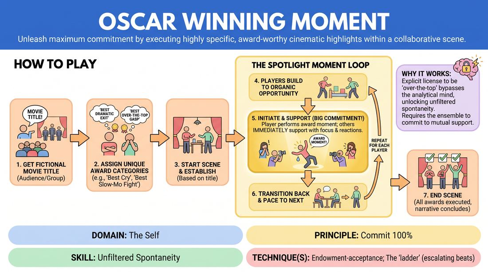

# Award-Winning Moments

{ .game-hero }

> Unleash maximum commitment by executing highly specific, award-worthy cinematic highlights within a collaborative scene.

## Overview
Players collaborate on a brand-new scene inspired by a fictional movie title. Each performer is assigned a highly specific, prestigious award category—such as 'Best Dramatic Cry' or 'Best Slow-Motion Action Sequence'—which they must seamlessly integrate and perform with absolute, uninhibited commitment during the scene.

## What It Trains
- **Domain:** D1 — The Self
- **Principle(s):** Commit 100%; Yes, And; Make Your Partner a Genius; Show, Don't Tell; Follow the Follower
- **Skill(s):** Unfiltered Spontaneity; Emotional Fluidity; Physicality & Space Work; Offer Reception; Heightening & Exploration; Support Work; Pacing & Rhythm
- **Technique(s):** Endowment-acceptance; The 'ladder' (escalating beats); Walk-ons
- **Focus:** comedy_game

**Objective:** To develop uninhibited commitment, physical and emotional heightening, and the ability to share the spotlight by executing and supporting high-stakes theatrical choices.

## Setup
An open performance space. 3 to 4 players stand on stage. The facilitator or remaining group members act as the audience to provide a fictional movie title and assign one specific 'award category' to each player before the scene begins.

## How to Play
1. Gather 3 to 4 players on stage and ask the audience or remaining group for a fictional movie title.
2. Assign each player a unique, highly specific award category (e.g., 'Best Dramatic Exit,' 'Best Over-the-Top Gasp,' 'Best Slow-Motion Fight Sequence,' or 'Best Monologue About Food').
3. Begin the scene normally, establishing the platform, characters, and setting based on the movie title.
4. As the scene progresses, players look for organic opportunities to build toward and execute their designated award-winning moment.
5. When a player initiates their award-winning moment, all other players must immediately shift their focus to support them, using physical reactions, active listening, and high-stakes emotional responses to make the moment feel truly epic.
6. Once a player's moment concludes, the scene transitions back to collaborative play, pacing toward the next player's spotlight moment.
7. The scene ends once all players have successfully executed their award-winning moments and the narrative reaches a satisfying conclusion.

## Facilitation Notes
- Side-coach players to avoid rushing their moments; let the scene build naturally so the high-stakes action feels earned.
- Remind off-focus players that their primary job during another player's moment is to make them look like a genius through active, high-stakes support.
- If a player hesitates, call out 'And action on [Player's Name]'s award-winning moment!' to give them a supportive push.
- Pitfall: Players doing their moments simultaneously. Fix: Coach them to pass the spotlight cleanly, ensuring only one major award-winning moment happens at a time.

## Variations
- Director's Cut: The facilitator acts as a director, calling out 'Award-Winning Moment!' for a specific player in real-time, forcing them to instantly launch into their action.
- Genre Shift: Assign a specific cinematic genre (e.g., Sci-Fi, Film Noir, Soap Opera) that dictates the style of all the award categories.
- The Sequel: Play a two-part scene where the second part must feature the 'acceptance speeches' of the characters, justifying why they won those awards.

## Debrief
- How did committing 100% to a ridiculous or extreme choice affect your overall confidence in the scene?
- What did it feel like to actively support someone else's massive, spotlight-stealing moment?
- How did the pacing change when we allowed ourselves to slow down and fully explore a single physical or emotional beat?

## Safety & Inclusion
Ensure physical award categories (like falls or fight sequences) are adapted to the physical comfort and safety levels of each performer. Encourage players to define their physical boundaries before starting.

## Why It Works
By giving players an explicit license to be 'over-the-top' within a specific category, it bypasses the analytical mind and unlocks unfiltered spontaneity. The game engine relies on mutual support: when the ensemble commits to treating a silly moment with absolute dramatic gravity, it elevates the comedy and builds deep trust.
