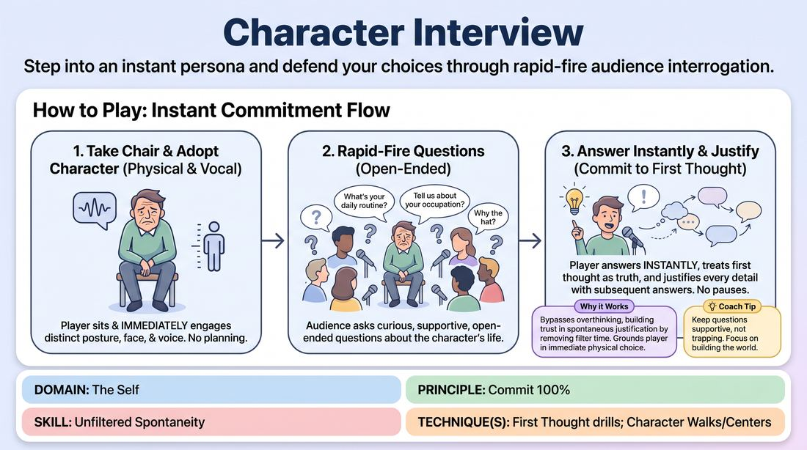

# The Hot Seat Interview

{ .game-hero }

> Step into an instant persona and defend your choices through rapid-fire audience interrogation.

## Overview
A single player sits in a central chair and immediately adopts a distinct physical and vocal character. The rest of the group acts as talk-show hosts or journalists, asking open-ended questions that the player must answer instantly. The player commits fully to their physical choices and justifies every spontaneous detail on the fly.

## What It Trains
- **Domain:** D1 — The Self
- **Principle(s):** Commit 100%; The First Thought Is a Gift; Show, Don't Tell
- **Skill(s):** Unfiltered Spontaneity; Physicality & Space Work; Vocal Craft; World-Building; Justification; Stage Presence & Clarity
- **Technique(s):** First Thought drills; Character Walks/Centers; Vocal characterization; C.R.O.W. (Character, Relationship, Objective, Where); Justify the absurd
- **Focus:** skill_drill

**Objective:** Develops unfiltered spontaneity, physical commitment, and rapid justification by training players to trust their first instinctual thoughts without self-censoring.

## Setup
Place a single chair at the front of the room facing the rest of the group, who sit or stand in a semi-circle as the interviewers.

## How to Play
1. One volunteer takes the central chair facing the group.
2. The player immediately adopts a distinct physical posture, facial expression, and vocal quality to establish a character.
3. The remaining players begin asking curious, open-ended questions about the character's life, occupation, and daily routine.
4. The player in the chair must answer every question instantly, without pausing to plan or filter their thoughts.
5. The player treats their very first spoken response as absolute truth, no matter how absurd, and uses subsequent answers to justify it.
6. The interviewers ask supportive questions that build on the character's established details rather than trying to trap them.
7. After two to three minutes of rapid-fire questioning, the facilitator calls 'scene' and a new player takes the chair.

## Facilitation Notes
- Coaching cue: 'Answer before you think!' Encourage the player to speak the very first word that comes to mind.
- Pitfall: The player hesitates or says 'I don't know' to buy time. Fix: Remind them that in this world, their character is the ultimate authority and any answer they give is correct.
- Coaching cue: 'Let your body lead.' If a player gets stuck, have them shift their physical posture in the chair to discover a new vocal tone or attitude.
- Pitfall: Interviewers asking closed yes/no questions or aggressive 'gotcha' questions. Fix: Remind the group that their goal is to make the performer look brilliant by exploring their world.

## Variations
- Physical Catalyst: The player must start with a specific physical quirk, such as a twitching foot or a stiff shoulder, and let the character's voice and personality emerge entirely from that physical state.
- The Expert: The character is introduced as a world-renowned authority on an absurd, fictional field suggested by the audience.
- Emotional Shift: The facilitator calls out different emotions during the interview, and the player must instantly transition their character's emotional state while maintaining the same backstory.

## Debrief
- How did it feel to answer questions before you had time to plan the perfect response?
- What did you discover about the relationship between your physical posture and the voice of your character?
- How did committing to your first random detail help build a consistent world?

## Safety & Inclusion
Ensure players feel free to decline specific character prompts that might touch on sensitive personal topics. Encourage players to choose fictional, heightened archetypes rather than real-world cultural caricatures.

## Why It Works
By removing the time to plan, this drill bypasses the analytical brain's filter. The physical constraint of the chair grounds the player, while the rapid-fire questions force them to rely on immediate justification, proving that any spontaneous choice can be made logical in retrospect.
