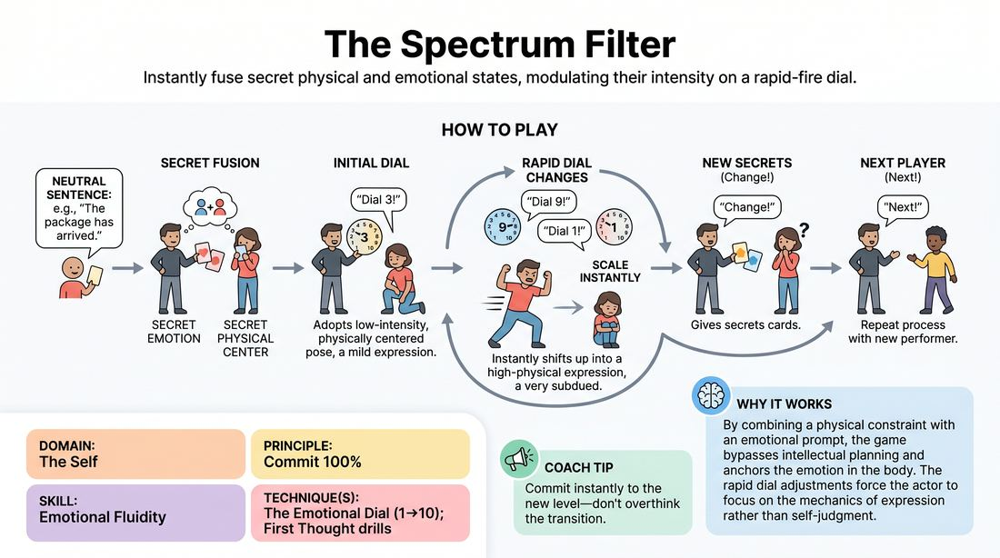

# The Spectrum Filter

{ .game-hero }

> Instantly fuse secret physical and emotional states, modulating their intensity on a rapid-fire dial.

## Overview
A solo performer receives a secret combination of an emotion and a physical center, then delivers a single neutral phrase. A facilitator dynamically adjusts an intensity dial from one to ten, forcing the actor to scale their expression up or down instantly. This high-energy drill builds rapid emotional access, physical commitment, and the ability to shed self-consciousness under pressure.

## What It Trains
- **Domain:** D1 — The Self
- **Principle(s):** Commit 100%; Fail Joyfully; Vulnerability; The First Thought Is a Gift
- **Skill(s):** Unfiltered Spontaneity; Emotional Fluidity; Physicality & Space Work; Vocal Craft; Self-Recovery
- **Technique(s):** First Thought drills; The Emotional Dial (1→10); Character Walks/Centers; Vocal characterization
- **Focus:** skill_drill

**Objective:** To develop deep emotional fluidity and physical commitment by instantly embodying contrasting internal states and modulating their intensity without intellectualizing.

## At a Glance
| Aspect | Detail |
|---|---|
| Players | 5–10 (ideal 5-10) |
| Time | ~15 min |
| Complexity | 3/5 |
| Skill level | competent |
| Energy | medium |
| Physicality | medium |
| Modality | in_person |
| Space | moderate |
| Props | Index cards with emotions, Index cards with physical characteristics |
| Audience | not required |

## Setup
Prepare two decks of index cards: one containing distinct emotions (e.g., grief, ecstasy, paranoia, awe) and another containing physical centers or movement qualities (e.g., leaden feet, chest-forward, floating, rigid spine). Clear a performance space at the front of the room. Have the group sit as supportive observers.

## How to Play
1. Select a single, short, neutral sentence to be used throughout the round, such as 'The package has arrived.'
2. One player steps into the performance space as the active performer, while another player or the facilitator acts as the Director.
3. The Director draws one secret Emotion card and one secret Physical Center card, showing them only to the performer.
4. The Director calls out a starting intensity level on a scale of 1 to 10 (e.g., 'Dial 3!').
5. The performer immediately adopts the physical center and the emotion at that exact intensity, then delivers the neutral sentence.
6. The Director rapidly calls out new dial numbers (e.g., 'Dial 9!', 'Dial 1!'), and the performer must instantly scale their physical and vocal expression of the same state up or down, repeating the sentence.
7. After a few dial adjustments, the Director calls 'Change!', draws two brand-new secret cards, and calls a new dial number, prompting the performer to instantly drop the old state and embody the new one.
8. After two or three full card combinations, the Director calls 'Next!', and a new performer steps up to repeat the process with a new neutral sentence.

## Facilitation Notes
- Encourage performers to avoid pantomiming or explaining the cards; the goal is internal embodiment, not a guessing game for the audience.
- If a player gets stuck or overthinks, side-coach them to focus on their breath and physical posture first, letting the emotion follow the physical shape.
- Keep the pace brisk. Do not give the performer time to plan; call the dial numbers quickly to bypass their analytical mind.
- Watch for 'middle-grounding' where players stay at a safe level 5. Push them to make level 1 barely perceptible and level 10 an absolute, explosive maximum.

## Variations
- Gibberish Delivery: Replace the English phrase with a line of gibberish, forcing the performer to rely entirely on vocal tone, resonance, and physical expression.
- Public Filters: For less experienced players, reveal the cards to the audience first so the performer feels supported by the group's shared understanding.
- Compound States: Draw two conflicting emotion cards simultaneously (e.g., joyful rage) to challenge the performer's emotional complexity.

## Debrief
- How did changing your physical posture alter the ease of accessing the assigned emotion?
- What did you notice about your internal critic when the dial was suddenly cranked to ten?
- How did it feel to instantly drop a high-intensity state when the 'Change' cue was called?

## Safety & Inclusion
Ensure players know they can self-calibrate the physical prompts to match their mobility levels. If an emotion card triggers genuine personal distress, players are always free to signal for a pass or draw a new card without explanation.

## Why It Works
By combining a physical constraint with an emotional prompt, the game bypasses intellectual planning and anchors the emotion in the body. The rapid dial adjustments force the actor to focus on the mechanics of expression rather than self-judgment, cultivating true spontaneity and emotional agility.
