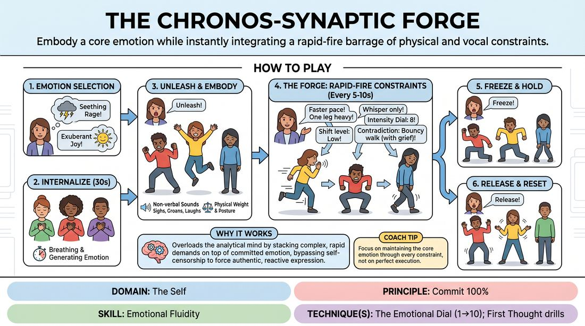

# The Emotional Crucible

{ .game-hero }

> Embody a core emotion while instantly integrating a rapid-fire barrage of physical and vocal constraints.

## Overview
A high-intensity physical and emotional drill where players deeply commit to a single core feeling, then dynamically express it through movement and non-verbal sound. As they move, a facilitator layers on rapid, cumulative, and often contradictory physical and vocal instructions. Players must instantly adapt to these new constraints without dropping their underlying emotional truth, building profound psychophysical agility.

## What It Trains
- **Domain:** D1 — The Self
- **Principle(s):** Commit 100%; Fail Joyfully; Vulnerability; The First Thought Is a Gift
- **Skill(s):** Unfiltered Spontaneity; Emotional Fluidity; Physicality & Space Work; Vocal Craft; Silence & Stillness; Self-Recovery
- **Technique(s):** First Thought drills; The Emotional Dial (1→10); Character Walks/Centers; Weight & resistance mime; Projection & breath support; Gibberish; Do nothing exercises
- **Focus:** skill_drill

**Objective:** To develop deep emotional fluidity and absolute physical commitment under pressure. This drill trains players to bypass cognitive hesitation, embrace vulnerability, and maintain a truthful emotional core while managing complex, shifting physical and vocal demands.

## At a Glance
| Aspect | Detail |
|---|---|
| Players | 4–8 (ideal 4-8) |
| Time | ~15 min |
| Complexity | 4/5 |
| Skill level | competent |
| Energy | high |
| Physicality | high |
| Modality | in_person |
| Space | large_open |
| Props | none |
| Audience | not required |

## Setup
An open, unobstructed room with plenty of space for 4 to 8 players to move around safely. No props or chairs are needed. One person acts as the facilitator, while the remaining players stand spaced out across the floor.

## How to Play
1. The facilitator selects a distinct, high-stakes emotion (such as seething rage, exuberant joy, or profound grief) and announces it to the group.
2. Players close their eyes or adopt a soft downward gaze, spending 30 seconds silently breathing and generating that specific emotion internally, letting it fill their entire body before making any outward movement.
3. The facilitator calls out 'Unleash!' and players open their eyes, immediately moving through the space to physically and vocally embody the emotion without using any real words.
4. Players must use non-verbal vocalizations (sighs, laughs, groans) and physicalize the weight, resistance, and posture that naturally flow from their chosen emotional state.
5. Once the movement is established, the facilitator begins calling out new, specific constraints every 5 to 10 seconds, which players must instantly adopt while keeping their core emotion alive.
6. The facilitator's prompts should accumulate, requiring players to layer instructions like adjusting their emotional intensity on a dial from 1 to 10, shifting their physical center of gravity, or speaking in gibberish.
7. The facilitator can introduce challenging contradictions, such as commanding a player to adopt a light, bouncy walk while maintaining deep grief, or holding one limb completely frozen while the rest of the body rages.
8. After a high-intensity sequence of layered prompts, the facilitator calls out 'Freeze and Hold,' prompting players to find absolute stillness and silence while still vibrating with the internal emotion.
9. The facilitator calls 'Release!' and players immediately drop all physical and emotional tension, shaking out their limbs and taking a deep breath to return to a neutral, relaxed state before starting a new round with a different emotion.

## Facilitation Notes
- Side-coaching cue: 'Don't think, just react! Let the new instruction hit your body before your brain can process it.'
- Side-coaching cue: 'Keep the core emotion burning. The new physical constraint is just a filter for that same feeling, not a replacement.'
- Pitfall: Players drop the emotional connection when a physical constraint is added, turning the exercise into a purely mechanical mime game. Fix: Remind them to breathe and re-anchor the emotion in their chest or gut before moving.
- Pitfall: Cognitive overload causing players to freeze or stop moving entirely. Fix: Encourage them to 'fail joyfully' by making a messy, immediate physical choice rather than trying to find the 'correct' response.
- Keep the pacing of prompts brisk. If you give players more than 10 seconds to think, they will intellectualize the movement instead of reacting instinctively.

## Variations
- Contradictory Split: Instruct players to split their body in half, expressing one emotion (like joy) in their upper body and a completely different emotion (like fear) in their lower body.
- First-Thought Monologue: Instead of gibberish, have players speak a continuous, unfiltered stream-of-consciousness monologue aloud, expressing the raw thoughts driven by their current emotional state.
- Environmental Friction: Layer in imaginary environmental factors, such as moving through thick molasses, walking on hot coals, or navigating zero gravity, while maintaining the emotional core.

## Debrief
- How did it feel to try and maintain a deep emotional truth while your physical body was forced to do something contradictory?
- When the prompts came rapidly, what did you have to let go of in order to keep up?
- How did the non-verbal vocalizations help or hinder your ability to stay connected to the emotion?
- What did you discover about your ability to recover when you felt overwhelmed or lost the emotional thread?

## Safety & Inclusion
Because this exercise demands high emotional vulnerability and physical movement, remind players that they are in control of their physical boundaries. If an emotional state feels genuinely unsafe or triggering, they can step out or dial down the intensity to a manageable level (such as a 1 or 2 on the dial) without judgment.

## Why It Works
This game works by overloading the analytical mind. By stacking rapid, complex, and sometimes contradictory physical and vocal demands on top of a committed emotional state, the brain's self-censoring mechanism is bypassed. This forces the performer to rely on pure, unfiltered physical impulse and emotional intuition, building a direct pathway between internal feeling and external expression.
