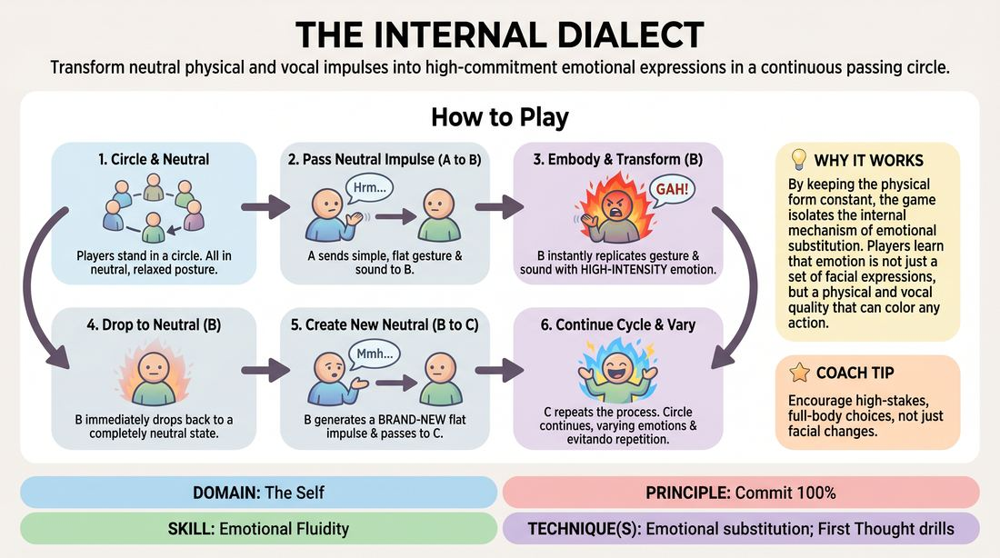

# The Emotional Echo

{ .game-hero }

> Transform neutral physical and vocal impulses into high-commitment emotional expressions in a continuous passing circle.

## Overview
A fast-paced circle drill where players practice rapid emotional transformation and precise physical replication. Players receive a completely neutral physical gesture and vocal sound, instantly embody it with a high-commitment emotional state, and then pass a brand-new neutral impulse to the next player. This cycle sharpens the boundary between neutral presence and intense emotional commitment.

## What It Trains
- **Domain:** D1 — The Self
- **Principle(s):** Commit 100%; Fail Joyfully; Vulnerability; The First Thought Is a Gift; Make Your Partner a Genius
- **Skill(s):** Unfiltered Spontaneity; Emotional Fluidity; Physicality & Space Work; Vocal Craft; Self-Recovery; Active Listening; Offer Reception
- **Technique(s):** First Thought drills; The Emotional Dial (1→10); Emotional substitution; Projection & breath support; Vocal characterization
- **Focus:** skill_drill

**Objective:** To develop emotional fluidity and substitution by training players to instantly access, commit to, and transition between diverse emotional states using a fixed physical and vocal template.

## At a Glance
| Aspect | Detail |
|---|---|
| Players | 4–8 (ideal 4-8) |
| Time | ~15 min |
| Complexity | 2/5 |
| Skill level | advanced_beginner |
| Energy | medium |
| Physicality | medium |
| Modality | in_person |
| Space | minimal |
| Props | none |
| Audience | not required |

## Setup
Players stand in a circle facing inward. No props or materials are required. The space should be quiet enough for subtle vocalizations to be clearly heard.

## How to Play
1. Begin with all players standing in a circle in a neutral, relaxed posture.
2. The first player initiates by sending a neutral impulse to the player on their left: a single, simple physical gesture paired with a single, flat vocal sound with absolutely no emotional coloring.
3. The receiving player must immediately replicate the exact physical gesture and vocal sound, but completely filter them through a chosen, high-intensity emotional state.
4. During this emotional replication, the player must transform the neutral vocal sound into an expressive vocalization that matches the chosen emotion while retaining the core vowel or syllable shape.
5. Immediately after completing the emotional expression, the same player must drop back to a neutral state and generate a brand-new, emotionally flat physical gesture and vocal sound.
6. The player passes this new neutral impulse to the person on their left, who repeats the process of emotional transformation and neutral generation.
7. Continue the cycle around the circle, encouraging players to explore a wide variety of distinct emotions and avoid repeating states used by previous players.

## Facilitation Notes
- Side-coaching cue: 'Commit 100 percent to the feeling! Don't just mimic the shape, let the emotion fill your entire body and voice.'
- Common Pitfall: Players often bleed the emotion of their transformation into the new neutral impulse they generate. Remind them to shake it off and find absolute zero before passing the next offer.
- Side-coaching cue: 'Keep the physical shape identical. The magic is in how the emotion changes the quality and speed of the movement, not the movement itself.'
- If players struggle to find an emotion instantly, coach them to let their first physical instinct dictate the feeling rather than overthinking the choice.

## Variations
- Conflicting Layers: Require players to filter the physical gesture through one emotion while the vocal sound expresses a contrasting emotion.
- Intensity Dial: The facilitator calls out a number from 1 to 10 right before the replication, forcing the player to scale the emotional expression to that specific volume.
- Silent Echo: Perform the entire exercise without vocalizations, relying purely on physical quality, breath, and facial expression to convey the emotional shift.

## Debrief
- How did restricting your physical movement to an exact replica affect your ability to access the emotion?
- What was more challenging: fully committing to the emotional peak, or instantly dropping back down to absolute neutrality?
- How did changing the vocal quality of a neutral sound help you step into a genuine feeling?

## Safety & Inclusion
Ensure players know they can choose any emotion they feel safe exploring, and can opt for lighter or abstract emotions if intense emotions feel overwhelming. Encourage physical modifications for any gestures to accommodate mobility needs.

## Why It Works
By keeping the physical form constant, the game isolates the internal mechanism of emotional substitution. Players learn that emotion is not just a set of facial expressions, but a physical and vocal quality that can color any action. Alternating rapidly between high-intensity commitment and flat neutrality builds self-recovery and emotional agility.
