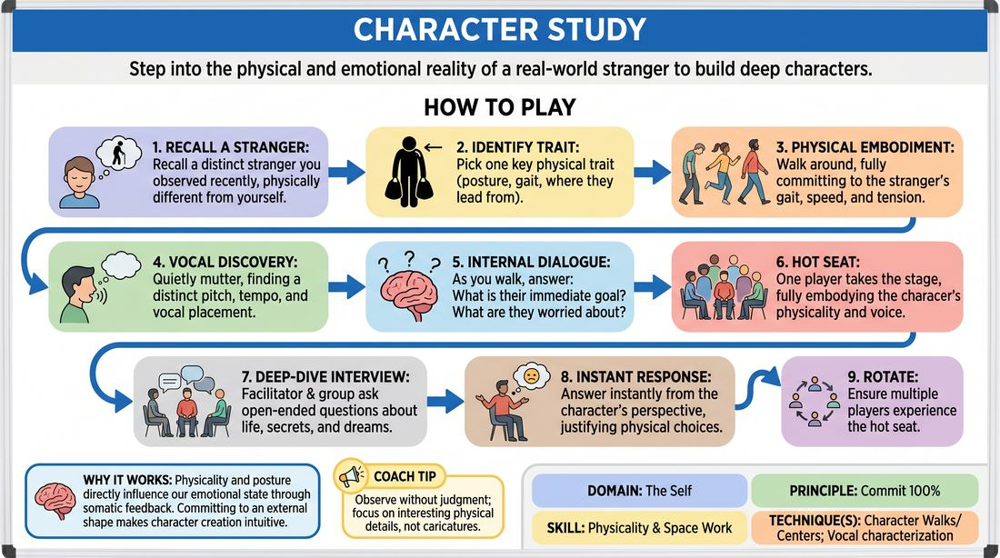

# Embodied Portrait

{ .game-hero }

> Step into the physical and emotional reality of a real-world stranger to build deep characters.

## Overview
Players recall a distinct stranger they have observed in daily life who is physically or demographically different from themselves. They physically embody this person's posture, gait, and vocal patterns, then sit for a deep-dive interview to discover their inner world. It is a powerful exercise in somatic character generation and deep commitment.

## What It Trains
- **Domain:** D1 — The Self
- **Principle(s):** Commit 100%; Vulnerability
- **Skill(s):** Physicality & Space Work; Vocal Craft; World-Building
- **Technique(s):** Character Walks/Centers; Vocal characterization; C.R.O.W. (Character, Relationship, Objective, Where)
- **Focus:** skill_drill

**Objective:** Develops 100% commitment to physical and vocal choices that are outside the player's default habits, using external observation as a springboard for deep character work.

## Setup
An open room where players can walk around safely, with a single chair placed at the front of the space for the interview portion.

## How to Play
1. Ask players to close their eyes and recall a specific stranger they observed recently in public who is physically or demographically very different from them.
2. Instruct players to identify one key physical trait of this stranger, such as their posture, where they lead from in their body, or how they carry their weight.
3. Have all players begin walking around the space, fully committing to this stranger's physical gait, speed, and physical tension level.
4. While walking, players quietly mutter to themselves in the character's voice, finding a distinct pitch, tempo, and vocal placement.
5. Ask players to mentally answer basic questions as they walk: What is this person's immediate goal? What are they worried about right now?
6. Gather the group. Invite one volunteer to take the hot seat at the front of the room, fully embodying their character's physical posture and vocal quality.
7. The facilitator and remaining players ask the character open-ended questions about their life, relationships, secrets, and dreams.
8. The interviewed player must answer instantly from the character's perspective, justifying every physical and vocal choice with emotional truth.
9. Rotate players so multiple participants experience the hot seat and receive feedback on their physical and vocal commitment.

## Facilitation Notes
- Side-coach physical shifts: Remind players to lead from a specific body part (e.g., 'Lead with your chin' or 'Carry your weight in your heels') to avoid generic caricatures.
- If a player leans into a stereotype, coach them to find the human vulnerability or a contrasting trait (e.g., a tough-looking character who loves baking).
- Encourage players not to pause and think before answering; let the physical posture dictate the emotional response.
- Remind players to maintain the physical posture throughout the entire interview, especially when they are thinking of an answer.

## Variations
- The Encounter: Two embodied characters meet in a neutral space (like a bus stop) and have a brief, low-stakes conversation.
- Object Work Integration: The hot-seated character must perform a simple physical task (like folding laundry or making tea) while being interviewed.

## Debrief
- How did changing your physical center affect your emotional state or the way you answered questions?
- What did it feel like to commit 100% to a physical shape that felt completely unnatural to your own body?
- How does starting with physical observation prevent us from playing generic, repetitive characters?

## Safety & Inclusion
Ensure players choose physical traits that are respectful and avoid mocking physical disabilities or caricaturing marginalized groups. Emphasize finding the shared humanity and dignity in the observed stranger.

## Why It Works
Physicality and posture directly influence our emotional state through somatic feedback. By committing fully to an external physical shape, the brain naturally fills in the psychological gaps, making character creation intuitive rather than intellectual.
