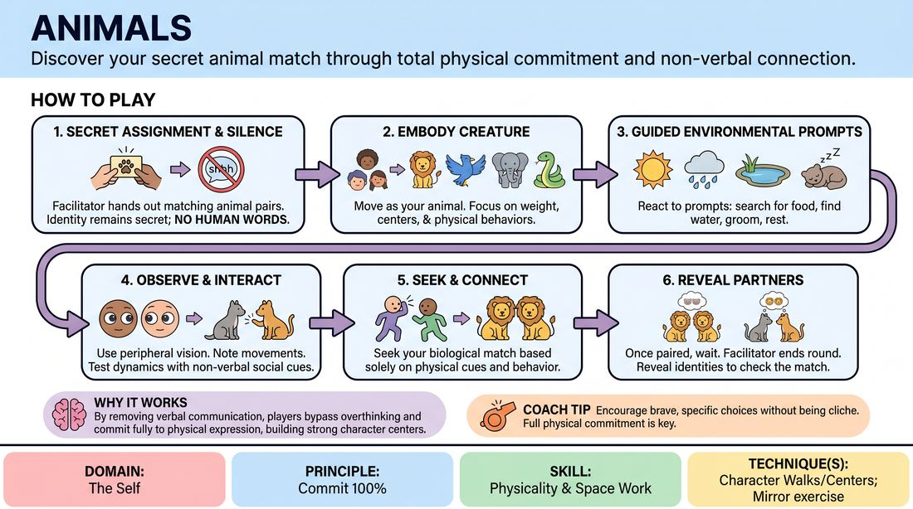

# Creature Pairs

{ .game-hero }

> Discover your secret animal match through total physical commitment and non-verbal connection.

## Overview
Players are secretly assigned matching animal identities in pairs. Moving through a shared space, they embody their creature's physical centers and behaviors through a series of guided prompts, ultimately seeking out their biological counterpart without using human words.

## What It Trains
- **Domain:** D1 — The Self
- **Principle(s):** Commit 100%; Make Your Partner a Genius; Group Mind
- **Skill(s):** Physicality & Space Work; Active Listening; Single-Partner Empathy & Mirroring; Peripheral Awareness
- **Technique(s):** Character Walks/Centers; Mirror exercise; Stage-picture exercises
- **Focus:** connection

**Objective:** To develop uninhibited physical commitment, explore non-verbal character centers, and cultivate deep peripheral awareness and partner empathy.

## Setup
An open, safe room free of obstacles. The facilitator prepares matching pairs of animal identities (written on slips of paper or whispered secretly to players). Ensure an even number of participants.

## How to Play
1. Distribute secret animal identities to all players, ensuring every animal has exactly one matching partner in the room.
2. Instruct players to keep their identity completely secret and to refrain from using any human language throughout the exercise.
3. Have players spread out in the space and begin moving as their assigned animal, focusing on physical centers and weight distribution.
4. Call out a series of environmental and behavioral prompts for the animals to react to, such as searching for water, grooming, or settling down to sleep.
5. Encourage players to observe the other creatures in the space using peripheral vision, noting how others move, react, and occupy space.
6. Introduce a prompt for social interaction, such as greeting another creature or establishing dominance, allowing players to test their physical dynamics.
7. Instruct players to actively seek out their biological match based solely on physical behavior, movement patterns, and non-verbal cues.
8. Once players believe they have found their partner, they must stand together and wait for the facilitator to call an end to the round.
9. Have each pair reveal their animal identities to see if they successfully connected with their match.

## Facilitation Notes
- Side-coach players to avoid easy vocalizations and instead focus on physical weight, posture, and tempo.
- If players are hesitant or self-conscious, encourage them to commit 100% by exaggerating their movements and leading with a specific physical center.
- Pitfall: Players immediately grouping up or talking. Fix: Remind them that silence is mandatory and the discovery must be purely physical.
- Encourage players to make their partner look good by responding organically to the physical offers of other animals they encounter.

## Variations
- Silent Evolution: Play the entire game in absolute silence, relying entirely on body language and eye contact without any animal sounds.
- The Human Intruder: Assign one or two players to be humans exploring the wilderness, forcing the animals to react to their presence.
- Status Shift: Assign different status levels to the animals to add a layer of social hierarchy to the physical interactions.

## Debrief
- How did committing fully to a physical center help you embody your animal without relying on words?
- What specific physical cues helped you identify your matching partner?
- How did it feel to communicate and connect purely through movement and eye contact?

## Safety & Inclusion
Ensure the space is clear of tripping hazards. Offer modifications for players with limited mobility, allowing them to express their animal's essence through upper-body movement, facial expressions, or vocal qualities. Establish clear boundaries regarding physical contact before starting.

## Why It Works
By stripping away verbal communication, players are forced to rely entirely on physical expression and active observation. Embodying an animal bypasses intellectual overthinking, encouraging 100% commitment to a physical character center. The search for a partner builds deep empathy and peripheral awareness as players learn to read and mirror subtle physical offers.
