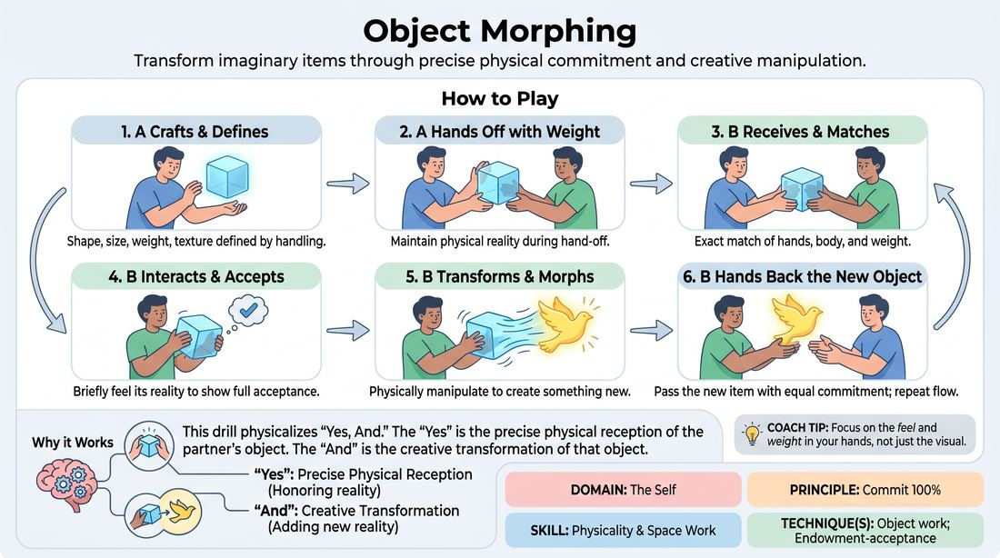

# Object Morphing

{ .game-hero }

> Transform imaginary items through precise physical commitment and creative manipulation.

## Overview
A physical partner drill where players construct, pass, and transform imaginary objects. By focusing on weight, texture, and scale, players practice receiving a physical offer with absolute commitment before morphing it into something entirely new.

## What It Trains
- **Domain:** D1 — The Self
- **Principle(s):** Commit 100%; Yes, And
- **Skill(s):** Physicality & Space Work; Offer Reception; Active Gifting
- **Technique(s):** Object work; Endowment-acceptance; Endowment-gifting drills
- **Focus:** skill_drill

**Objective:** To develop high-fidelity object work, active gifting, and physical commitment by treating imaginary space as a tangible, malleable medium.

## At a Glance
| Aspect | Detail |
|---|---|
| Players | 2+ (ideal 2 or 8-15) |
| Time | ~10 min |
| Complexity | 2/5 |
| Skill level | novice |
| Energy | medium |
| Physicality | medium |
| Modality | in_person |
| Space | minimal |
| Props | none |
| Audience | not required |

## Setup
Players stand in pairs facing each other with comfortable space between them. No physical props are used; the entire exercise relies on pantomime and spatial awareness.

## How to Play
1. Player A begins by silently crafting an imaginary object out of thin air, defining its size, weight, shape, and texture through deliberate physical handling.
2. Once the object is fully realized, Player A hands it over to Player B, maintaining its physical boundaries and weight during the hand-off.
3. Player B receives the object, matching their hands and body posture to the exact dimensions, weight, and orientation established by Player A.
4. Player B interacts with the received object briefly to demonstrate full acceptance of its physical reality, such as feeling its weight or turning it over.
5. Player B then physically manipulates the object—stretching, compressing, folding, breaking, or melting it—to transform it into a completely different item.
6. Once the new object is fully formed, Player B hands it back to Player A, who receives it with the same level of physical commitment and repeats the process.

## Facilitation Notes
- Side-coach players to slow down: the magic of the game is in the transition and the preservation of weight, not just the speed of the transformation.
- Pitfall: Players immediately change the object without first holding and honoring the original shape. Fix: Instruct players to freeze for three seconds holding the received object before starting the morph.
- Encourage players to use their whole bodies, not just their fingertips, to convey weight and resistance.
- Remind players to avoid verbalizing what the object is; let the physical commitment do the talking.

## Variations
- Circle Pass: Arrange the entire group in a circle and pass a single morphing object around, with each player receiving, morphing, and passing it to their neighbor.
- Sound Effects: Add abstract vocal sound effects that match the physical tension, stretching, or snapping of the object as it morphs.
- Speed Run: Once the physical vocabulary is established, challenge pairs to morph the objects rapidly while maintaining high-fidelity weight and shape.

## Debrief
- How did it feel to receive an object where your partner committed 100% to its weight and shape?
- What physical cues made it easiest to understand the boundaries of the object being handed to you?
- Why is it important to fully accept the physical reality of the object before you begin to change it?

## Safety & Inclusion
Ensure players are mindful of physical boundaries and comfortable with close-proximity pantomime. If standing is difficult, this exercise can easily be played seated.

## Why It Works
This drill works because it physicalizes the core improv principle of 'Yes, And.' The 'Yes' is the precise physical reception of the partner's object, honoring its weight and dimensions. The 'And' is the creative transformation of that object into something new. By requiring 100% commitment to an invisible object, it builds muscle memory for believable space work.
