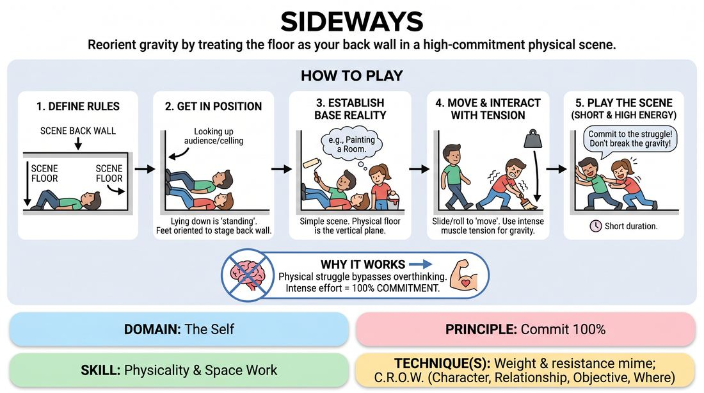

# Sideways Stage

{ .game-hero }

> Reorient gravity by treating the floor as your back wall in a high-commitment physical scene.

## Overview
In this highly physical game, players perform a scene while lying down on the floor, which represents the vertical back wall of their environment. The actual back wall of the stage represents the floor, forcing players to completely re-map their physical relationship to gravity, weight, and movement. The resulting struggle creates a hilarious and visually striking illusion of defying gravity.

## What It Trains
- **Domain:** D1 — The Self
- **Principle(s):** Commit 100%; Show, Don't Tell; Base Reality First
- **Skill(s):** Physicality & Space Work; World-Building
- **Technique(s):** Weight & resistance mime; C.R.O.W. (Character, Relationship, Objective, Where)
- **Focus:** mixed

**Objective:** To develop total physical commitment, core body control, and precise weight and resistance mime by forcing players to consciously simulate gravity in a rotated plane.

## Setup
Clear a wide, clean, and comfortable floor space, ensuring it is free of debris or splinters. Players must wear comfortable clothing that covers their arms and legs (such as long sleeves and sweatpants) to prevent friction burns, and remove any sharp jewelry or accessories.

## How to Play
1. Define the spatial rules clearly: the physical floor is the 'back wall' of the scene, and the physical back wall of the stage is the 'floor' of the scene.
2. Have two to three players lie down on their backs or sides on the physical floor, facing up toward the ceiling or directly toward the audience.
3. Establish a simple, everyday base reality scene, such as two people painting a room, waiting for a bus, or cooking in a kitchen.
4. To 'stand' in the scene, players must lie flat on their backs with the soles of their feet pointed toward the physical back wall.
5. To 'walk' or move around, players must slide, shimmy, or roll along the physical floor while keeping their feet oriented toward the physical back wall.
6. To interact with objects, players must use intense muscle tension to simulate weight, remembering that gravity in the scene pulls toward the physical back wall.
7. Play a short, high-energy scene where players must maintain this physical illusion while executing a simple narrative task.

## Facilitation Notes
- Side-coaching cue: 'Show the weight! If you lift an arm, remember gravity is pulling it toward the back wall, not the floor!'
- Common pitfall: Players standing up physically when they get excited. Remind them that standing up physically means their character is now floating or pinned to the wall.
- Side-coaching cue: 'Engage your core. Every step and gesture requires resistance to look convincing to the audience.'
- Encourage players to use the physical floor to slide, crawl, or hang, creating gravity-defying stage pictures that would be impossible standing up.
- Monitor physical exertion closely; remind players to move deliberately to avoid muscle strains or sudden impacts with the floor.

## Variations
- Virtual Gravity (Online Adaptation): Players position their webcams to capture their upper bodies while they sit sideways in their chairs, or lie on the floor behind them. They treat the side of the video frame as 'down,' creating a gravity-defying illusion for the viewers on screen.
- Gravity Shift: Mid-scene, the facilitator calls out a new direction for gravity (e.g., 'Gravity is now the ceiling!'), forcing players to instantly adjust their physical orientation.
- The Cliffhanger: Players perform an action scene, such as scaling a mountain or hanging from a ledge, using the floor to safely simulate extreme heights.

## Debrief
- How did shifting your physical orientation change your level of commitment to the scene?
- What physical adjustments did you have to make to make the illusion of gravity look convincing?
- How did the physical limitation of being on the floor affect your verbal choices and pacing?

## Safety & Inclusion
This game is highly physical and requires core strength, sliding, and lying on the floor. Ensure the floor is swept and free of hazards. Players should wear long sleeves and pants to prevent friction burns, and avoid sudden, high-impact drops onto knees or elbows. For players with mobility, back, or neck limitations, adapt the game by letting them sit in a chair and act as a 'floating' character, or have them direct the physical players from the sidelines.

## Why It Works
By forcing players to physically struggle against simulated gravity, it bypasses intellectual overthinking. The intense physical effort required to maintain the illusion naturally leads to 100% commitment and highly detailed, slow-paced object work.
