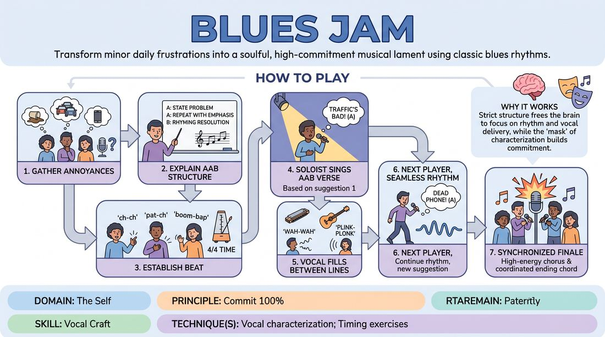

# The Blues Jam

{ .game-hero }

> Transform minor daily frustrations into a soulful, high-commitment musical lament using classic blues rhythms.

## Overview
A high-energy musical game where players take minor audience grievances and transform them into a cohesive, rhythmic blues song. Players take turns singing verses, backing each other up with vocal instrumentation, and committing fully to a stylized, soulful vocal characterization.

## What It Trains
- **Domain:** D1 — The Self
- **Principle(s):** Commit 100%; Group Mind; The Audience Is the Final Scene Partner
- **Skill(s):** Unfiltered Spontaneity; Vocal Craft; Pacing & Rhythm; Stage Presence & Clarity
- **Technique(s):** Vocal characterization; Timing exercises
- **Focus:** mixed

**Objective:** Develops vocal characterization, rhythmic timing, and uninhibited commitment by leaning into the musicality of the blues genre.

## Setup
Players stand in a line or semi-circle facing the audience. No physical instruments are needed; all music is generated vocally by the players.

## How to Play
1. Gather three to five minor, everyday annoyances from the audience to serve as the inspiration for the verses.
2. Explain the AAB blues structure: Line A states the problem, Line A repeats the problem with emphasis, and Line B delivers a rhyming resolution or consequence.
3. Establish a steady, rhythmic blues beat in 4/4 time using vocal percussion, chest-patting, or finger-snapping.
4. The first soloist steps forward and sings a classic AAB blues verse based on the first audience suggestion.
5. Between the soloist's lines, the non-singing players provide vocal fills mimicking blues instruments like a harmonica or guitar.
6. Once the first verse is complete, the rhythm continues seamlessly as the next player steps forward to sing about the next suggestion.
7. Conclude the song with all players joining in a synchronized, high-energy final chorus and a coordinated ending chord.

## Facilitation Notes
- Coaching cue: Lean into the grit! Use your chest voice, raspy tones, or dramatic slides to embody the blues character.
- Coaching cue: Keep the rhythm steady. Don't let the beat drop when a singer is thinking of their next line.
- Pitfall: Players freeze trying to make perfect rhymes. Fix: Remind them that the AAB structure gives them time to think; repeating the first line (A) buys time to find a rhyme for the final line (B).
- Pitfall: The backing beat drowns out the soloist. Fix: Remind the backing group to drop their volume when the soloist sings and swell during the gaps.
- Online Adaptation: To bypass audio lag on video calls, have one designated player keep the beat while others stay muted, or have each soloist sing their verse completely a cappella without a live backing beat.

## Variations
- The Solo Instrumentalist: One player acts purely as a vocal lead guitar, stepping up to perform a non-verbal vocal solo between verses.
- The Call-and-Response: The soloist sings a line, and the rest of the group must immediately repeat it back in harmony before the soloist moves to the next line.
- The Lag-Free Pass: In online settings, players take turns singing their verses completely solo with no backing track, passing the focus to the next player who immediately picks up the tempo.

## Debrief
- How did committing to a strong vocal character help you bypass your inner editor?
- How did the backing group's vocal support and energy affect the confidence of the soloist?
- What did you notice about the relationship between rhythm, pacing, and comedic timing in this structure?

## Safety & Inclusion
Ensure suggestions remain lighthearted (minor inconveniences) rather than deep personal traumas to keep the energy playful and inclusive. Allow players to use physical rhythm or vocal rhythm based on their physical comfort and vocal range. For online play, players can type their lyrics in chat if they have vocal accessibility needs.

## Why It Works
By forcing players to adhere to a strict musical structure, the brain is forced to focus on rhythm and vocal delivery rather than overthinking the content. The high-commitment vocal characterization acts as a mask, giving players the freedom to sing boldly without self-consciousness.
