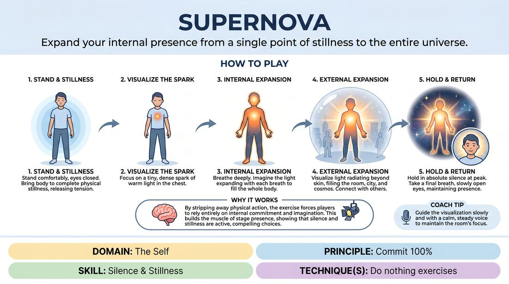

# The Radiant Core

{ .game-hero }

> Expand your internal presence from a single point of stillness to the entire universe.

## Overview
A quiet, guided visualization exercise where players stand in absolute stillness with eyes closed, imagining a point of light in their chest expanding outward. It transitions the room from chaotic energy to a state of deep, shared focus and physical presence.

## What It Trains
- **Domain:** D1 — The Self
- **Principle(s):** Commit 100%
- **Skill(s):** Silence & Stillness
- **Technique(s):** Do nothing exercises
- **Focus:** connection

**Objective:** To develop the ability to command presence through absolute physical stillness and internal commitment, learning that doing nothing can be a powerful, active choice.

## Setup
Players find a comfortable standing position anywhere in the room, ensuring they have enough personal space to stand undisturbed. No props or special staging required.

## How to Play
1. Instruct all players to stand comfortably with their feet shoulder-width apart, let their arms hang naturally, and gently close their eyes.
2. Guide the players to bring their entire physical body to complete stillness, releasing any fidgeting or tension.
3. Direct their attention to the center of their chest, prompting them to visualize a tiny, dense spark of warm, vibrant light.
4. Instruct them to breathe deeply, imagining this spark expanding with each breath to fill their torso, limbs, hands, feet, and head.
5. Guide them to visualize this light radiating outward beyond their skin, filling the immediate air around them and connecting with the other players in the room.
6. Expand the visualization further, prompting them to imagine the light filling the entire building, the surrounding city, and eventually stretching out into the atmosphere and the cosmos.
7. Hold the group in absolute silence and stillness at this peak of cosmic expansion for several deep breaths.
8. Gently bring the players back by asking them to take one final deep breath and slowly open their eyes, maintaining their physical stillness and connection to the space.

## Facilitation Notes
- Use a low, steady, and calm vocal tone to guide the visualization, matching the desired energy of the room.
- If players fidget, sway, or giggle due to discomfort with silence, side-coach them to acknowledge the urge to move, let it go, and recommit 100% to absolute stillness.
- Emphasize that doing nothing physically requires active mental commitment; stillness is not passive, it is highly charged.
- Ensure adequate time is given to the silence at the peak of the visualization to let the stillness settle.

## Variations
- The Shared Resonance: After opening eyes, players must maintain eye contact with others in absolute silence for thirty seconds without speaking or moving.
- Vocal Hum: As the light expands to fill the universe, players let out a low, collective hum that grows and fades with the visualization.

## Debrief
- How did it feel to stand completely still without any external task or action?
- What did you notice about the energy in the room when everyone committed to doing nothing?
- How can we bring this sense of internal scale and presence into our active scene work?

## Safety & Inclusion
Ensure players know they can keep their eyes softly focused on the floor if closing them entirely causes dizziness or discomfort. Provide the option to sit comfortably if standing for three minutes is physically challenging.

## Why It Works
By stripping away physical action, the exercise forces players to rely entirely on internal commitment and imagination. This builds the muscle of stage presence, showing that silence and stillness are active, compelling choices rather than empty space.
