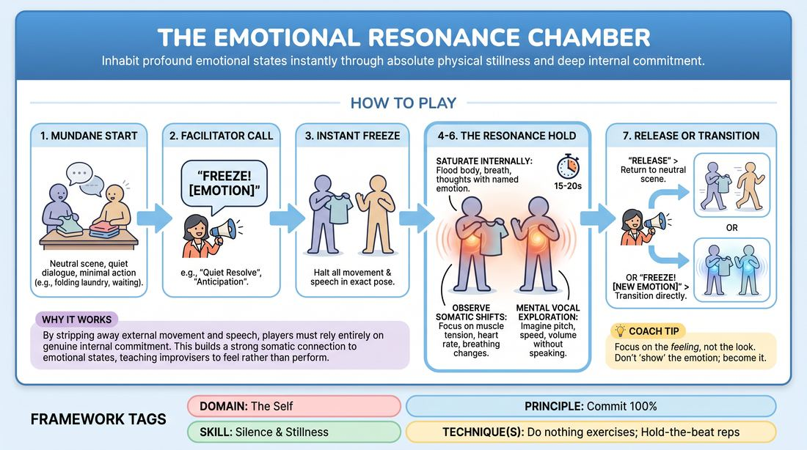

# The Resonance Chamber

{ .game-hero }

> Inhabit profound emotional states instantly through absolute physical stillness and deep internal commitment.

## Overview
A low-energy, high-focus exercise where players transition from a simple, low-stakes scene into moments of absolute physical freeze. Instead of just holding a pose, players must instantly flood their internal landscape with a designated emotion, letting it vibrate silently within them. This shifts the focus from performing an emotion for an audience to genuinely experiencing it somatically.

## What It Trains
- **Domain:** D1 — The Self
- **Principle(s):** Commit 100%; Vulnerability; The First Thought Is a Gift
- **Skill(s):** Silence & Stillness; Emotional Fluidity; Self-Recovery; Vocal Craft
- **Technique(s):** Do nothing exercises; Hold-the-beat reps; The Emotional Dial (1→10); Projection & breath support
- **Focus:** skill_drill

**Objective:** To develop absolute commitment to internal emotional states, master the power of physical stillness, and build the capacity to rapidly access and release deep feelings without relying on external theatricality.

## At a Glance
| Aspect | Detail |
|---|---|
| Players | 3–7 (ideal 3-6) |
| Time | ~10 min |
| Complexity | 2/5 |
| Skill level | advanced_beginner |
| Energy | low |
| Physicality | low |
| Modality | in_person |
| Space | minimal |
| Props | none |
| Audience | not required |

## Setup
An open, quiet room with minimal distractions. Three to seven players stand or sit in a loose circle or casual stage arrangement. No props or special materials are required.

## How to Play
1. Begin a low-stakes, neutral scene with two or three players performing a mundane task, such as waiting for a train or folding laundry, using minimal, quiet dialogue or simple gibberish.
2. The facilitator calls out 'Freeze!' followed by a specific emotion, such as 'Freeze! Quiet Resolve' or 'Freeze! Anticipation'.
3. Instantly, all players must halt all physical movement and speech, locking into their exact physical posture at that microsecond.
4. While frozen, players must immediately summon the named emotion internally, letting it saturate their body, breath, and thoughts without changing their external pose.
5. Players hold this absolute stillness for fifteen to twenty seconds, focusing on how the emotion alters their internal muscle tension, heart rate, and breathing patterns.
6. During the hold, players mentally explore how this emotion would shape their voice, such as pitch, speed, and volume, if they were to speak, without making any actual sound.
7. The facilitator calls 'Release' to return to the neutral scene, or immediately calls out a new emotion to transition directly into a different internal state.

## Facilitation Notes
- Coaching Cue: 'Don't show us the emotion; feel it. Let the audience be a fly on the wall to your internal state, not the target of a performance.'
- Pitfall & Fix: Players might try to adjust their posture to 'act out' the emotion when the freeze is called. Fix: Remind them to keep the exact physical shape they were in and let the emotion inhabit that shape, no matter how awkward or neutral it is.
- Coaching Cue: 'Notice where the emotion lives in your body. Is it in your chest, your throat, or your stomach? Breathe into that space.'
- Pitfall & Fix: Players losing focus or giggling during the silence. Fix: Keep the holds shorter initially (five to ten seconds) and gradually increase the duration as their stamina for stillness grows.

## Variations
- Emotional Dial: The facilitator adds an intensity level from one to ten, such as 'Freeze! Grief, level three' or 'Freeze! Joy, level nine', to practice emotional modulation.
- Impulse Freeze: Instead of naming an emotion, the facilitator calls 'Freeze! Your Impulse.' Players must instantly lock in and amplify the very first internal impulse or gut reaction they felt right before the freeze.
- Subtle Sound Current: While holding the freeze, players are permitted to let out a tiny, almost imperceptible vocalization, such as a soft hum, a sigh, or a sharp breath, that directly reflects the internal emotion.

## Debrief
- How did it feel to experience an emotion deeply without the pressure to show or perform it for others?
- What physical sensations did you notice changing inside your body when transitioning between contrasting emotions?
- How does practicing absolute stillness change your relationship to silence on stage?
- Did you find it easy or difficult to let go of one emotion and immediately commit one hundred percent to the next?

## Safety & Inclusion
Ensure players know they are in complete control of their emotional depth; if a prompted emotion touches on personal trauma, they can choose an adjacent, manageable variation of that feeling or step out of the freeze. Establish a clear physical 'reset' gesture, like shaking out the hands, to help players consciously shed intense emotions after the exercise.

## Why It Works
By stripping away the ability to move or speak, the game forces players to abandon external acting tricks and rely entirely on genuine internal commitment. This builds a strong somatic connection to emotional states, teaching improvisers that silence and stillness carry immense dramatic weight and that authentic presence is felt by the audience even without overt action.
