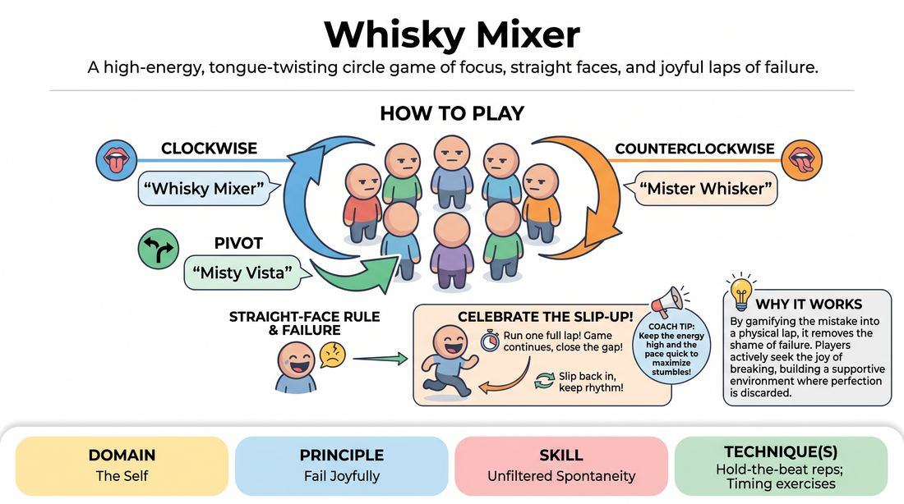

# Whisky Mixer

{ .game-hero }

> A high-energy, tongue-twisting circle game of focus, straight faces, and joyful laps of failure.

## Overview
Players stand in a circle passing specific phonetic phrases clockwise or counterclockwise while trying to maintain a deadpan expression. The moment anyone cracks a smile, laughs, or stumbles over the words, they celebrate the slip-up with a quick lap around the outside of the circle, keeping the energy high and the laughter infectious.

## What It Trains
- **Domain:** D1 — The Self
- **Principle(s):** Fail Joyfully; Group Mind
- **Skill(s):** Unfiltered Spontaneity; Silence & Stillness; Pacing & Rhythm
- **Technique(s):** Hold-the-beat reps; Timing exercises
- **Focus:** connection

**Objective:** Develops unfiltered spontaneity, rapid cognitive switching, and the ability to fail joyfully by turning mistakes and laughter into a celebrated physical action.

## Setup
A wide, standing circle with a completely clear perimeter behind the players to allow for safe running. No props or materials are required.

## How to Play
1. Have all players stand in a circle facing inward, ensuring there is ample space behind them to jog safely.
2. Establish the clockwise phrase: when passing the turn to the left (clockwise), the player must say 'Whisky Mixer'.
3. Establish the counterclockwise phrase: when passing the turn to the right (counterclockwise), the player must say 'Mister Whisker'.
4. Introduce the pivot phrase: any player, on their turn, can say 'Misty Vista' to instantly reverse the direction of the flow and switch the active phrase.
5. Enforce the straight-face rule: all players must attempt to keep a completely serious, deadpan expression throughout the game, even when it is not their turn.
6. If a player laughs, smiles, or stumbles over the words, they must immediately call out their mistake and run one full lap around the outside of the circle.
7. The game does not pause when a player runs; the remaining players must quickly close the gap and keep the rhythm going.
8. Once the runner completes their lap, they slip back into their original spot in the circle and rejoin the play.

## Facilitation Notes
- Coaching cue: 'Lean into the eye contact! Use intense focus and vocal inflections to make your neighbors crack.'
- Coaching cue: 'Celebrate the lap! It is not a punishment; it is a victory lap of joy.'
- Pitfall: Players might slow down the tempo to avoid making mistakes. Fix: Encourage a steady, driving beat. The faster the phrases travel, the more delightful the chaos becomes.
- Pitfall: Running laps becomes chaotic or unsafe. Fix: Establish a rule that all laps must be run in a single direction (e.g., always clockwise around the outside) to prevent head-on collisions.

## Variations
- Gibberish Switch: Replace the standard phrases with three nonsense words of the group's choosing to increase phonetic difficulty.
- Silent Mixer: Play the entire game using only physical gestures and facial expressions to pass the turn, maintaining the straight-face rule.
- Double Lap: If two people laugh at the same time, they must high-five behind the circle before completing their respective laps.

## Debrief
- How did it feel to run the lap? Did it feel like a punishment, or did it release the tension of making a mistake?
- How does trying not to laugh affect your focus and spontaneity?
- What happened to the group mind when multiple people were running laps at once?

## Safety & Inclusion
Ensure the running path behind the circle is completely clear of bags, chairs, or tripping hazards. For players with mobility challenges, the 'lap' can be modified to a joyful spin in place, a dramatic bow, or a designated physical gesture instead of running.

## Why It Works
By gamifying the mistake (laughing or slipping up) into a physical lap, it removes the shame of failure. Players actively seek the joy of breaking, which builds a supportive, high-energy environment where perfection is discarded in favor of playful connection.
