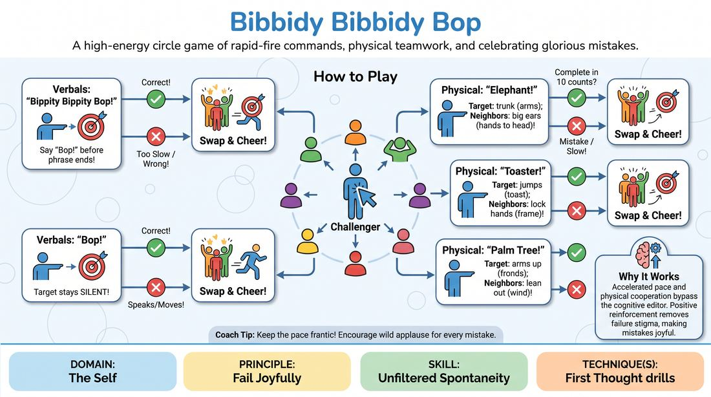

# Bippity Bippity Bop

{ .game-hero }

> A high-energy circle game of rapid-fire commands, physical teamwork, and celebrating glorious mistakes.

## Overview
Players stand in a circle with one challenger in the center who points and issues rapid-fire verbal or physical prompts. The target and their immediate neighbors must instantly coordinate specific poses or phrases before a fast countdown ends. If anyone hesitates or errs, they joyfully claim the center spot amidst roaring applause from the group.

## What It Trains
- **Domain:** D1 — The Self
- **Principle(s):** Fail Joyfully; Make Your Partner a Genius; Group Mind
- **Skill(s):** Unfiltered Spontaneity; Active Listening; Peripheral Awareness; Support Work
- **Technique(s):** First Thought drills
- **Focus:** connection

**Objective:** Develops unfiltered spontaneity, rapid physical commitment, and the ability to fail joyfully by reframing mistakes as moments of high-energy celebration.

## At a Glance
| Aspect | Detail |
|---|---|
| Players | 6+ (ideal 8-20) |
| Time | ~10 min |
| Complexity | 2/5 |
| Skill level | novice |
| Energy | high |
| Physicality | medium |
| Modality | in_person |
| Space | moderate |
| Props | none |
| Audience | not required |

## Setup
Have all players stand in a shoulder-to-shoulder circle facing inward. One player volunteer starts in the center as the Challenger. No props or materials are required.

## How to Play
1. The Challenger points at a player in the circle and says 'Bippity Bippity Bop!' The target must interrupt and say 'Bop!' before the Challenger finishes the phrase.
2. If the Challenger points and says only 'Bop!', the target must remain completely silent. Speaking or moving on a solo 'Bop' is an error.
3. If the target fails to respond in time, or speaks when they should have remained silent, they swap places with the Challenger, celebrated by a loud cheer from the entire circle.
4. Introduce three-person physical poses, starting with 'Elephant': the pointed-at target forms a trunk with their arms, while their left and right neighbors instantly form large ears with their outer arms.
5. Introduce a second pose, 'Toaster': the target jumps up and down like toast while the two neighbors lock hands around them to form the toaster frame.
6. Introduce a third pose, 'Palm Tree': the target stands straight with arms up like palm fronds while the neighbors lean outward like wind-blown branches.
7. For any three-person pose, the Challenger points, names the pose, and counts rapidly from one to ten. All three players must complete the pose before the count of ten.
8. If any of the three players makes a mistake, hesitates, or fails to complete their part of the pose in time, that player joyfully runs to the center to become the new Challenger.

## Facilitation Notes
- Side-coach players to celebrate their mistakes: 'When you mess up, throw your hands in the air, yell woohoo, and run to the center like you won the lottery!'
- Keep the Challenger's countdown fast and relentless to bypass the players' analytical filters and force instinctive reactions.
- Watch out for players becoming overly cautious or apologetic; actively pause and lead a group cheer for the first few errors to set a supportive tone.
- Remind the circle that they must maintain active peripheral awareness, as they are always responsible for supporting their neighbors at a split-second's notice.

## Variations
- Custom Creations: Allow the center Challenger to invent a brand-new three-person pose on the fly, naming it and counting to ten while the target and neighbors spontaneously improvise the shape.
- Silent Bop: Play the entire game in complete silence, using only eye contact, pointing, and physical gestures to initiate and execute the poses.
- Double Trouble: Place two Challengers in the center simultaneously, doubling the speed and requiring intense focus from the circle players.

## Debrief
- How did the group's active celebration of mistakes change your fear of messing up?
- What did you notice about your physical reaction time when you stopped overthinking?
- How did you use your peripheral vision and body language to support your neighbors without speaking?

## Safety & Inclusion
Ensure players are mindful of physical boundaries when forming close-contact poses. Offer low-impact alternatives for players with mobility constraints, such as allowing the 'Toaster' to raise their hands instead of jumping.

## Why It Works
By accelerating the pace and demanding instant physical cooperation, the game bypasses the cognitive editor. The immediate, positive reinforcement of errors removes the stigma of failure, transforming mistakes into a shared source of joy and connection.
