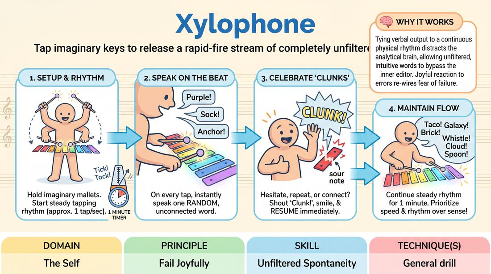

# Xylophone

{ .game-hero }

> Tap imaginary keys to release a rapid-fire stream of completely unfiltered, random words.

## Overview
Xylophone is a solo spontaneity drill where the player uses the physical metaphor of playing a mallet instrument to bypass their inner editor. By striking imaginary keys in a steady rhythm, the player forces themselves to speak random, disconnected words on every beat, celebrating any hesitation as a joyful 'sour note'.

## What It Trains
- **Domain:** D1 — The Self
- **Principle(s):** Fail Joyfully
- **Skill(s):** Unfiltered Spontaneity
- **Focus:** skill_drill

**Objective:** To develop unfiltered spontaneity and the ability to fail joyfully by maintaining a steady verbal rhythm without planning, censoring, or correcting mistakes.

## At a Glance
| Aspect | Detail |
|---|---|
| Players | 1–1 (ideal 1) |
| Time | ~1 min |
| Complexity | 1/5 |
| Skill level | novice |
| Energy | low |
| Physicality | none |
| Modality | in_person |
| Space | minimal |
| Props | none |
| Audience | not required |

## Setup
Stand or sit comfortably with a small clear space in front of you. Imagine a classic wooden xylophone resting at waist height. No physical props or partners are required.

## How to Play
1. Hold two imaginary mallets in your hands, hovering over your imaginary waist-high xylophone.
2. Begin tapping the imaginary keys in a steady, moderate rhythm of about one tap per second.
3. Every single time an imaginary mallet strikes a key, speak one random word aloud instantly.
4. Ensure the words have absolutely no logical connection, narrative thread, or associative pattern to the previous words.
5. If you hesitate, repeat a word, or make a logical connection, consciously celebrate this 'sour note' by shouting 'Clunk!', smiling, and immediately resuming the rhythm.
6. Continue this steady, rhythmic play for exactly one minute, focusing on speed and rhythm over making 'good' choices.

## Facilitation Notes
- Coaching cue: 'Keep the mallets moving!' The physical rhythm helps bypass the analytical brain.
- Pitfall: Players trying to tell a story or group words by category (e.g., 'apple, banana, orange'). Fix: Encourage them to jump wildly across categories (e.g., 'brick, gravity, soup, Tuesday').
- Coaching cue: 'Embrace the clunk!' When a pause happens, make the 'Clunk!' sound loud and cheerful to train the brain to associate mistakes with playfulness.
- If playing in a group setting, have everyone practice simultaneously in their own space to reduce self-consciousness and encourage individual focus.

## Variations
- Pitch Shift: Match the vocal pitch of the word to the physical position of the key, using a high pitch on the right and a low pitch on the left.
- Gibberish Keys: Instead of real words, speak nonsense syllables or gibberish sounds with each tap, focusing purely on vocal variety and speed.

## Debrief
- How did maintaining a physical rhythm affect your ability to think of words?
- What did it feel like to celebrate the 'clunks' instead of feeling frustrated by them?
- How did your inner editor try to sneak in and create patterns or logical connections?

## Safety & Inclusion
This solo exercise is highly accessible and can be performed seated. Players with limited hand mobility can tap a foot, nod their head, or simply blink to establish the rhythm.

## Why It Works
By tying verbal output to a continuous physical rhythm, the game occupies the analytical left-brain with motor control, allowing the intuitive right-brain to release unfiltered words. Forcing a joyful reaction to mistakes re-wires the fear of failure into a lighthearted game mechanic.
