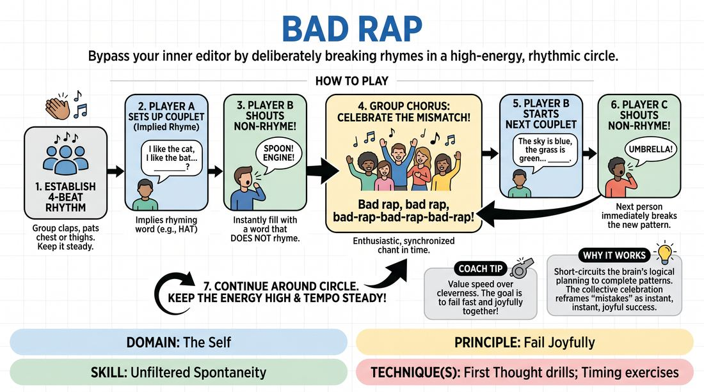

# Off-Beat Rap

{ .game-hero }

> Bypass your inner editor by deliberately breaking rhymes in a high-energy, rhythmic circle.

## Overview
In this high-energy circle game, players establish a collective rhythm and take turns setting up rhyming couplets. Instead of completing the rhyme, the next player must instantly shout a completely non-rhyming word. The entire group then celebrates this glorious mismatch with a synchronized chant, training players to value instant, unfiltered spontaneity over perfection.

## What It Trains
- **Domain:** D1 — The Self
- **Principle(s):** Fail Joyfully; The First Thought Is a Gift; Group Mind
- **Skill(s):** Unfiltered Spontaneity; Pacing & Rhythm
- **Technique(s):** First Thought drills; Timing exercises
- **Focus:** skill_drill

**Objective:** To develop unfiltered spontaneity and the ability to fail joyfully by intentionally disrupting predictable linguistic patterns and silencing the internal editor.

## Setup
Have all players stand in a circle. No props or special staging are required, though the facilitator should ensure there is enough space for everyone to comfortably clap or tap a rhythm.

## How to Play
1. Establish a collective, steady, moderate four-beat rhythm with the entire group using light handclaps, chest-pats, or thigh-slaps.
2. Player A delivers a simple, rhythmic two-line setup (a couplet) that heavily implies a specific rhyming word at the very end, but stops right before saying that final word.
3. Player B (the person to Player A's left) must instantly fill in the blank with a word that absolutely does not rhyme with the setup.
4. Immediately after Player B shouts the non-rhyming word, the entire group enthusiastically chants the chorus: 'Bad rap, bad rap, bad-rap-bad-rap-bad-rap!' in time with the established beat.
5. Once the chorus finishes, Player B immediately begins the next two-line setup, keeping the rhythm going.
6. Player C (to Player B's left) fills in the blank with another non-rhyming word, triggering the group chorus again.
7. Continue around the circle, keeping the energy high and the tempo steady, ensuring everyone gets a turn to both set up and disrupt a rhyme.

## Facilitation Notes
- Side-coaching cue: 'Don't think, just blurt! The very first word that pops into your head is the perfect word.'
- Common Pitfall: Players freeze because they are trying to find a 'funny' or 'clever' non-rhyming word. Fix: Remind them that mundane words (like 'table' or 'shoe') are hilarious in this context because they break the rhythm. Speed is more important than cleverness.
- Common Pitfall: The group rhythm falls apart during the transition. Fix: Keep a physical beat going throughout the entire game; the facilitator can act as the metronome if needed.
- Side-coaching cue: 'Celebrate the mismatch! Lean into the chant with high energy to support your teammate!'

## Variations
- Category Match: The non-rhyming word must fit the context of the sentence but still not rhyme (e.g., 'I wanted to wear my favorite shirt, so I put on my... pants').
- Double Time: Increase the tempo of the beat as the group gets more comfortable, forcing even faster, less-filtered responses.
- Physicalized Chorus: Add a specific, synchronized dance move or gesture that the entire group performs during the 'Bad rap' chorus to increase physical engagement.

## Debrief
- How did it feel to actively avoid the 'correct' rhyming word? Did your brain fight you?
- What happened to your anxiety when the entire group celebrated your 'bad' rhyme with a high-energy chant?
- How does keeping a physical rhythm help or hinder your ability to think spontaneously?

## Safety & Inclusion
This game relies on rhythm and vocalization. For players with hearing, speech, or physical rhythm challenges, allow them to establish a rhythm that works for them (e.g., nodding, swaying) and encourage any vocalization or physical gesture to represent the non-rhyming word. Ensure the group chant is supportive and never mocking.

## Why It Works
The human brain is wired to complete patterns, making rhyming intuitive and predictable. By forcing a sudden, deliberate break in this pattern, the game short-circuits the logical planning mind. The collective, high-energy chant reframes the 'mistake' (the non-rhyme) as a moment of shared celebration, deeply reinforcing the principle of failing joyfully.
