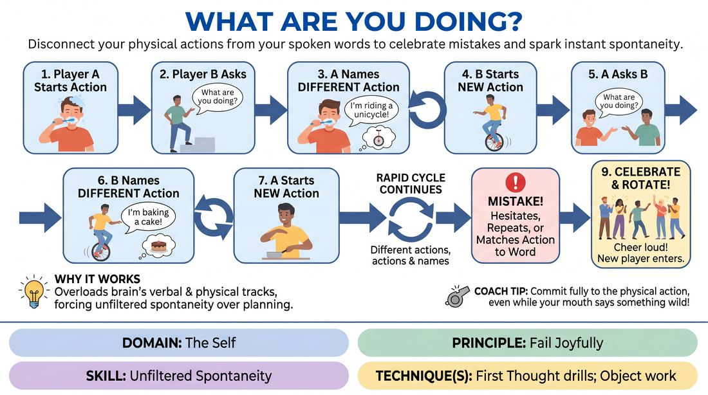

# What Are You Doing?

{ .game-hero }

> Disconnect your physical actions from your spoken words to celebrate mistakes and spark instant spontaneity.

## Overview
A fast-paced, high-energy physical drill where players perform one physical action while verbally naming a completely different one for their partner to perform. The cognitive friction inevitably leads to hilarious mistakes, which are celebrated with massive applause to build a culture of joyful failure.

## What It Trains
- **Domain:** D1 — The Self
- **Principle(s):** Fail Joyfully; The First Thought Is a Gift; Yes, And
- **Skill(s):** Unfiltered Spontaneity; Physicality & Space Work; Active Listening; Offer Reception
- **Technique(s):** First Thought drills; Object work; Endowment-acceptance
- **Focus:** skill_drill

**Objective:** To bypass the analytical mind, practice unfiltered spontaneity, and build resilience to mistakes by celebrating failure as a group.

## At a Glance
| Aspect | Detail |
|---|---|
| Players | 2+ (ideal 8-16) |
| Time | ~5 min |
| Complexity | 2/5 |
| Skill level | novice |
| Energy | high |
| Physicality | medium |
| Modality | in_person |
| Space | minimal |
| Props | none |
| Audience | not required |

## Setup
Players stand in a circle or a line. Two players step into the center to begin. No props or special staging required.

## How to Play
1. Player A begins performing a clear, repetitive physical action, such as brushing their teeth.
2. Player B steps up, looks at Player A, and asks, 'What are you doing?'
3. Player A must immediately name a completely different action, such as 'I'm riding a unicycle', while continuing to physically brush their teeth.
4. Player B must instantly begin physically miming the new action of riding a unicycle.
5. Player A then asks Player B, 'What are you doing?'
6. Player B must name a completely different action, such as 'I'm baking a cake', while continuing to physically ride the unicycle.
7. Player A must instantly switch to miming the new action of baking a cake.
8. The cycle continues rapidly back and forth until a player hesitates, repeats an action, or physically mimes the action they are verbally naming.
9. When a mistake occurs, the round ends immediately with the entire group cheering and applauding, and a new player steps in to challenge the survivor.

## Facilitation Notes
- Coaching cue: 'Don't think, just speak! Your first thought is the best thought.'
- Pitfall: Players trying to be clever or funny, which causes hesitation. Fix: Encourage mundane, simple actions like sweeping or eating an apple to keep the speed high.
- Coaching cue: 'Celebrate the glitch!' Ensure the audience gives a massive, hero-style ovation when someone messes up, reinforcing that mistakes are the goal.
- Pitfall: Players matching their physical movement to the words they are saying. Fix: Remind them that their hands must keep doing Action A while their mouth says Action B.

## Variations
- Non-elimination Circle: Instead of head-to-head elimination, pass the question around the circle sequentially to keep everyone constantly engaged.
- Emotional Overlay: Players must perform the physical action and ask the question with a specific assigned emotion, such as terrified or ecstatic.
- Category Restriction: All named actions must fit within a specific category, like 'at the beach' or 'medieval times', to add a light cognitive constraint.

## Debrief
- How did it feel when your brain glitched and you made a mistake? How did the group's reaction change that feeling?
- What happened when you tried to plan your next answer instead of staying in the moment?
- How does accepting the very first thought that pops into your head help you stay spontaneous?

## Safety & Inclusion
Ensure physical actions are accessible to all physical abilities; players can adapt any physical mime to match their mobility level, including seated miming.

## Why It Works
The game deliberately overloads the brain's executive function by splitting verbal and physical tracks. By forcing this cognitive overload, players cannot plan or censor themselves, forcing them to rely on unfiltered spontaneity. When the system inevitably crashes, the immediate positive reinforcement of applause reframes failure as a joyful, shared release rather than a source of shame.
