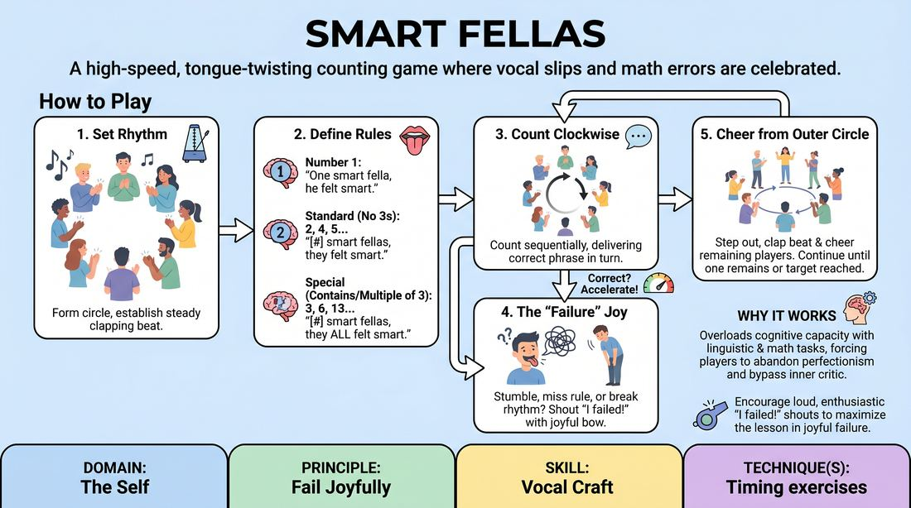

# Smart Fellas

{ .game-hero }

> A high-speed, tongue-twisting counting game where vocal slips and math errors are celebrated.

## Overview
Players stand in a circle and count upward sequentially while navigating a tricky tongue-twister and a mathematical pattern. The combination of mental math and rapid articulation inevitably leads to hilarious vocal slip-ups, making it an excellent tool for embracing mistakes.

## What It Trains
- **Domain:** D1 — The Self
- **Principle(s):** Fail Joyfully; Group Mind
- **Skill(s):** Vocal Craft; Pacing & Rhythm
- **Technique(s):** Timing exercises
- **Focus:** skill_drill

**Objective:** Develops vocal articulation, rhythmic pacing, mental agility, and the ability to fail joyfully under pressure.

## At a Glance
| Aspect | Detail |
|---|---|
| Players | 3+ (ideal 8-15) |
| Time | ~5 min |
| Complexity | 2/5 |
| Skill level | novice |
| Energy | medium |
| Physicality | none |
| Modality | in_person |
| Space | minimal |
| Props | none |
| Audience | not required |

## Setup
Players stand in a circle facing inward. No props or special materials are required.

## How to Play
1. Form a circle and establish a steady, moderate clapping rhythm to keep the pace.
2. Explain that the group will count upward sequentially, with each player delivering the correct phrase for their number in turn.
3. Introduce the phrase for number 1: 'One smart fella, he felt smart.'
4. Introduce the standard phrase for numbers that do NOT contain the digit 3 and are NOT multiples of 3: '[Number] smart fellas, they felt smart.'
5. Introduce the special phrase for numbers that DO contain the digit 3 OR are multiples of 3: '[Number] smart fellas, they all felt smart.'
6. Begin the count with the first player and move clockwise around the circle.
7. If a player stumbles on the tongue-twister, misses a math rule, or breaks the rhythm, they must shout 'I failed!' with a joyful bow, then step to the outer circle.
8. Eliminated players join the outer circle to clap the beat and cheer on the remaining active players.
9. The game continues accelerating until only one player remains or the group successfully reaches a high target number.

## Facilitation Notes
- Encourage players to prioritize the physical rhythm over perfect calculation; keeping the beat makes the game fun and challenging.
- Remind players to use crisp consonants, focusing on the teeth, lips, and tongue to navigate the 's' and 'f' sounds.
- If players get too tense, pause and have everyone intentionally chant the common slip-up 'one fart smeller' to break the ice and reduce performance anxiety.
- Ensure the 'joyful failure' bow is enthusiastic and supported by immediate applause from the entire group.

## Variations
- No Elimination: Instead of players stepping out, any mistake simply resets the count back to one with the next player, keeping everyone continuously engaged.
- Physicalized Accents: Add a physical gesture, such as a jump or a spin, on every number that contains a three or is a multiple of three.
- Reverse Direction: Change the direction of the count around the circle every time a multiple of five is reached.

## Debrief
- How did your relationship with making mistakes change as the game got faster?
- What physical adjustments did you make to keep your speech clear under pressure?
- How did the support of the group clapping and cheering affect your anxiety about failing?

## Safety & Inclusion
For groups with speech, language, or neurodivergent differences, use the 'No Elimination' variation to prevent anyone from feeling singled out, and allow players to use simplified phrases if needed.

## Why It Works
By overloading the brain with both a linguistic tongue-twister and a mathematical rule, cognitive capacity is quickly exceeded. This structural guarantee of failure forces players to abandon perfectionism, bypass their inner critic, and find genuine joy in the resulting absurdity.
