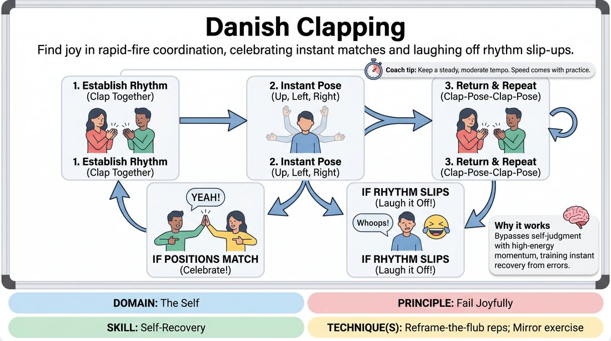

# Sync and Celebrate

{ .game-hero }

> Find joy in rapid-fire coordination, celebrating instant matches and laughing off rhythm slip-ups.

## Overview
A high-energy, fast-paced partner game where players attempt to maintain a steady physical rhythm while making spontaneous spatial choices. Standing face-to-face, partners alternate between clapping together and throwing their arms into one of three distinct positions. When their positions accidentally match, they erupt into an enthusiastic celebration before immediately diving back into the beat.

## What It Trains
- **Domain:** D1 — The Self
- **Principle(s):** Fail Joyfully; Make Your Partner a Genius
- **Skill(s):** Self-Recovery; Unfiltered Spontaneity; Active Listening; Single-Partner Empathy & Mirroring
- **Technique(s):** Reframe-the-flub reps; Mirror exercise
- **Focus:** connection

**Objective:** To build rapid self-recovery and a joyful relationship with mistakes by reframing coordination slips, hesitation, and missed cues as opportunities for playful connection rather than failure.

## Setup
Players pair up and stand facing each other with about arm's length of space between them. No props or special materials are required.

## How to Play
1. Establish a steady, moderate tempo with your partner by clapping your own hands together simultaneously.
2. Immediately after the clap, both players must instantly strike one of three arm positions: arms straight up, arms pointing to the left, or arms pointing to the right.
3. Bring your hands back to the center to clap together again, maintaining the established rhythm of clap, pose, clap, pose.
4. If your arm positions do not match, simply continue the rhythm without pausing: clap, then strike your next spontaneous pose.
5. If your arm positions match perfectly (e.g., both players point left), break the rhythm to high-five each other with both hands, shout 'YEAH!' in celebration, and then immediately clap to restart the cycle.
6. If anyone hesitates, misses a beat, or messes up the pattern, both partners must instantly laugh it off, yell 'Whoops!', clap, and resume the game without stopping to analyze the error.

## Facilitation Notes
- Side-coaching cue: 'Keep the tempo steady! Don't slow down to think about your next move.'
- Side-coaching cue: 'Celebrate the mismatches and the rhythm breaks just as loudly as the perfect matches!'
- Pitfall: Players freeze or apologize when they make a mistake. Fix: Encourage them to replace 'Sorry' with a physical gesture of celebration or a quick laugh, immediately returning to the clap.
- Pitfall: Players try to coordinate or signal their next move. Fix: Remind them that the joy comes from the surprise of accidental alignment, not planned synchronization.

## Variations
- Sound Effects: Instead of silent poses, assign a distinct, silly sound effect to each of the three arm positions that must be made simultaneously with the pose.
- Group Circle: Play in a giant circle where players must match the person to their left and right simultaneously, celebrating when the entire circle matches.
- Speed Run: Gradually increase the tempo every 30 seconds, forcing players to rely entirely on muscle memory and instinct.

## Debrief
- How did it feel when you messed up the rhythm compared to when you matched your partner?
- What strategies did you use to recover quickly when the pattern fell apart?
- How does celebrating mistakes change your physical tension and mental focus during a high-pressure task?

## Safety & Inclusion
For players with limited mobility or shoulder issues, the three arm positions can be modified to smaller gestures (e.g., thumbs up, hands on hips, hands on heart) or facial expressions. Ensure high-fives are gentle and consensual, or replace them with a vocal celebration.

## Why It Works
By pairing physical rhythm with rapid, unpredictable choices, the game bypasses the analytical brain. When mistakes inevitably happen, the high-energy momentum forces players to bypass self-judgment and immediately recover, training the brain to associate coordination failures with playfulness and connection.
