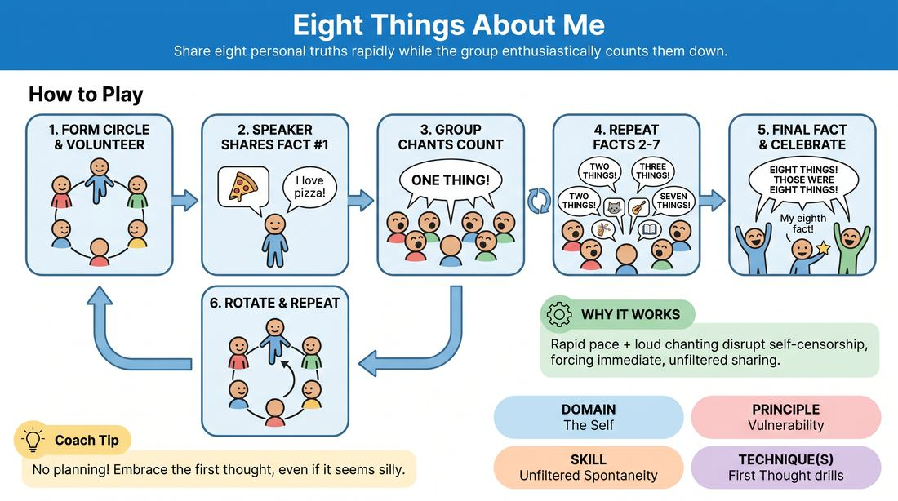

# Eight Things About Me

{ .game-hero }

> Share eight personal truths rapidly while the group enthusiastically counts them down.

## Overview
A high-energy, low-stakes icebreaker where players take turns standing in the center of a circle to share eight true facts about themselves. The surrounding group supports them by loudly chanting the count after each statement, creating a supportive wall of sound that bypasses self-censorship.

## What It Trains
- **Domain:** D1 — The Self
- **Principle(s):** Vulnerability; The First Thought Is a Gift; Group Mind
- **Skill(s):** Unfiltered Spontaneity; Support Work
- **Technique(s):** First Thought drills
- **Focus:** connection

**Objective:** To practice unfiltered spontaneity and vulnerability by sharing personal truths without overthinking, while the group practices active, enthusiastic support.

## Setup
Players stand in a circle. No props or special staging required; just enough space for everyone to see and hear each other.

## How to Play
1. Form a standing circle with all participants.
2. One volunteer steps into the center of the circle to share eight true facts about themselves.
3. The speaker shares their first fact, which can be as simple or profound as they like.
4. Immediately after the fact is shared, the outer circle enthusiastically chants in unison: 'One thing!'
5. The speaker continues sharing facts one by one, without pausing to plan or filter.
6. After each subsequent fact, the outer circle chants the corresponding number, such as 'Two things!' up to 'Seven things!'
7. When the eighth fact is shared, the outer circle celebrates by chanting: 'Eight things! Those were eight things!' accompanied by a round of applause.
8. The speaker steps back into the circle, and a new volunteer steps into the center to repeat the process until everyone has had a turn.

## Facilitation Notes
- Coaching cue: 'Speak your first thought! Don't search for the perfect or coolest fact.'
- If players pause to think of interesting facts, encourage them to share incredibly mundane things like 'I am wearing blue shoes' to keep the momentum going.
- Coaching cue: 'Outer circle, match and elevate the speaker's energy. Your chant is a safety net, not a judgment.'
- Remind the group that their loud, rhythmic support is what makes it safe for the speaker to be vulnerable and spontaneous.

## Variations
- Rapid Five: Reduce the count to five things but increase the tempo, forcing even faster, less-filtered responses.
- Fictional Persona: Play the game in character, sharing eight facts about a made-up character to practice spontaneous character building.
- Themed Eight: Restrict the facts to a specific category, such as 'Eight things I love' or 'Eight things I'm bad at' to deepen vulnerability.

## Debrief
- How did it feel when you ran out of planned facts and had to say the very first thing that came to mind?
- How did the loud, enthusiastic chanting of the group affect your willingness to share?
- What did you notice about the difference between your curated facts and your spontaneous ones?

## Safety & Inclusion
Ensure players know they can share simple, surface-level facts; vulnerability does not require sharing deep trauma or private secrets. Respect physical comfort if standing in the center feels too exposing; players can share from their spot in the circle.

## Why It Works
By combining a rapid-fire pace with loud, rhythmic group validation, the game bypasses the analytical mind's editor. The chanting acts as a cognitive disruptor, preventing the speaker from planning ahead and forcing them to rely on immediate, unfiltered honesty.
