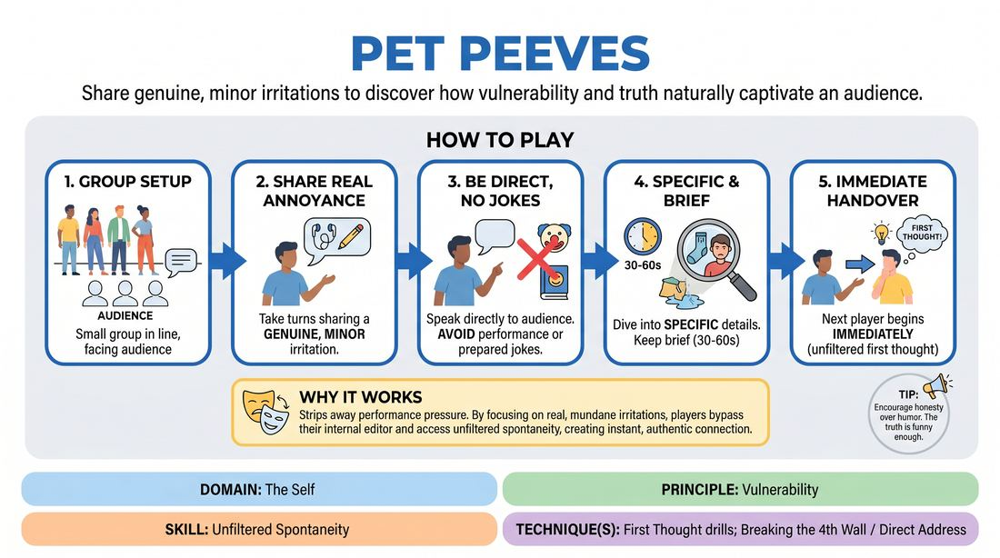

# Pet Peeves

{ .game-hero }

> Share genuine, minor irritations to discover how vulnerability and truth naturally captivate an audience.

## Overview
Players stand in a line and take turns sharing a real, minor personal annoyance with the group. By speaking with absolute honesty and specificity rather than trying to perform or tell jokes, players experience how authentic self-disclosure instantly engages an audience.

## What It Trains
- **Domain:** D1 — The Self
- **Principle(s):** Vulnerability; Truth Over Pandering
- **Skill(s):** Unfiltered Spontaneity; Audience-Energy Management; Stage Presence & Clarity
- **Technique(s):** First Thought drills; Breaking the 4th Wall / Direct Address
- **Focus:** skill_drill

**Objective:** To develop unfiltered spontaneity and vulnerability by sharing genuine personal truths, demonstrating that authentic human experience is inherently compelling and humorous without the need to manufacture jokes.

## Setup
An in-person playing space where 5 to 10 players can stand in a line facing the rest of the group (who act as the audience). No props or materials are required.

## How to Play
1. Invite a small group of players (ideally 5) to stand in a line facing the audience.
2. Explain that each player will take turns sharing one genuine, minor pet peeve—a small, everyday irritation that truly bothers them.
3. Instruct players to speak directly to the audience, using first-person language, and to avoid any pre-planned jokes, stand-up routines, or performative characters.
4. Encourage the active speaker to dive into specific details: when this annoyance happens, exactly what it looks or feels like, and their genuine emotional reaction to it.
5. Keep the shares brief (around 30 to 60 seconds per person) to maintain momentum and prevent overthinking.
6. Once a player finishes, the next person in line immediately begins their share, practicing first-thought spontaneity without filtering or editing their choice of peeve.
7. Rotate through the line until everyone has shared, then swap in a new group of players from the audience to repeat the exercise.

## Facilitation Notes
- Side-coaching cue: 'Speak as yourself, not a character.' If a player starts using a stand-up comedy cadence, gently interrupt and ask them to tell it to a friend.
- Watch out for players choosing 'safe' or generic peeves (like 'traffic' or 'slow internet') without personal detail. Prompt them: 'What is a weirdly specific one that is unique to you?'
- Encourage physical stillness and direct eye contact with the audience to build stage presence and ground their vulnerability.
- If a player gets stuck, coach them to focus on the physical sensation of the irritation: 'Where do you feel that annoyance in your body when it happens?'

## Variations
- The Deep Dive: After the initial share, the facilitator or audience can ask one follow-up question to push the player into even deeper, more specific honesty.
- Emotional Escalation: Have the player start the share calmly and gradually let the genuine, petty frustration build in intensity, exploring the comedy of over-reacting to something minor.
- The 'Me Too' Chorus: If an audience member deeply resonates with a shared peeve, they can quietly step up and stand behind the speaker in solidarity, visually mapping shared human quirks.

## Debrief
- How did it feel to share a real, unfiltered part of yourself without trying to be funny?
- Why do you think the audience laughed or leaned in during the most specific, honest moments?
- What is the difference in energy between trying to invent a joke versus simply telling the truth?

## Safety & Inclusion
Ensure players know they should only share minor, low-stakes annoyances rather than deep personal traumas. This keeps the space safe and light while still practicing genuine vulnerability.

## Why It Works
This drill works because it strips away the pressure to 'perform' or 'be clever.' By focusing on a real, mundane irritation, players bypass their internal editor and access unfiltered spontaneity. The audience connects with the recognizable truth of the moment, proving that vulnerability and authenticity are the ultimate sources of comedic tension and relief.
