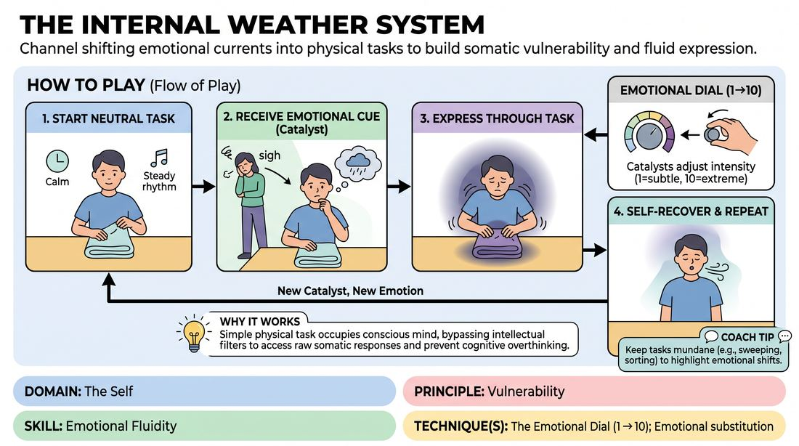

# Internal Weather System

{ .game-hero }

> Channel shifting emotional currents into physical tasks to build somatic vulnerability and fluid expression.

## Overview
In this exercise, a central player performs a repetitive, mundane task while surrounding players act as emotional catalysts. These catalysts send non-verbal vocal and physical impulses that the central player must absorb, let alter their internal state, and express through their physical work. The experience trains players to fluidly navigate diverse emotional states and return to a centered baseline.

## What It Trains
- **Domain:** D1 — The Self
- **Principle(s):** Vulnerability; Commit 100%; The First Thought Is a Gift
- **Skill(s):** Emotional Fluidity; Physicality & Space Work; Vocal Craft; Self-Recovery; Unfiltered Spontaneity; Active Listening; Offer Reception
- **Technique(s):** The Emotional Dial (1→10); Emotional substitution; Character Walks/Centers; Gibberish; Do nothing exercises
- **Focus:** skill_drill

**Objective:** To develop emotional fluidity and somatic vulnerability by practicing the real-time integration of external emotional stimuli into physical action, while mastering the art of self-recovery.

## Setup
Form a circle of 5 to 7 players in an open space. Designate one player to stand in the center as the Active Player, while the remaining players stand in a semi-circle around them as the Echoes.

## How to Play
1. The facilitator assigns the Active Player a simple, repetitive physical task, such as sweeping a floor, folding laundry, or polishing a glass.
2. The Active Player begins performing this task at a neutral, calm baseline, establishing a steady physical rhythm.
3. An Echo player initiates an emotional current by sending a non-verbal cue, such as a gibberish phrase, a sigh, a gasp, or a distinct physical posture.
4. The Active Player pauses briefly to receive the cue, letting the emotional tone land in their body and alter their internal state.
5. The Active Player resumes their physical task, but now executes it through the lens of this new emotion, altering their movement speed, weight, and breathing.
6. The Echoes can use hand gestures to adjust the 'Emotional Dial,' signaling the Active Player to scale the intensity of the emotion from a subtle 1 to an extreme 10.
7. Once the emotion peaks, the Active Player allows the feeling to naturally subside, practicing 'self-recovery' to return to a functional, centered baseline while continuing the task.
8. The process repeats with a different Echo introducing a new emotional current, allowing the Active Player to transition through multiple distinct states.

## Facilitation Notes
- Side-coach the Active Player to 'do nothing' for a split second when they receive a cue, ensuring they actually feel the shift before reacting.
- Watch out for players who abandon their physical task to act out the emotion; remind them that the task is the anchor that makes the emotional shift visible.
- Encourage Echoes to offer clear, singular emotional tones rather than complex, muddy signals, making it easier for the Active Player to respond cleanly.
- Use the cue: 'Let the breath lead the change' to help players transition out of their heads and into their bodies.

## Variations
- Clashing Currents: Two Echoes deliver contrasting emotional cues simultaneously, forcing the Active Player to navigate and express internal conflict.
- Rapid Weather: The facilitator calls out rapid transitions, challenging the Active Player to shift emotional states with minimal recovery time.

## Debrief
- How did anchoring your focus on a physical task affect your ability to experience and express different emotions?
- What did you discover about your capacity to 'recover' and return to center after expressing a high-intensity emotion?
- How can practicing this somatic vulnerability help you support your scene partners during high-stakes moments?

## Safety & Inclusion
Establish a clear, non-verbal 'stop' signal before beginning. Remind players that they are in complete control of their emotional boundaries and can choose to dial down the intensity of any state that feels uncomfortable or overwhelming.

## Why It Works
By keeping the conscious mind occupied with a simple physical task, the game bypasses intellectual filters and accesses raw somatic responses. The non-verbal nature of the cues prevents cognitive overthinking, forcing the player to rely on immediate, intuitive emotional resonance and physical expression.
