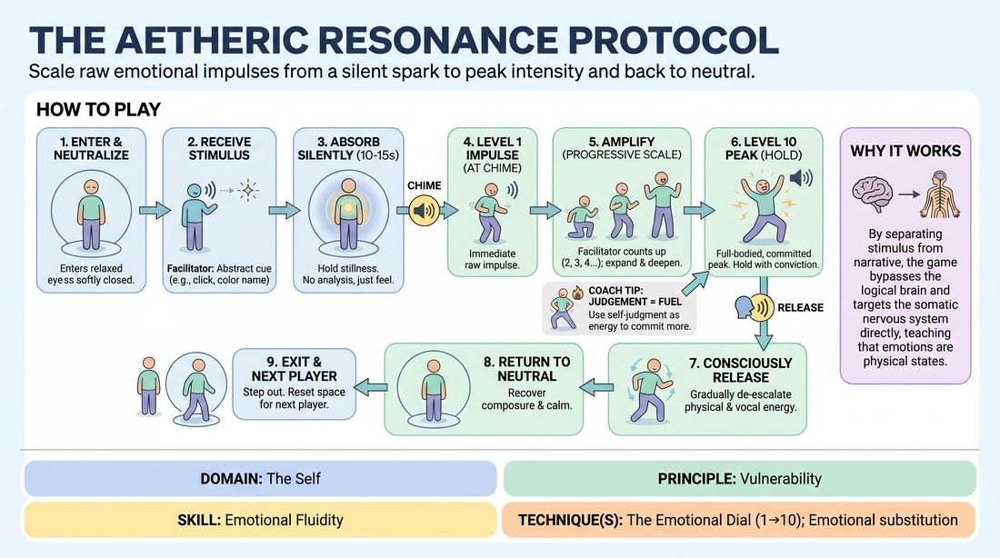

# The Resonance Dial

{ .game-hero }

> Scale raw emotional impulses from a silent spark to peak intensity and back to neutral.

## Overview
The Resonance Dial is an advanced solo training drill designed to build deep emotional fluidity and somatic control. A single player steps into a designated space to receive an abstract, non-verbal stimulus, silently absorbs its impact, and then systematically scales their physical and vocal response from a subtle level 1 to an explosive level 10 before mindfully de-escalating back to calm neutrality.

## What It Trains
- **Domain:** D1 — The Self
- **Principle(s):** Commit 100%; Fail Joyfully; Vulnerability; The First Thought Is a Gift
- **Skill(s):** Unfiltered Spontaneity; Emotional Fluidity; Physicality & Space Work; Vocal Craft; Silence & Stillness; Self-Recovery
- **Technique(s):** The Emotional Dial (1→10); Emotional substitution; Weight & resistance mime; Projection & breath support; Vocal characterization; Do nothing exercises
- **Focus:** skill_drill

**Objective:** Develops emotional fluidity, somatic commitment, and self-recovery by training players to consciously manipulate their emotional intensity (the Emotional Dial) and safely navigate high-energy performance states.

## At a Glance
| Aspect | Detail |
|---|---|
| Players | 3–8 (ideal 3-8) |
| Time | ~20 min |
| Complexity | 4/5 |
| Skill level | proficient |
| Energy | high |
| Physicality | high |
| Modality | in_person |
| Space | moderate |
| Props | bell, chime |
| Audience | not required |

## Setup
Set up a clear, moderate-sized playing space in the center of the room (the 'Resonance Zone'). The remaining 2 to 7 players sit in a semi-circle as supportive observers. The facilitator needs a small bell, chime, or clicker to signal transitions.

## How to Play
1. One player steps into the Resonance Zone and stands in a relaxed, neutral posture with their eyes closed or focused softly ahead.
2. The facilitator delivers a single, abstract, non-linguistic stimulus, such as a sharp vocal click, a sustained low hum, a primary color name like 'Cobalt', or a sensory texture word like 'Viscous'.
3. The player stands in complete silence and stillness for 10 to 15 seconds, letting the stimulus resonate internally without analyzing, planning, or intellectualizing a response.
4. At the sound of the facilitator's chime, the player immediately externalizes their very first, raw physical or vocal impulse at 'Level 1' on the emotional dial (e.g., a tiny finger twitch, a soft sigh, or a subtle shift in weight).
5. The facilitator calls out 'Amplify' or counts upward (2, 3, 4...) to prompt the player to progressively expand, deepen, and magnify this physical and vocal expression.
6. If the player experiences any self-judgment or feels they have 'failed' the impulse, they must immediately lean into that feeling of awkwardness and use it as physical fuel to amplify the expression further.
7. The player continues scaling up until they reach 'Level 10'—a fully committed, full-bodied, and full-voiced peak expression of the state, holding it with absolute vulnerability for a few seconds.
8. The facilitator calls out 'Release', signaling the player to consciously and gradually de-escalate their physical and vocal energy, mindfully returning to a calm, neutral baseline.
9. Once the player has fully recovered their composure and returned to a neutral state, they step out of the space, and the next player enters without any immediate verbal critique from the group.

## Facilitation Notes
- Side-coach with neutral, steady prompts like 'Amplify' or direct numbers (1 to 10) to keep the player out of their analytical mind.
- Pitfall: Players often jump straight from Level 2 to Level 10. Fix: Remind them to explore the micro-steps of the dial, treating each number as a distinct physical and vocal shift.
- Pitfall: Intellectualizing the stimulus (e.g., acting out a literal story based on the word 'Viscous'). Fix: Side-coach them to focus purely on the physical sensation and breath rather than a narrative.
- Encourage players to 'fail joyfully' by physically exaggerating any moments of hesitation or self-doubt, turning mental blocks into physical movement.
- Ensure the 'Release' phase is given adequate time; do not rush the transition back to neutrality, as self-recovery is a core skill being trained.

## Variations
- Dual Resonance: Two players enter the space simultaneously, each receiving a different abstract stimulus, scaling their dials while remaining aware of each other's physical presence without direct interaction.
- Accelerated Dial: Shorten the entire cycle to 30 seconds total, forcing rapid-fire transitions from silence to peak to recovery to build high-speed emotional agility.
- Internalized Dial: The player scales the emotional intensity from 1 to 10 internally, expressing it externally only through micro-movements, breath, and eye contact.

## Debrief
- How did it feel to sit in silence with the stimulus before reacting? What did you notice about your brain's desire to plan?
- At what point on the dial (1-10) did you feel the most resistance, and how did you move past it?
- What physical or vocal strategies helped you successfully transition from a level 10 peak back to a calm, neutral baseline?

## Safety & Inclusion
Because this exercise accesses high-intensity emotional states, establish a clear 'opt-out' signal (like crossing arms over the chest) if a player feels overwhelmed. Remind participants that they are in control of their physical boundaries and can choose to scale their 'Level 10' to a level that feels safe and manageable for their nervous system today.

## Why It Works
By separating the stimulus from narrative context, the game bypasses the logical brain and targets the somatic nervous system directly. The structured progression of the Emotional Dial teaches players that emotions are physical states that can be consciously entered, amplified, and exited, demystifying intense vulnerability and building deep self-trust.
