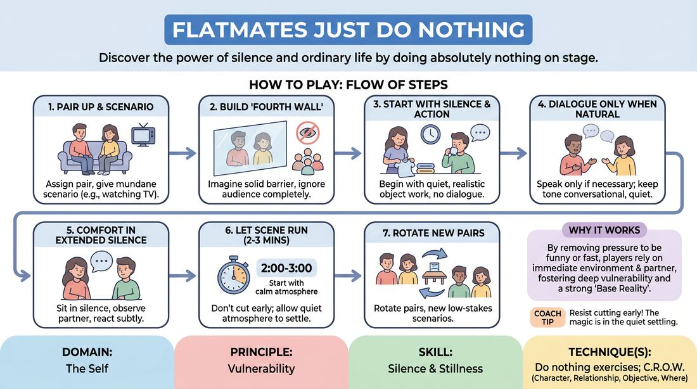

# The Quiet Roommates

{ .game-hero }

> Discover the power of silence and ordinary life by doing absolutely nothing on stage.

## Overview
In this low-stakes scene-work exercise, players inhabit a shared space and perform mundane, everyday tasks without the pressure to be funny or fast. By embracing silence and a realistic 'fourth wall,' players discover that doing nothing builds a rich, believable base reality. The experience shifts the focus from performing for the audience to genuinely connecting with a partner.

## What It Trains
- **Domain:** D1 — The Self
- **Principle(s):** Vulnerability; Make Your Partner a Genius; Base Reality First
- **Skill(s):** Silence & Stillness; Active Listening; World-Building
- **Technique(s):** Do nothing exercises; C.R.O.W. (Character, Relationship, Objective, Where)
- **Focus:** connection

**Objective:** Develops vulnerability, silence, stillness, active listening, and establishing a base reality first by resisting the urge to invent conflict or jokes.

## At a Glance
| Aspect | Detail |
|---|---|
| Players | 2+ (ideal 2-16) |
| Time | ~15 min |
| Complexity | 2/5 |
| Skill level | novice |
| Energy | low |
| Physicality | low |
| Modality | in_person |
| Space | minimal |
| Props | none |
| Audience | not required |

## Setup
Set up two chairs or a simple performance space representing a familiar, everyday environment. No physical props are needed; all object work is mimed. Players work in pairs while the rest of the group acts as supportive observers.

## How to Play
1. Assign a pair of players to the stage and give them a simple, mundane scenario, such as roommates watching television or coworkers sitting in a breakroom.
2. Instruct the players to imagine a solid 'fourth wall' between themselves and the audience, allowing them to completely ignore the onlookers.
3. Begin the scene with physical action and silence rather than dialogue, focusing on realistic, slow-paced object work like folding laundry or sipping a warm drink.
4. Allow dialogue to emerge only when it feels completely natural and necessary, keeping the tone conversational, quiet, and ordinary.
5. Encourage players to comfortably sit in silence for extended periods, observing their partner's physical choices and reacting to them subtly.
6. Let the scene run for two to three minutes, resisting the urge to cut early, allowing the quiet atmosphere to fully settle.
7. Rotate new pairs onto the stage with different low-stakes, everyday scenarios to practice the same grounded approach.

## Facilitation Notes
- Side-coach with cues like: 'Breathe. Let the silence hang. You do not need to fix it.'
- Watch out for players who panic and invent a high-stakes crisis (e.g., 'The house is on fire!'). Gently steer them back to the mundane task at hand.
- Encourage deep physical commitment by side-coaching: 'Focus on your object work. What does the mug feel like? How hot is the coffee?'
- If players rush to fill every gap with chatter, challenge them to count to three in their heads before responding to any line.

## Variations
- The Silent Partner: One player is completely silent throughout the scene, while the other speaks only when absolutely necessary, maintaining the mundane task.
- Subtext Only: Players perform the mundane task and are allowed to speak, but they must only talk about the physical objects around them, letting their relationship show through physical proximity and tone.
- The Slow-Motion Escalation: Start with absolute stillness and mundane activity, then slowly introduce one tiny, realistic point of friction without raising voices.

## Debrief
- How did it feel to sit in silence on stage without trying to be funny or clever?
- What did you notice about your partner's character just by watching their physical movements?
- How does establishing a quiet, realistic base reality make later comedic choices more powerful?
- Did you feel more or less connected to your partner when you weren't speaking?

## Safety & Inclusion
Since players are mimicking close domestic or professional quarters, remind them to respect personal space boundaries and use non-contact object work. Ensure players with mobility needs can choose comfortable seating or standing positions that suit them.

## Why It Works
By stripping away the pressure to generate plot or jokes, players are forced to rely on their immediate environment and their partner. This fosters deep vulnerability because players cannot hide behind cleverness. It builds a strong 'Base Reality First' because the physical environment and relationship are established through shared, quiet presence before any narrative conflict is introduced.
