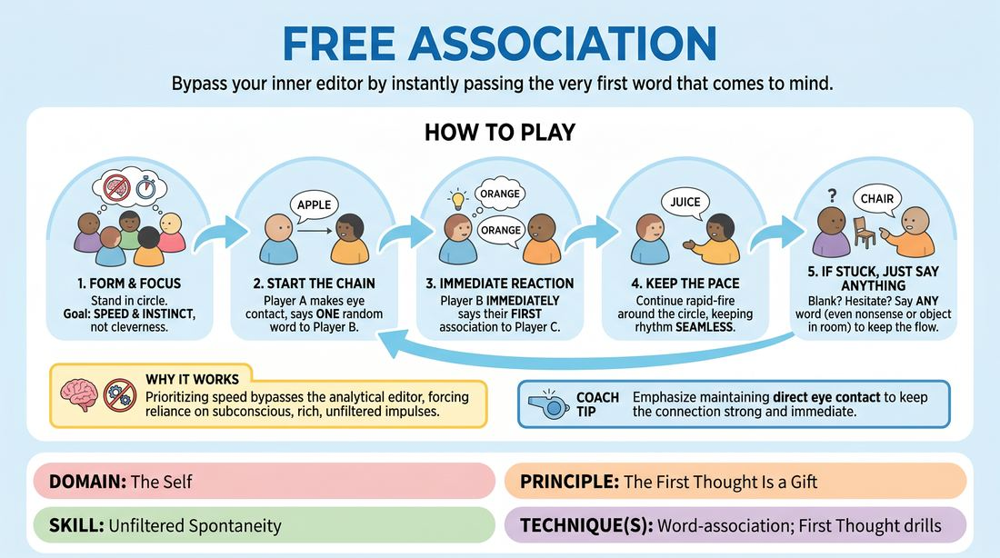

# Rapid Word Association

{ .game-hero }

> Bypass your inner editor by instantly passing the very first word that comes to mind.

## Overview
This is a high-energy, fast-paced warm-up where players stand in a circle and pass single-word associations around as quickly as possible. The game creates a playful, low-stakes environment where players learn to trust their immediate, unfiltered impulses rather than planning or searching for the perfect response.

## What It Trains
- **Domain:** D1 — The Self
- **Principle(s):** The First Thought Is a Gift; Yes, And
- **Skill(s):** Unfiltered Spontaneity; Active Listening; Offer Reception
- **Technique(s):** Word-association; First Thought drills
- **Focus:** skill_drill

**Objective:** To develop unfiltered spontaneity, active listening, and immediate offer reception by practicing the principle that the first thought is a gift.

## At a Glance
| Aspect | Detail |
|---|---|
| Players | 2+ (ideal 2-20) |
| Time | ~5 min |
| Complexity | 1/5 |
| Skill level | novice |
| Energy | medium |
| Physicality | low |
| Modality | in_person |
| Space | minimal |
| Props | none |
| Audience | not required |

## Setup
Have all players stand in a circle facing inward. No props or materials are required, just a clear space where everyone can easily see and hear one another.

## How to Play
1. Gather the group into a standing circle and explain that the goal is speed and instinct, not cleverness or humor.
2. Player A turns to the player on their right, makes direct eye contact, and says a single, random starting word.
3. The receiving player immediately says the very first word that pops into their head upon hearing that word, turning to the next player in the circle.
4. The next player immediately associates off that new word, passing their own first thought to the next person.
5. Continue this rapid-fire chain around the circle, keeping the rhythm as fast and seamless as possible.
6. If a player hesitates, blanks, or gets stuck, encourage them to say literally any word—even a nonsense word or an object they see in the room—to keep the momentum going.

## Facilitation Notes
- Use side-coaching cues like: 'Don't think, just blink and speak!' or 'Give us the raw first thought, no matter how boring!'
- Watch out for players trying to be funny or clever, which inevitably slows down the rhythm. Remind them that obvious associations (like 'grass' to 'green') are the best because they are honest and fast.
- Address self-correction (saying 'uh' or changing the word mid-breath) by instructing players to commit fully to whatever sound or word first starts to leave their mouth.
- Keep the energy high by clapping a steady, fast tempo if the group's pace begins to drag.

## Variations
- Cross-Circle Pass: Instead of going in order around the circle, players make eye contact and throw the word to anyone across the circle.
- Physical Association: Players must accompany their word with a physical gesture, and the next player must associate off both the word and the physical movement.
- Category Shift: Every ten words, the facilitator claps, and the next player must break the chain and start an entirely new, unrelated word association.

## Debrief
- How did it feel to say the very first thing that came to mind without filtering it?
- What did you notice happening to the speed of the game when you tried to plan your word in advance?
- How does trusting your first thought help reduce anxiety when stepping into an improv scene?

## Safety & Inclusion
Ensure players know that any word is fine, and if they feel genuinely stuck or uncomfortable, they can simply repeat the word they just heard or say 'pass' to keep the energy moving without shame.

## Why It Works
By prioritizing speed over cleverness, the brain's analytical editor is bypassed. This forces players to rely on their subconscious, demonstrating that their natural, unfiltered impulses are rich, sufficient, and instantly available.
