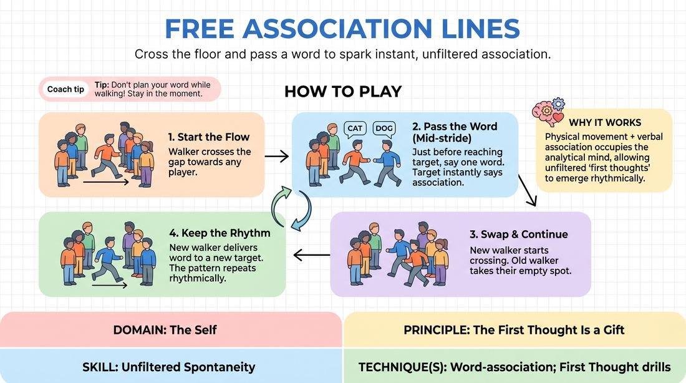

# Association Crossings

{ .game-hero }

> Cross the floor and pass a word to spark instant, unfiltered association.

## Overview
Players form two parallel lines facing each other. One player walks across the gap and delivers a single-word offer to an opposing player, who must instantly associate and cross to a new target. It is a dynamic, physicalized word-association drill that bypasses the analytical brain.

## What It Trains
- **Domain:** D1 — The Self
- **Principle(s):** The First Thought Is a Gift; Fail Joyfully; Yes, And; Group Mind
- **Skill(s):** Unfiltered Spontaneity; Active Listening; Offer Reception; Pacing & Rhythm
- **Technique(s):** Word-association; First Thought drills
- **Focus:** skill_drill

**Objective:** To develop unfiltered spontaneity and rapid offer reception by pairing physical movement with immediate, first-thought word association.

## Setup
Arrange the group into two equal parallel lines facing each other, leaving a clear gap of about 8 to 12 feet between them. No props or materials are required.

## How to Play
1. Identify one player to start the game as the active walker.
2. The active walker begins walking across the gap toward any player in the opposite line.
3. Just before reaching the target player, the walker speaks a single, spontaneous word.
4. The target player must immediately say the very first word that comes to mind in response to the word they just heard.
5. As soon as the target player speaks their associated word, they must begin walking across the gap toward a player in the opposite line.
6. The original walker steps into the empty spot left by the target player, joining that line.
7. The new walker continues the pattern, delivering their word to a new target just before they arrive, keeping the physical and verbal momentum going.

## Facilitation Notes
- Encourage players to move at a steady, deliberate pace; rushing the physical walk can cause verbal panic, while walking too slowly kills the rhythm.
- Side-coach players to speak the word just before they arrive, rather than planning it at the start of their walk.
- If a player freezes or hesitates, coach them to make any sound or say the first object they see—celebrate the 'mistake' and keep moving.
- Watch out for 'pre-planning' where players decide their word before they even start walking. Remind them that the first thought is a gift.

## Variations
- Multi-Walker Chaos: Introduce a second or third walker simultaneously to increase the energy, reduce individual pressure, and build group mind.
- Last Letter Link: The word delivered must begin with the last letter of the word received (e.g., 'Apple' leads to 'Elephant').
- Emotional Delivery: Walkers must deliver their word with a specific, strong emotion, which the receiver must adopt and use for their own crossing.

## Debrief
- How did the physical act of walking affect your ability to think of a word?
- What happened when you tried to pre-plan your word versus letting it happen spontaneously?
- How did it feel when there were multiple people crossing at the same time?

## Safety & Inclusion
Ensure the walking path is clear of tripping hazards. Players with mobility considerations can participate by using a designated gesture or pointing instead of walking, or the lines can be brought closer together to minimize physical travel.

## Why It Works
By combining physical movement with verbal association, the game occupies the analytical mind, allowing the subconscious to deliver unfiltered 'first thoughts.' The physical hand-off of the spot creates a clear, rhythmic structure that supports rapid offer reception and joyful failure.
