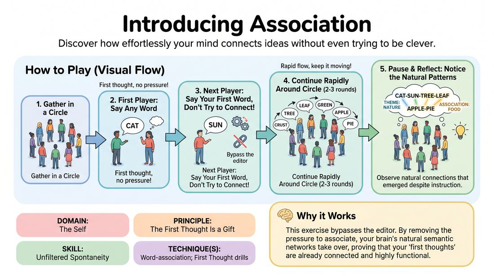

# Accidental Association

{ .game-hero }

> Discover how effortlessly your mind connects ideas without even trying to be clever.

## Overview
A low-stakes introductory exercise where players speak single words in a circle under the guise of complete randomness. As the words flow, the group naturally discovers that the human brain cannot help but create patterns, themes, and associations. It serves as a powerful, experiential proof that our first thoughts are already connected to the group mind.

## What It Trains
- **Domain:** D1 — The Self
- **Principle(s):** The First Thought Is a Gift; Group Mind
- **Skill(s):** Unfiltered Spontaneity; Thematic Synthesis
- **Technique(s):** Word-association; First Thought drills
- **Focus:** skill_drill

**Objective:** To demonstrate the inevitability of word-association and to build trust in one's unfiltered, immediate thoughts by showing that the mind naturally synthesizes themes without conscious effort.

## Setup
Players stand in a circle facing inward. No props or special staging are required. The facilitator should frame this as a simple, low-pressure warm-up.

## How to Play
1. Gather the group into a standing circle.
2. Instruct the first player to say any single word that comes to mind, emphasizing that there is no right or wrong choice.
3. Direct the player to their immediate left to follow with another single word, completely of their own choosing.
4. Explicitly instruct the players not to try to connect their word to the previous word; they should simply say the very first word that pops into their head.
5. Continue sending single words rapidly around the circle, player by player, for two or three full rotations.
6. Pause the circle and ask the group what they noticed about the sequence of words that emerged.
7. Highlight the moments where clear thematic threads, direct associations, or narrative patterns naturally occurred despite the instruction to be random.

## Facilitation Notes
- Coaching Cue: 'Don't plan! Let the word drop out of your mouth the moment it is your turn.'
- Pitfall: Players trying to be deliberately random or 'weird' to break the chain. Fix: Remind them that true randomness is harder than letting the brain do its natural work; encourage them to accept the very first mundane word that appears.
- Coaching Cue: 'Keep the tempo brisk. Speed bypasses the analytical filter.'
- Pitfall: Hesitation or pausing to think of a 'good' word. Fix: Snap your fingers gently to keep the rhythm, or encourage them to make a sound if a word doesn't immediately come.

## Variations
- The Conscious Chain: Run the circle again, but this time explicitly instruct players to build on the previous word (traditional word association) to compare how much easier it feels now that the pressure is off.
- Opposite Day: Instruct players to actively try to say a word that has absolutely nothing to do with the previous word, demonstrating how difficult it actually is to escape association.

## Debrief
- How hard was it to find a word that was truly random and unconnected to what came before?
- What does this tell us about our brain's natural ability to cooperate and build themes without planning?
- How can we use this realization to relieve pressure when we are improvising scenes?

## Safety & Inclusion
Ensure a low-pressure environment where any word (as long as it is respectful) is accepted. If a player freezes, they can pass or repeat a word without judgment.

## Why It Works
This exercise works because it bypasses the editor. By telling players they do not need to associate, we remove the pressure to 'get it right.' The brain's natural semantic networks take over, proving that our 'first thoughts' are highly functional, contextual, and collaborative. It shifts the player from a state of effortful generation to effortless reception.
