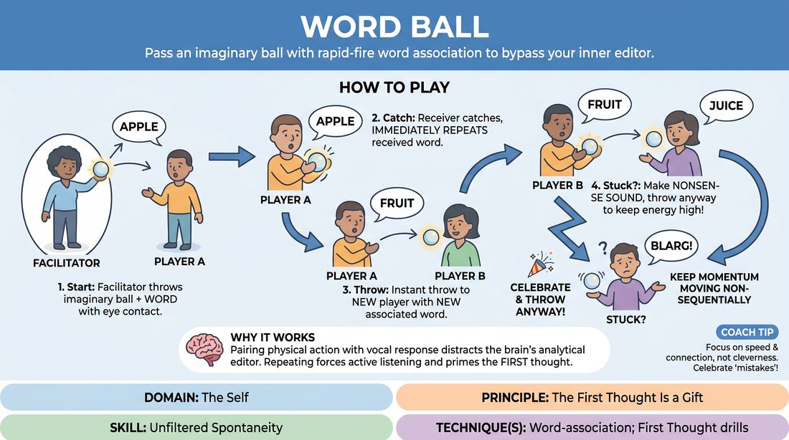

# Word Ball

{ .game-hero }

> Pass an imaginary ball with rapid-fire word association to bypass your inner editor.

## Overview
A fast-paced, physicalized warm-up where players pass an invisible ball across a circle, pairing each catch and throw with immediate vocalizations. By combining physical movement with rapid word association, players bypass their analytical minds and embrace their very first impulses.

## What It Trains
- **Domain:** D1 — The Self
- **Principle(s):** The First Thought Is a Gift; Fail Joyfully; Yes, And; Group Mind
- **Skill(s):** Unfiltered Spontaneity; Active Listening; Pacing & Rhythm
- **Technique(s):** Word-association; First Thought drills; Last Word Response; Timing exercises
- **Focus:** skill_drill

**Objective:** To develop unfiltered spontaneity and active listening by training players to accept their first instinctual thought as a gift, maintaining a steady group rhythm without hesitation or self-censorship.

## At a Glance
| Aspect | Detail |
|---|---|
| Players | 3+ (ideal 6-20) |
| Time | ~5 min |
| Complexity | 1/5 |
| Skill level | novice |
| Energy | medium |
| Physicality | low |
| Modality | in_person |
| Space | minimal |
| Props | none |
| Audience | not required |

## Setup
Players stand in a comfortable, open circle facing inward. No props or special materials are required. The facilitator should ensure there is enough space for everyone to make clear eye contact and physical throwing gestures.

## How to Play
1. Gather the group into a standing circle and establish eye contact across the space.
2. The facilitator initiates the game by holding an imaginary, hand-sized ball, making eye contact with another player, and throwing the ball to them while speaking a single, random word.
3. The receiving player must physically catch the imaginary ball, immediately repeat the word they just heard, and then instantly throw the ball to a new player while saying a new, associated word.
4. The pass must always include three distinct elements: clear eye contact, a physical throwing or catching gesture, and the spoken words (the repeated word on the catch, and the new word on the throw).
5. Keep the momentum moving rapidly across the circle in a non-sequential, unpredictable pattern, ensuring everyone remains highly alert.
6. If a player gets stuck or hesitates, they should make a nonsense sound, throw the ball anyway, and let the group celebrate the moment to keep the energy high.

## Facilitation Notes
- Coaching cue: Throw the physical ball and the word at the exact same time! This physical-vocal alignment helps bypass intellectual planning.
- Pitfall: Players planning their word while waiting for the ball. Fix: Remind them that they cannot know their word until they hear what is thrown to them. Keep minds completely blank until the catch.
- Coaching cue: Repeat to receive, release to throw. Emphasize that repeating the incoming word acts as a cognitive bridge that triggers the next association naturally.
- Pitfall: Self-censorship or pausing because a word feels boring or wrong. Fix: Encourage players to lean into obvious, simple, or repetitive words. The goal is speed and connection, not cleverness.

## Variations
- Dissociation Ball: Instead of associating, players must throw a word that has absolutely no logical connection to the word they just caught, which paradoxically requires even faster instinctual processing.
- Sound and Motion Ball: Replace words entirely with abstract physical movements and vocal sounds, focusing purely on mirroring and immediate physical response.
- Category Ball: Restrict all words to a specific, fast-changing category (e.g., kitchen appliances, emotions, things found underwater) to practice rapid retrieval within boundaries.

## Debrief
- How did it feel when you let go of trying to say the perfect or funny word?
- What physical cues helped you stay present and ready to receive the ball?
- How does repeating the word you just heard help quiet your inner editor?

## Safety & Inclusion
Ensure physical throwing and catching gestures are adaptable to all physical mobility levels; a simple nod or point can substitute for a full throw. Remind players that while unfiltered thoughts are encouraged, we still maintain a supportive, respectful space free of targeted harm.

## Why It Works
By pairing a physical action (catching/throwing) with a vocal response, the brain's analytical editor is distracted by the physical coordination. Repeating the received word ensures active listening and forces the player to start from their partner's offer, embodying the core Yes, And principle at a micro-level.
