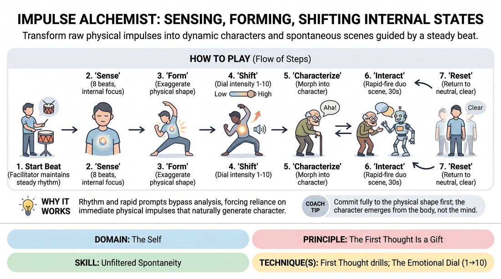

# Impulse Alchemy

{ .game-hero }

> Transform raw physical impulses into dynamic characters and spontaneous scenes guided by a steady beat.

## Overview
Impulse Alchemy is an active, high-energy group game that bridges the gap between somatic mindfulness and playful character work. Players use a steady percussive rhythm to access internal physical sensations, amplify them into expressive physical shapes, and instantly transition those shapes into comedic or dramatic character scenes. By moving from abstract physical states to active scene work, players bypass their cognitive filters to discover rich, unedited characters.

## What It Trains
- **Domain:** D1 — The Self
- **Principle(s):** Commit 100%; Fail Joyfully; The First Thought Is a Gift
- **Skill(s):** Unfiltered Spontaneity; Emotional Fluidity; Physicality & Space Work; Vocal Craft; Silence & Stillness; Self-Recovery
- **Technique(s):** First Thought drills; The Emotional Dial (1→10); Character Walks/Centers; Weight & resistance mime; Projection & breath support; Vocal characterization; Gibberish; Do nothing exercises; Hold-the-beat reps
- **Focus:** skill_drill

**Objective:** To develop unfiltered spontaneity and emotional fluidity by training players to translate pre-cognitive physical sensations into immediate, committed character choices and spontaneous scene initiations.

## Setup
An open, uncluttered room where 4 to 10 players can stand with at least a four-foot radius of personal space. The facilitator needs a simple percussive instrument (like a hand drum, shaker, or woodblock) to maintain a steady, moderate tempo of 60-80 beats per minute.

## How to Play
1. Establish the Pulse: Have all players stand in neutral positions throughout the space. The facilitator begins playing a steady, moderate percussive beat (60-80 BPM) to ground the room in a shared rhythm.
2. Phase 1 - Sense: On the facilitator's vocal cue of 'Sense,' players close their eyes (or soften their gaze) and focus entirely inward for 8 beats, identifying the very first raw, physical sensation or texture (e.g., a tingle in the shoulders, a heaviness in the knees) without labeling it.
3. Phase 2 - Form: On the cue 'Form,' players instantly open their eyes and translate that internal sensation into a committed, exaggerated full-body physical posture and a simultaneous non-linguistic sound (like a hum, sigh, or click) on the next beat.
4. Phase 3 - Shift: On the cue 'Shift,' players adjust the intensity of their current physical and vocal expression by dialing it up or down (using an internal 1-to-10 scale) for 8 beats, exploring the emotional range of the shape.
5. Phase 4 - Characterize: On a double-beat cue, players instantly transition their abstract shape and sound into a distinct character. They adopt a specific character voice based on their sound and begin a repetitive physical activity (e.g., sweeping, painting, typing) that matches their physical shape.
6. Phase 5 - Spontaneous Duo: On the cue 'Interact,' players lock eyes with the nearest partner and immediately initiate a rapid-fire, 30-second scene. They must let their physicalized character dictate their relationship and point of view, committing 100% to the first line of dialogue that comes out.
7. Phase 6 - Reset: On the cue 'Reset,' players release their characters and return to a neutral standing position of silence and stillness for 8 beats to clear their canvas before the next round begins.

## Facilitation Notes
- To prevent overthinking during the 'Form' phase, side-coach: 'Don't plan the shape, let your body snap into it on the beat. Your first thought is a gift!'
- During the 'Characterize' transition, encourage players to find a voice that matches the physical tension of their shape. If they are hunched and heavy, their voice might be low and gravelly.
- Keep the energy high and playful during the 'Spontaneous Duo' phase. Remind players that there are no mistakes, only gifts, and to fail joyfully if a scene choice feels absurd.
- Ensure the transition from abstract movement to character dialogue is seamless. The physical shape must directly inspire the character's attitude and first line.

## Variations
- Remote Rhythm (Online Adaptation): To bypass video-call audio latency, the facilitator uses visual cues (like holding up colored cards or using hand gestures) instead of an audio beat. During the 'Spontaneous Duo' phase, players use a 'popcorn' style unmuting sequence or play in designated breakout rooms to keep the audio clean.
- Somatic Prompts: For less experienced players, replace the open-ended 'Sense' phase with a specific physical prompt, such as 'Sense a sudden chill' or 'Sense a heavy weight in your chest,' to make the initial step more concrete.
- Pass the Impulse: Instead of simultaneous play, players stand in a circle. One player starts a physical shape and sound, passes it to their neighbor, who must instantly absorb it, shift it, and transform it into a character scene with the person next to them.

## Debrief
- How did transitioning from an abstract physical shape into a character scene feel compared to starting a scene from a verbal premise?
- What did you discover about your character's emotional state just by adjusting your physical dial?
- How did the reset phase help you let go of the previous character and start fresh?

## Safety & Inclusion
Ensure all physical shapes are adaptable to individual mobility levels; micro-movements or purely facial/vocal expressions are fully valid. If closing eyes causes disorientation, players should maintain a soft downward gaze. Establish a 'no-contact' rule for the spontaneous duo scenes to respect physical boundaries.

## Why It Works
By pairing a steady external rhythm with rapid, structured prompts, this game bypasses the analytical mind and forces players to rely on their immediate physical impulses. The transition to scenes proves that physical states naturally generate emotional and narrative depth.
