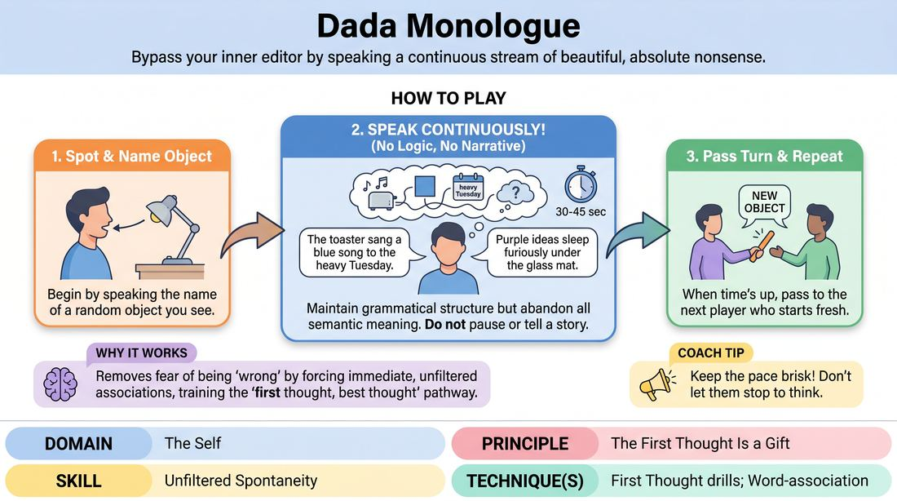

# Dada Stream

{ .game-hero }

> Bypass your inner editor by speaking a continuous stream of beautiful, absolute nonsense.

## Overview
A rapid-fire verbal warm-up where players speak continuously without logical connection. By deliberately avoiding sense, players learn to trust their immediate impulses and silence their internal critic in a low-stakes, high-energy environment.

## What It Trains
- **Domain:** D1 — The Self
- **Principle(s):** The First Thought Is a Gift; Fail Joyfully
- **Skill(s):** Unfiltered Spontaneity
- **Technique(s):** Word-association; First Thought drills
- **Focus:** skill_drill

**Objective:** To develop unfiltered spontaneity and the ability to trust the first thought by severing the brain's logical, narrative-building pathways.

## At a Glance
| Aspect | Detail |
|---|---|
| Players | 1+ (ideal 1-12) |
| Time | ~5 min |
| Complexity | 1/5 |
| Skill level | novice |
| Energy | medium |
| Physicality | low |
| Modality | in_person |
| Space | minimal |
| Props | none |
| Audience | not required |

## Setup
Players stand in a circle. No props or special materials are required; the game can be played in any space with visible objects.

## How to Play
1. Select a starting player and have them look around the room to identify a random physical object.
2. The player speaks the name of that object aloud to begin their monologue.
3. Immediately after naming the object, the player must continue speaking without pausing, transitioning into pure non-sequiturs and illogical associations.
4. The speaker must actively avoid making narrative sense, telling a coherent story, or staying on any single topic for more than a few words.
5. Maintain proper grammatical structure (e.g., 'The toaster sang a blue song to the heavy Tuesday') while completely abandoning semantic meaning.
6. Keep the pace brisk, aiming for a continuous flow of speech for 30 to 45 seconds.
7. Once the time is up, the player passes the turn to the next person in the circle, who immediately starts with a new object.

## Facilitation Notes
- Side-coaching cue: 'If you make sense, you've failed! Keep it beautifully meaningless.'
- Common Pitfall: Players trying to be clever or poetic, which slows down their delivery. Fix: Encourage speed over poetry; rapid-fire nonsense is better than crafted surrealism.
- Side-coaching cue: 'Don't pause to think. If you get stuck, just repeat the last word or make a sound until a new word pops out.'
- Common Pitfall: Falling into a logical story. Fix: Gently interrupt with 'Break the logic!' or 'Next random word!'

## Variations
- Tag-Team Dada: A player starts the monologue, and on the facilitator's clap, the next player must instantly take over, continuing the nonsense stream mid-sentence.
- Physical Dada: Players must match their absurd verbal stream with equally abstract, non-literal physical gestures.
- Dada Dialogue: Two players have a 'conversation' where they respond to each other instantly, but their sentences must have absolutely no logical connection to what the other person just said.

## Debrief
- How did it feel to deliberately try not to make sense?
- What did you notice about your brain's desire to create a logical story or pattern?
- How can silencing that logical 'editor' help us when we are starting a fresh improv scene?

## Safety & Inclusion
Ensure players know there is no 'right' way to do this; stuttering, gibberish, or repeating words are all perfectly valid ways to keep the stream going. This is a low-stakes environment where intellectual 'failure' is celebrated.

## Why It Works
By removing the burden of logic, the brain is freed from the fear of being 'wrong.' This game forces the speaker to rely entirely on immediate, unfiltered associations, training the cognitive pathway of 'first thought, best thought' and building confidence in spontaneous expression.
