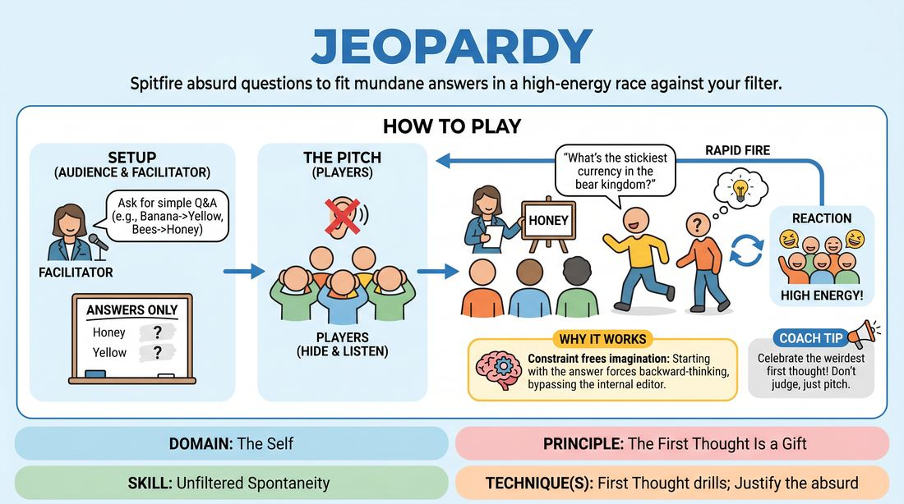

# The Answer Is

{ .game-hero }

> Spitfire absurd questions to fit mundane answers in a high-energy race against your filter.

## Overview
A fast-paced comedy game where players are given a simple, factual answer and must instantly generate the most ridiculous, highly specific, or hilariously misconstrued questions that could lead to it. By reversing the traditional trivia format, players bypass their internal editors to find immediate, playful justifications.

## What It Trains
- **Domain:** D1 — The Self
- **Principle(s):** The First Thought Is a Gift; The Audience Is the Final Scene Partner
- **Skill(s):** Unfiltered Spontaneity; Justification; Stage Presence & Clarity
- **Technique(s):** First Thought drills; Justify the absurd; Make the choice readable
- **Focus:** comedy_game

**Objective:** To train unfiltered spontaneity and rapid justification by treating the first absurd association that pops into your head as a perfect comedic gift.

## Setup
An active playing area for 3 to 8 players facing an audience. The facilitator needs a notepad, whiteboard, or paper and pen to record suggestions. Players stand in a line-up facing the audience.

## How to Play
1. Have all active players step forward, turn their backs to the audience, and securely cover their ears so they cannot hear the setup.
2. Ask the audience for three to five simple, factual questions and their correct, mundane answers (e.g., 'What color is a banana? Yellow' or 'What do bees make? Honey').
3. Write down only the answers on a whiteboard or notepad, keeping the original questions hidden from the players.
4. Signal the players to turn around, uncover their ears, and face the audience in a line-up.
5. Present the first written answer to the players (e.g., 'The answer is: Honey').
6. Players must step forward one by one to rapidly pitch alternative, absurd, or highly specific questions that could logically or comically result in that exact answer (e.g., 'What did I accidentally use as hair gel this morning?').
7. Encourage players to step up quickly without hesitating, delivering their line with high energy and stage presence directly to the audience.
8. Once the comedic energy for an answer peaks, present the next answer on the list and repeat the process.

## Facilitation Notes
- Side-coach players to avoid overthinking: 'Take your very first thought and say it with absolute confidence!'
- If a player hesitates or gets stuck, encourage them to make a sound or physical gesture first to bypass the intellectual block.
- Pitfall: Players trying to guess the actual original question. Fix: Remind them that the goal is to create the worst or most ridiculous question, not the correct one.
- Keep the tempo high. If a player steps up and struggles, have the next player immediately jump in to keep the momentum alive.

## Variations
- Category Freeze: The facilitator provides a specific genre or character voice (e.g., 'Shakespearean' or 'Sci-Fi') that all pitched questions must fit.
- Rapid Fire Tag: Players stand in a circle and pass the answer around, having only three seconds to shout out a question before passing it to the next person.

## Debrief
- How did it feel to say the very first thing that came to your mind without filtering it?
- What made a 'bad' or highly specific question get a bigger laugh than a logical one?
- How does committing fully to a bizarre idea help the audience accept it as truth?

## Why It Works
By starting with a fixed, unchangeable destination (the answer), the brain is forced to work backward. This constraint actually frees the imagination, as any path that successfully connects to the target answer becomes a valid comedic justification. It rewards immediate instinct over calculated joke-writing.
