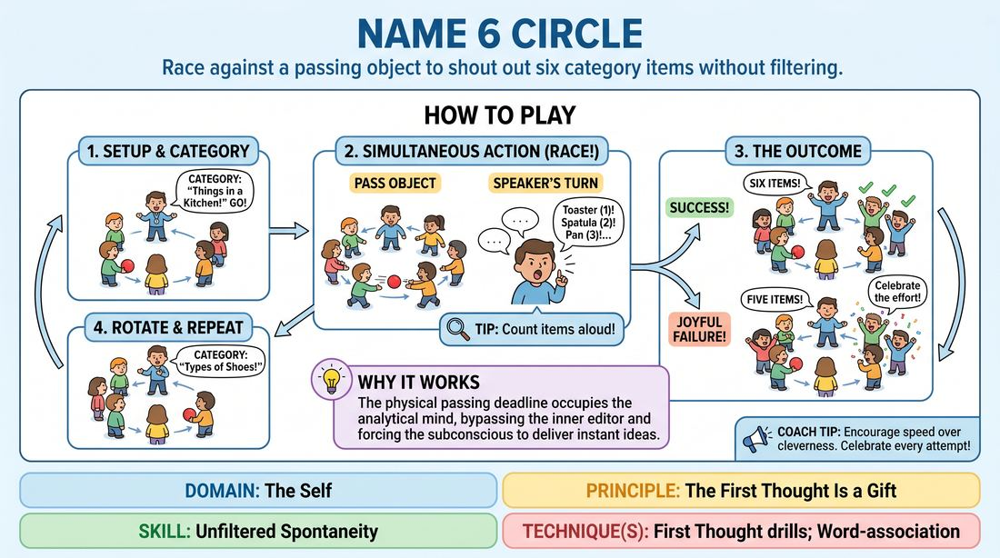

# The Passing Clock

{ .game-hero }

> Race against a passing object to shout out six category items without filtering.

## Overview
In this high-energy circle drill, a player must rapidly call out six items from a designated category before a physical object is passed completely around the circle. The physical countdown creates a playful pressure that forces players to bypass their internal editor and speak instantly.

## What It Trains
- **Domain:** D1 — The Self
- **Principle(s):** The First Thought Is a Gift; Fail Joyfully
- **Skill(s):** Unfiltered Spontaneity; Pacing & Rhythm
- **Technique(s):** Word-association; First Thought drills; Timing exercises
- **Focus:** skill_drill

**Objective:** To develop unfiltered spontaneity and rapid-fire decision-making by using a physical countdown to bypass intellectual overthinking.

## At a Glance
| Aspect | Detail |
|---|---|
| Players | 5+ (ideal 8-15) |
| Time | ~10 min |
| Complexity | 2/5 |
| Skill level | novice |
| Energy | medium |
| Physicality | low |
| Modality | in_person |
| Space | minimal |
| Props | tennis ball or knotted towel |
| Audience | not required |

## Setup
Players stand in a circle. The facilitator holds a small, soft, easy-to-catch object such as a tennis ball, a beanbag, or a knotted towel.

## How to Play
1. Form a standing circle with all participants.
2. Designate one player in the circle to be the active Speaker.
3. Give the physical object to the player immediately to the Speaker's left.
4. Call out a simple, broad category (e.g., 'things found in a refrigerator' or 'types of dogs') and shout 'Go!'
5. On the 'Go' signal, the players in the circle must pass the object quickly from hand to hand clockwise around the circle.
6. Simultaneously, the Speaker must rapidly call out six distinct items that fit the category before the object completes its lap and returns to the starting player.
7. The Speaker must count their own items aloud as they say them (e.g., 'Cheddar, one! Milk, two!...').
8. If the Speaker names all six items before the object completes the lap, the group cheers; if the object wins, the group celebrates the 'joyful failure' with equal enthusiasm.
9. Rotate the Speaker role to the next person in the circle, select a new category, and repeat the process.

## Facilitation Notes
- Coaching cue: 'Don't watch the ball! Close your eyes if you need to, and just let the words fly.' Watching the physical countdown often triggers analytical panic.
- Pitfall: Choosing overly academic or restrictive categories (e.g., '19th-century poets'). Fix: Keep categories highly accessible, sensory, and everyday so players have no excuse to stall.
- Coaching cue: 'Accept your first thought, even if it is slightly inaccurate or silly. Keep the momentum going!'
- Pitfall: The passing circle slowing down or speeding up unfairly. Fix: Encourage a steady, rhythmic passing pace to keep the 'clock' consistent for everyone.

## Variations
- The Hot Seat: One player stands in the center. They point to a circle player, name a category, and immediately start passing the ball. If the circle player cannot name the items in time, they swap places with the center player.
- Blind Pass: The Speaker must close their eyes while listing their items to completely remove the visual distraction of the approaching ball.
- Varying Numbers: Adjust the target number of items (e.g., 'Name 4' or 'Name 8') depending on the size of the circle and the speed of the group.

## Debrief
- What happened to your internal editor when you realized the ball was moving quickly?
- How did it feel to shout out an answer that was slightly incorrect or silly just to beat the clock?
- How can we apply this sense of urgency and trust in our 'first thoughts' to our scenic initiations?

## Safety & Inclusion
Ensure the passing object is soft and lightweight to prevent injury or drop-related anxiety. For players with limited hand mobility, the passing action can be replaced by a rapid verbal 'pass' or a simple physical gesture directed at the next person.

## Why It Works
The physical movement of the ball acts as a visual and kinetic timer that occupies the analytical mind. Because the player is focused on the looming physical deadline, their conscious editor is bypassed, forcing the subconscious to deliver immediate, unfiltered responses.
