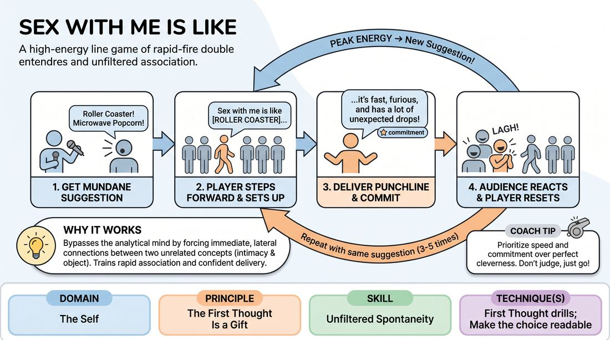

# Sex With Me Is Like

{ .game-hero }

> A high-energy line game of rapid-fire double entendres and unfiltered association.

## Overview
Players stand in a line-up and take turns stepping forward to complete a comparative joke based on an audience suggestion. It challenges players to instantly connect a mundane object or concept to a suggestive prompt, training rapid association and confident delivery.

## What It Trains
- **Domain:** D1 — The Self
- **Principle(s):** The First Thought Is a Gift; The Audience Is the Final Scene Partner
- **Skill(s):** Unfiltered Spontaneity; Stage Presence & Clarity
- **Technique(s):** First Thought drills; Make the choice readable
- **Focus:** comedy_game

**Objective:** To develop unfiltered spontaneity and trust in one's first instinct by delivering quick, punchy comparisons without self-censoring or overthinking.

## Setup
Players form a horizontal line facing the audience. The facilitator stands to the side to gather suggestions and manage the tempo.

## How to Play
1. Ask the players to stand in a straight line facing the audience.
2. Solicit a mundane, non-suggestive object or concept from the audience, such as a roller coaster, microwave popcorn, or a library book.
3. Explain the formula: A player steps forward, delivers the setup 'Sex with me is like [the suggestion]...', provides a punchline that connects the two, and steps back.
4. Encourage players to step forward as soon as an association hits them, prioritizing speed and commitment over perfect cleverness.
5. Once a player delivers their line, the audience reacts, and the player steps back into the line.
6. Other players step forward to offer different punchlines based on the same suggestion.
7. After three to five punchlines, or when the energy peaks, the facilitator calls for a new suggestion to start a fresh round.

## Facilitation Notes
- Coaching cue: 'Trust your first thought! Don't try to make it perfect, just make it fast.'
- Pitfall: Players standing in line overthinking, waiting for the 'perfect' joke, which kills the momentum. Fix: Encourage them to step forward on impulse, even if the connection is silly or absurd.
- Coaching cue: 'Sell the punchline with eye contact and strong stage presence.'
- Pitfall: Mumbling or retreating before the punchline is finished. Fix: Remind players to plant their feet, deliver the line clearly to the audience, and hold their posture for a beat before stepping back.

## Variations
- Alternative Prompts: Change the setup to 'My cooking is like...' or 'My driving is like...' to adjust the maturity level or explore different comedic angles.
- Tag-Team: Players must step forward in pairs and alternate words or lines to build the punchline together.
- Rapid Fire: The facilitator points directly to players in rapid succession, forcing them to speak instantly without waiting to step forward voluntarily.

## Debrief
- How did it feel to step forward before you had the entire punchline fully formed?
- What happened to the energy of the room when you committed fully to a silly or absurd joke?
- How does trusting your very first association help bypass the inner critic?

## Safety & Inclusion
While the game uses suggestive themes, players should always have the agency to pass or use PG-rated double entendres. Establish a boundary before playing that players can opt for absurd, non-sexual interpretations, or substitute the prompt with 'Dating me is like...' or 'My friendship is like...' if they prefer. Ensure the space feels supportive and free of genuine vulgarity.

## Why It Works
The game forces a collision between two unrelated concepts (the suggestion and intimacy), which naturally triggers the brain's lateral thinking. By demanding immediate delivery, it bypasses the analytical mind, training players to treat their first thought as a gift and rely on stage presence to sell the moment.
