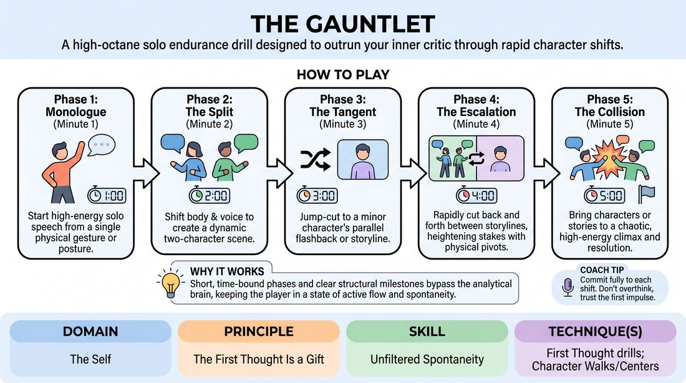

# The Solo Gauntlet

{ .game-hero }

> A high-octane solo endurance drill designed to outrun your inner critic through rapid character shifts.

## Overview
The Solo Gauntlet is a high-tempo, solo improvisation drill designed to bypass the analytical mind through continuous, structured action. Over a focused three-to-five-minute period, a single player navigates a series of rapid, self-directed transitions from monologues to multi-character scenes. By operating under a strict time-boxed progression, the performer is forced to trust their immediate physical and vocal impulses without hesitation.

## What It Trains
- **Domain:** D1 — The Self
- **Principle(s):** Commit 100%; The First Thought Is a Gift; Start in the Middle
- **Skill(s):** Unfiltered Spontaneity; Emotional Fluidity; Physicality & Space Work; Narrative Architecture; World-Building
- **Technique(s):** First Thought drills; Character Walks/Centers; Vocal characterization; Platform/Tilt
- **Focus:** skill_drill

**Objective:** To cultivate unfiltered spontaneity, rapid character physicalization, and narrative agility by training the player to treat every immediate impulse as an absolute truth, outrunning the internal editor through structured time pressure.

## Setup
A clear, safe performance space free of physical hazards. A timer visible to the player, set for 3 to 5 minutes, or a facilitator ready to call out structural milestones. No chairs or props are used to maximize physical engagement, though modifications are welcomed.

## How to Play
1. Set a timer for 3 to 5 minutes, dividing the performance into clear one-minute structural phases to guide the narrative progression.
2. Phase 1 (Minute 1 - The Monologue): Begin immediately with a high-energy solo monologue inspired by a single physical gesture or posture, establishing a strong point of view.
3. Phase 2 (Minute 2 - The Split): Transition the monologue into a dynamic two-character scene by physically shifting your body orientation and vocal tone, responding directly to your own previous lines.
4. Phase 3 (Minute 3 - The Tangent): Jump-cut to a parallel scene, flashback, or spin-off storyline featuring a minor character mentioned in the previous phase, establishing a new environment.
5. Phase 4 (Minute 4 - The Escalation): Heighten the stakes by rapidly cutting back and forth between the two established storylines, using sharp physical pivots to mark the transitions.
6. Phase 5 (Minute 5 - The Collision): Bring the characters or storylines into a chaotic, high-energy climax, allowing their worlds to collide or resolve right as the timer sounds.

## Facilitation Notes
- Coaching Cue: 'Pace your physical energy. Treat this like a controlled sprint, not a wild dash, so you can sustain your vocal and physical commitment throughout.'
- Coaching Cue: 'If you get stuck, change your physical level. Drop to one knee or reach high to instantly trigger a new character perspective.'
- Pitfall: The player gets trapped in a repetitive verbal loop. Fix: Side-coach them to physically move to a new spot on the floor to force a spatial and narrative transition.
- Pitfall: Exhaustion or loss of articulation. Fix: Remind the player that high energy does not require shouting; focus on high emotional stakes and sharp physical choices instead.

## Variations
- The Virtual Gauntlet: Adapt for online play by using the camera frame as the transition boundary; stepping close to the camera represents an intimate monologue, while stepping back or shifting off-screen signals a character change.
- The Facilitator's Whistle: Instead of self-guided minute milestones, a facilitator blows a whistle or calls out prompts ('Flashback!', 'New Character!', 'Climax!') to trigger the transitions.
- The Low-Impact Gauntlet: A seated version where transitions are marked solely by head turns, facial expressions, and distinct vocal shifts, making the drill highly accessible while maintaining mental intensity.

## Debrief
- How did having specific one-minute milestones help you navigate the time without overthinking your next move?
- At what point did your inner critic stop analyzing, and how did your physical choices change once that happened?
- How did pacing your physical energy affect the clarity of your characters and scenes?

## Safety & Inclusion
Because this is a high-energy endurance drill, players must self-regulate their physical exertion. Clear the floor of all obstacles. For players with mobility challenges, the exercise can be performed seated or standing in place, using vocal variation, facial expressions, and upper-body posture to define characters and transitions.

## Why It Works
By shortening the duration to a highly focused 3-to-5-minute window and providing clear structural milestones, the player is kept in a state of active flow without reaching physical exhaustion. The rapid, time-bound phases prevent the brain from planning ahead, forcing the player to rely entirely on physical offers and immediate emotional commitments to drive the narrative forward.
