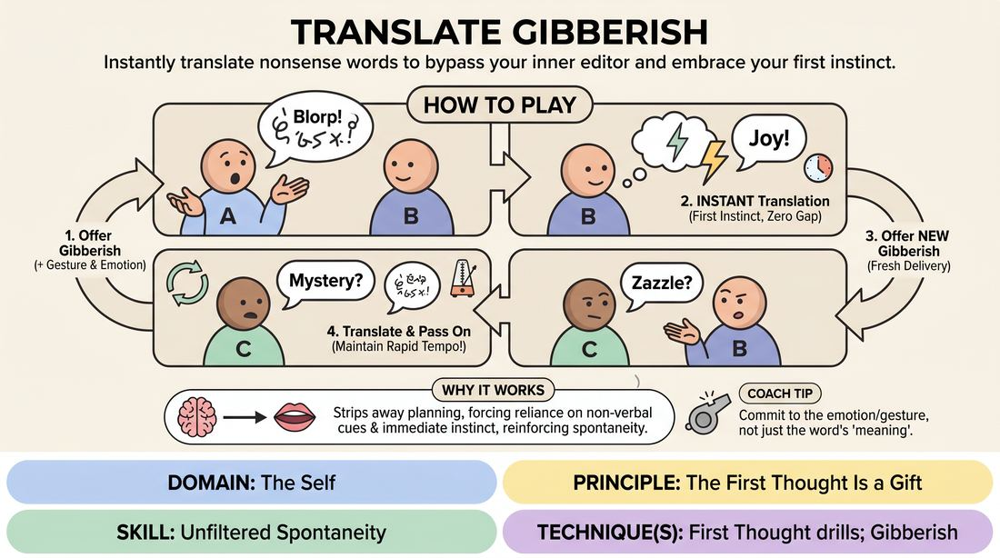

# Gibberish Translation Circle

{ .game-hero }

> Instantly translate nonsense words to bypass your inner editor and embrace your first instinct.

## Overview
In this fast-paced circle game, players pass invented nonsense words to their neighbors, who must instantly translate them into real words. By removing the safety net of literal language, players are forced to rely on vocal tone, physical expression, and immediate intuition. It creates a playful, low-stakes environment where hesitation is replaced by rapid-fire spontaneity.

## What It Trains
- **Domain:** D1 — The Self
- **Principle(s):** The First Thought Is a Gift; Yes, And
- **Skill(s):** Unfiltered Spontaneity; Vocal Craft; Active Listening; Offer Reception
- **Technique(s):** First Thought drills; Gibberish; Endowment-acceptance
- **Focus:** skill_drill

**Objective:** To develop unfiltered spontaneity and trust in one's first instinct by translating nonsense sounds without hesitation, training active listening and offer reception.

## At a Glance
| Aspect | Detail |
|---|---|
| Players | 3+ (ideal 5-15 (odd number preferred)) |
| Time | ~10 min |
| Complexity | 2/5 |
| Skill level | novice |
| Energy | medium |
| Physicality | low |
| Modality | in_person |
| Space | minimal |
| Props | none |
| Audience | not required |

## Setup
Players stand in a circle. An odd number of players is ideal to naturally shift the rhythm of who gives and who translates, though any group size of three or more works. No props or special staging required.

## How to Play
1. Form a standing circle with all participants.
2. Player A turns to Player B (on their right) and delivers a single, distinct gibberish word, accompanied by a clear physical gesture and emotional intention.
3. Player B immediately translates that gibberish word into a single real word in their native language, using their absolute first instinct.
4. Player B then turns to Player C (on their right) and offers a brand-new, distinct gibberish word with its own unique physical and vocal delivery.
5. Player C immediately translates Player B's gibberish word into a real word.
6. The pattern continues sequentially around the circle: receive gibberish, instantly translate it, then turn and pass a new gibberish word to the next player.
7. Maintain a rapid, continuous tempo throughout the circle, aiming for zero gap between the gibberish offer and the translation.

## Facilitation Notes
- Coaching cue: 'Don't think, just speak! The first sound or word that pops into your head is the correct one.'
- Pitfall: Players translating every word to something generic or repetitive (like 'banana' or 'hello') because they are scared of making a mistake. Fix: Encourage them to let the phonetic sounds, vowels, or the giver's physical posture dictate the translation.
- Coaching cue: 'Match the energy! If the gibberish sound is delivered with anger, let your translation carry that same emotional weight.'
- Pitfall: Pausing to intellectualize or 'find the perfect joke.' Fix: Snap your fingers to keep a steady, rapid rhythm, reminding them that speed beats cleverness.

## Variations
- The Double Duty: The receiver translates the gibberish word and must immediately use that same translation as the inspiration to generate their new gibberish word for the next person.
- Cultural Origin: After translating, the translator must also instantly name the fictional country or region where that gibberish word originated (e.g., 'That means "bicycle" in Northern Martian').
- Emotional Echo: The translator must match the exact physical posture and vocal inflection of the gibberish speaker when delivering their translation.

## Debrief
- How did it feel to translate a word without having any logical context?
- What clues did you use to find your translation (sounds, facial expressions, body language)?
- When did you feel your 'inner editor' try to step in, and how did you bypass it?

## Safety & Inclusion
Ensure players are mindful of not using mock accents that caricature real-world cultures or languages; encourage purely abstract, alien, or cartoonish phonetic sounds.

## Why It Works
By removing real language, the game strips away the analytical brain's ability to plan ahead. Players must rely entirely on non-verbal cues (vocal craft, physical expression) and immediate subconscious association, directly reinforcing the principle that the first thought is a gift.
