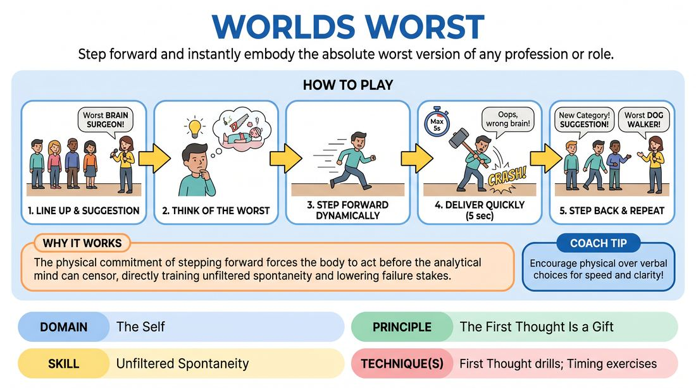

# World's Worst

{ .game-hero }

> Step forward and instantly embody the absolute worst version of any profession or role.

## Overview
A fast-paced, high-energy line-up game where players take turns stepping forward to deliver quick, comedic micro-scenes or one-liners depicting the most incompetent, inappropriate, or disastrous version of a suggested profession, hobby, or archetype. It is a classic showcase of rapid-fire wit, bold physical choices, and immediate commitment.

## What It Trains
- **Domain:** D1 — The Self
- **Principle(s):** The First Thought Is a Gift; Commit 100%; Play for the Back Row
- **Skill(s):** Unfiltered Spontaneity; Pacing & Rhythm; Stage Presence & Clarity
- **Technique(s):** First Thought drills; Timing exercises; Make the choice readable
- **Focus:** comedy_game

**Objective:** To bypass the internal editor, embrace the very first comedic instinct that comes to mind, and deliver it with absolute commitment and stage presence.

## Setup
Players form a horizontal line facing the audience (the back line). The facilitator acts as the host/emcee. No props or special staging are required, just a clear performance space.

## How to Play
1. The players stand in a straight line at the back of the stage, facing the audience.
2. The facilitator asks the audience for a profession, hobby, or social role (e.g., 'brain surgeon', 'dog walker', 'best man').
3. Once the suggestion is given, players think of a quick, funny way to represent the 'world's worst' version of that role.
4. When a player has an impulse, they must step forward dynamically into the playing space, deliver their line or physical action immediately, and then step back into the line.
5. Each contribution must be brief—ideally a single line of dialogue, a quick interaction, or a silent physical gag lasting no more than five seconds.
6. Multiple players can step forward one after another, and players can step forward multiple times for the same suggestion.
7. Once the momentum for a suggestion slows down, the facilitator calls out 'New Category!' and asks the audience for a new suggestion to repeat the process.

## Facilitation Notes
- Coaching cue: 'Step forward first, figure out what you are saying on the way!' This physical movement helps bypass the analytical brain.
- Coaching cue: 'Play to the back row! Make your physical choices big and your voice clear.'
- Pitfall: Players lingering too long on stage trying to build a complex scene. Fix: Remind them to keep it to a single punchy beat and step back immediately.
- Pitfall: Hesitation or waiting for the 'perfect' joke. Fix: Encourage players to step forward on their very first impulse, even if it is simple or silly.

## Variations
- Tag-Team Worst: Two players step forward together to do a rapid-fire, two-person micro-scene of the world's worst duo.
- World's Best: Flip the prompt to show the overly enthusiastic, hyper-competent, or bizarrely perfect version of the role, which often becomes equally disastrous.
- The Hot Seat: One player stays in the spotlight and must rapidly pitch five different 'world's worst' examples in a row for a single suggestion.

## Debrief
- How did it feel to step forward before you had a fully formed joke in your head?
- What happened to the energy of the room when you committed 100% to a simple or silly idea?
- How does trusting your 'first thought' prevent overthinking on stage?

## Safety & Inclusion
Remind players to avoid punching down or relying on harmful stereotypes of marginalized groups when depicting 'bad' behavior. Focus the comedy on incompetence, misplaced enthusiasm, or absurd situational irony.

## Why It Works
By demanding rapid-fire responses in a supportive line-up format, the game lowers the stakes of failure. The physical action of stepping forward forces the body to commit before the analytical mind can censor the idea, directly training unfiltered spontaneity and the principle that the first thought is a gift.
