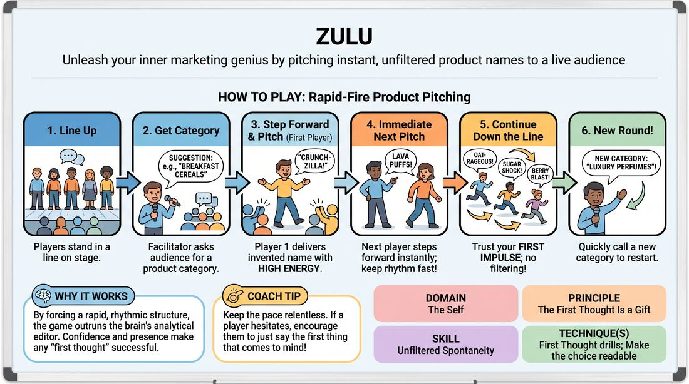

# First-Thought Branding

{ .game-hero }

> Unleash your inner marketing genius by pitching instant, unfiltered product names to a live audience.

## Overview
A fast-paced line-up game where players instantly invent bizarre, funny, or surprisingly apt names for products within a suggested category. It challenges players to bypass their internal editor and deliver their very first impulse directly to the audience. The energy builds as players step forward one by one, offering rapid-fire ideas with absolute confidence.

## What It Trains
- **Domain:** D1 — The Self
- **Principle(s):** The First Thought Is a Gift; The Audience Is the Final Scene Partner
- **Skill(s):** Unfiltered Spontaneity; Stage Presence & Clarity
- **Technique(s):** First Thought drills; Make the choice readable
- **Focus:** comedy_game

**Objective:** Develops unfiltered spontaneity and trust in one's first thoughts. It trains players to speak without self-censoring, building stage presence and direct connection with the audience.

## At a Glance
| Aspect | Detail |
|---|---|
| Players | 3+ (ideal 4-8) |
| Time | ~5 min |
| Complexity | 2/5 |
| Skill level | novice |
| Energy | medium |
| Physicality | low |
| Modality | in_person |
| Space | minimal |
| Props | none |
| Audience | required |

## Setup
Players stand in a straight line facing the audience. No props or special staging required, just a clear line of sight to the crowd.

## How to Play
1. Have all players stand in a horizontal line on stage, facing the audience.
2. Ask the audience for a suggestion of a common product category, such as breakfast cereals, luxury perfumes, or heavy machinery.
3. Explain that players will take turns stepping forward to pitch a completely made-up, original brand name for a new product in that category.
4. The first player in line steps forward, delivers their invented name with high energy and confidence directly to the audience, and steps back.
5. The next player immediately steps forward to deliver their name, keeping the rhythm fast and continuous.
6. Continue down the line, encouraging players to trust their very first mental impulse without pausing to analyze or improve it.
7. Once the end of the line is reached, the facilitator can quickly call out a new category to start another rapid-fire round.

## Facilitation Notes
- Coaching cue: 'Step and speak! Don't let the gap fill with thinking.'
- Pitfall: Players pausing to think of a 'good' or 'funny' name. Fix: Remind them that nonsense words or mundane words delivered with absolute confidence are often the funniest.
- Coaching cue: 'Sell it to the back row! Your delivery is the product.'
- Pitfall: Apologizing or laughing at one's own idea before delivering it. Fix: Coach them to maintain a straight face and high-status presenter persona until they step back into line.

## Variations
- Tagline Add-on: Players must deliver the invented name and a five-word slogan or tagline in the same breath.
- The Pitchman: Players have exactly three seconds to explain what the bizarre product actually does after naming it.
- Audience Choice: The audience votes on the most ridiculous or most plausible name by applause at the end of a round.

## Debrief
- How did it feel to say the very first word that popped into your head, even if it made no sense?
- What happened to the audience's reaction when you delivered a 'bad' name with absolute confidence?
- How does hesitating or trying to be clever change the energy of the game?

## Safety & Inclusion
Ensure the physical step forward is accessible to all players; players can simply raise a hand, nod, or lean forward if stepping is difficult. Keep the product categories light and universally accessible.

## Why It Works
By forcing a rapid, rhythmic structure, the game outruns the brain's analytical editor. Delivering the offer directly to the audience teaches players that confidence and presence can make any 'first thought' successful, reinforcing the principle that their initial impulse is a gift.
