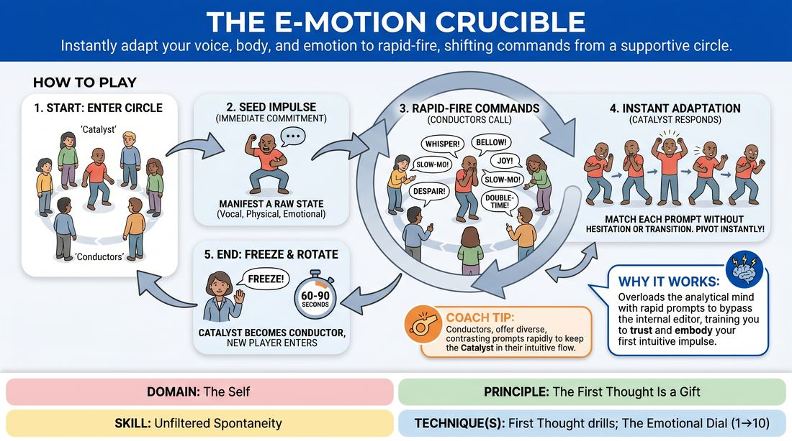

# The Impulse Crucible

{ .game-hero }

> Instantly adapt your voice, body, and emotion to rapid-fire, shifting commands from a supportive circle.

## Overview
This high-energy, solo-focused drill challenges a single player to immediately embody a series of rapid, sometimes contradictory physical, vocal, and emotional prompts. Standing in the center of a circle, the player must bypass their analytical mind to instantly physicalize whatever command is thrown at them. The result is a fast-paced, exhilarating workout that strips away hesitation and builds deep trust in one's immediate creative impulses.

## What It Trains
- **Domain:** D1 — The Self
- **Principle(s):** Commit 100%; Fail Joyfully; The First Thought Is a Gift
- **Skill(s):** Unfiltered Spontaneity; Emotional Fluidity; Physicality & Space Work; Vocal Craft; Silence & Stillness; Self-Recovery
- **Technique(s):** First Thought drills; The Emotional Dial (1→10); Character Walks/Centers; Weight & resistance mime; Vocal characterization; Gibberish; Do nothing exercises; Hold-the-beat reps
- **Focus:** skill_drill

**Objective:** To develop unfiltered spontaneity and emotional fluidity by training players to instantly commit to physical, vocal, and emotional shifts without intellectualizing or hesitating.

## At a Glance
| Aspect | Detail |
|---|---|
| Players | 3+ (ideal 6-12) |
| Time | ~15 min |
| Complexity | 2/5 |
| Skill level | advanced_beginner |
| Energy | high |
| Physicality | high |
| Modality | in_person |
| Space | moderate |
| Props | none |
| Audience | not required |

## Setup
An open, clear floor space. One player stands in the center of the room (the 'Catalyst'). The remaining players stand in a wide semi-circle or circle around them (the 'Conductors'). No props or materials are required.

## How to Play
1. One player steps into the center of the circle to act as the Catalyst, while the surrounding players act as the Conductors.
2. The Catalyst begins by immediately manifesting a 'seed impulse'—a raw, committed physical posture, vocal sound, or emotional state that represents their very first unthinking thought.
3. Once this initial state is established, the Conductors begin calling out rapid-fire, single-word or short-phrase commands to alter the Catalyst's current expression.
4. The Catalyst must instantly adapt their physical, vocal, or emotional state to match each new command without pausing to think, justify, or transition smoothly.
5. Conductors should offer commands from various categories, including volume (e.g., 'whisper', 'bellow'), tempo (e.g., 'double-time', 'slow-motion'), emotion (e.g., 'grief', 'ecstasy'), and physicality (e.g., 'heavy', 'weightless').
6. The Catalyst treats conflicting or overlapping commands as immediate pivots, instantly dropping the previous state to fully commit to the new prompt.
7. The Facilitator monitors the energy and calls 'Freeze!' after approximately 60 to 90 seconds of intense play.
8. The current Catalyst rotates back into the circle to become a Conductor, and a new player steps into the center to begin the next round.

## Facilitation Notes
- Coaching Cue: Remind the Catalyst, 'Don't transition, just teleport!' This helps them avoid logical, smooth bridges between states and encourages instant, jarring shifts.
- Pitfall: Conductors calling out complex, multi-word scenarios (e.g., 'You just lost your keys!'). Fix: Remind the circle to stick strictly to single-word or short-phrase sensory and emotional qualities (e.g., 'Panicked!', 'Heavy!').
- Coaching Cue: If the Catalyst freezes or hesitates, call out 'First physical movement!' to get them moving their body before their brain can catch up.
- Pitfall: The Catalyst trying to make sense of the sequence or build a narrative. Fix: Side-coach them to treat each command as a complete reset, letting go of the previous state entirely.
- Coaching Cue: Encourage the Conductors to keep a steady, rapid tempo, but avoid shouting over one another constantly so the Catalyst can actually hear the prompts.

## Variations
- Vocal and Physical Only: Restrict the commands to purely physical adjustments (e.g., posture, weight, speed) or purely vocal adjustments (e.g., pitch, tone, volume) to isolate specific performance tools.
- The Emotional Dial: Conductors use numbers from 1 to 10 alongside an emotion (e.g., 'Anger 3!', 'Anger 9!') to train precise control over emotional intensity.
- Dual Catalysts: Place two players in the center who must both adapt to the commands simultaneously, either mirroring each other or reacting to each other's shifts.

## Debrief
- How did it feel to let go of the need to make logical sense of your physical and emotional transitions?
- When you felt stuck or hesitated, what physical adjustment helped you recover and get back into the flow?
- How does practicing these instant, extreme shifts help you trust your first thoughts during a standard scene?

## Safety & Inclusion
Because this game demands rapid physical and emotional shifts, remind players to respect their own physical boundaries and avoid movements that cause pain or strain. If an emotional prompt feels uncomfortable or triggering, the Catalyst can instantly choose to interpret it in a highly stylized, abstract, or comedic way, or simply call 'pass' to receive a new prompt.

## Why It Works
By bombarding the player with rapid, external prompts, the game overloads the analytical left-brain, forcing the intuitive right-brain to take over. This bypasses the internal editor, training the player to treat their very first physical or vocal reaction as a gift. The constant, rapid shifts build muscle memory for emotional fluidity and physical commitment, proving that any state can be accessed instantly without intellectual preparation.
