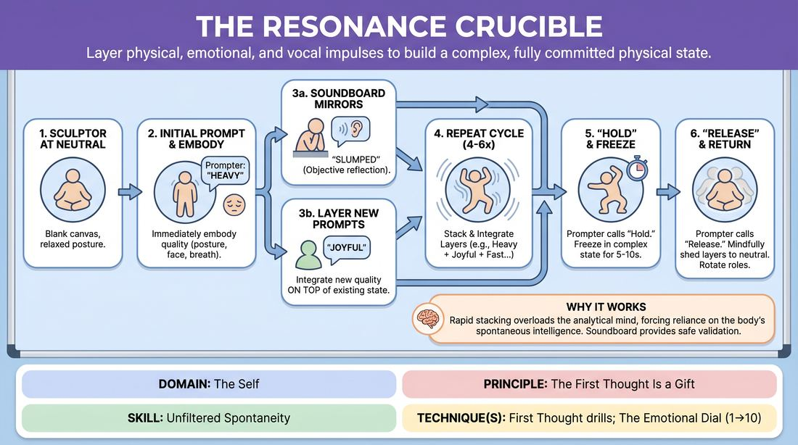

# The Resonance Crucible

{ .game-hero }

> Layer physical, emotional, and vocal impulses to build a complex, fully committed physical state.

## Overview
In this physical drill, a single player stands in the center to embody a series of layered, single-word prompts called out by the group. Instead of replacing the previous quality, the player must integrate each new physical, emotional, or vocal prompt on top of the existing ones. An observer acts as a live soundboard, offering immediate, non-judgmental reflections to help the player attune to their evolving physical state.

## What It Trains
- **Domain:** D1 — The Self
- **Principle(s):** Commit 100%; Fail Joyfully; Vulnerability; The First Thought Is a Gift; Make Your Partner a Genius
- **Skill(s):** Unfiltered Spontaneity; Emotional Fluidity; Physicality & Space Work; Vocal Craft; Silence & Stillness; Self-Recovery; Active Listening; Single-Partner Empathy & Mirroring
- **Technique(s):** First Thought drills; The Emotional Dial (1→10); Character Walks/Centers; Gibberish; Do nothing exercises; Mirror exercise; Emotional-echo drills
- **Focus:** skill_drill

**Objective:** Develops unfiltered spontaneity, deep physical commitment, and the ability to trust and execute the very first impulse without cognitive filtering.

## Setup
Four to eight players stand in a circle in an open, unobstructed space. One player is designated as the Sculptor in the center, one as the Soundboard on the perimeter, and the rest act as Prompters.

## How to Play
1. The Sculptor stands in the center of the circle in a relaxed, neutral posture, serving as a blank canvas.
2. A Prompter calls out a single, concise word representing a physical quality, emotional state, or vocal texture.
3. The Sculptor immediately and spontaneously embodies that quality, letting it alter their posture, facial expression, breathing, and non-verbal sounds.
4. The Soundboard observes the Sculptor and speaks a single, non-judgmental descriptive word or makes a non-verbal sound to mirror what they witness.
5. Another Prompter calls out a new quality, which the Sculptor must immediately layer onto their current state, combining both qualities simultaneously rather than replacing the first.
6. The cycle repeats for four to six prompts, with the Sculptor integrating each new layer while the Soundboard continues to offer brief, real-time reflections.
7. A Prompter calls out 'Hold,' and the Sculptor freezes in their complex, layered state for five to ten seconds to feel its full physical resonance.
8. A Prompter calls 'Release,' and the Sculptor mindfully sheds the layers to return to a neutral standing position before roles rotate.

## Facilitation Notes
- Encourage the Sculptor to bypass intellectual planning by moving instantly on the very first word spoken.
- If the Sculptor drops a previous layer, gently side-coach them to bring it back: 'Keep the heaviness while you add the joy.'
- Ensure the Soundboard remains strictly descriptive and non-judgmental, avoiding evaluative words like 'good' or 'funny.'
- Keep the pacing brisk; do not let more than five seconds pass between prompts to prevent the Sculptor from overthinking.

## Variations
- Abstract Prompts: Use abstract concepts like 'vapor,' 'shatter,' or 'rust' instead of direct physical or emotional words.
- Contradictory Only: Prompters must intentionally offer directly opposing qualities to force the integration of physical contradictions.
- Non-Verbal Soundboard: The Soundboard can only mirror the Sculptor using physical movement or abstract vocalizations, completely eliminating spoken words.

## Debrief
- How did it feel to hold and express two seemingly contradictory states in your body at the same time?
- When did your analytical mind try to take over, and how did you return to your physical impulse?
- How did the Soundboard's non-judgmental reflections affect your awareness of your own physical choices?

## Safety & Inclusion
Because this game involves embodying intense emotional states, players always have the right to 'pass' or step out. Prompters should avoid triggering or highly sensitive emotional terms, keeping prompts focused on clean, creative qualities.

## Why It Works
By rapidly stacking physical and emotional demands, the game overloads the analytical mind, forcing the player to rely entirely on their body's spontaneous intelligence. The Soundboard provides a safe, objective mirror that validates the player's physical choices without judgment, reinforcing vulnerability and self-recovery.
