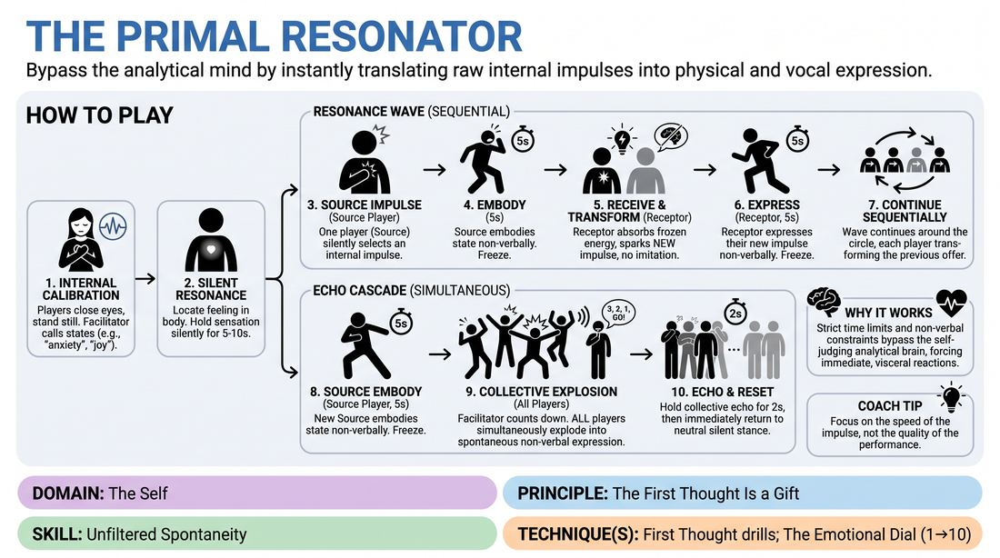

# The Resonance Wave

{ .game-hero }

> Bypass the analytical mind by instantly translating raw internal impulses into physical and vocal expression.

## Overview
This high-energy, non-verbal exercise guides players to connect deeply with their immediate internal sensations and express them instantly. Moving from silent self-reflection to rapid-fire physical and vocal exchanges, players learn to trust their first impulses without filtering or intellectualizing. The experience is visceral, vulnerable, and deeply grounding, building a strong connection between internal feeling and external expression.

## What It Trains
- **Domain:** D1 — The Self
- **Principle(s):** Commit 100%; Fail Joyfully; Vulnerability; The First Thought Is a Gift
- **Skill(s):** Unfiltered Spontaneity; Emotional Fluidity; Physicality & Space Work; Vocal Craft; Silence & Stillness; Self-Recovery; Active Listening; Offer Reception
- **Technique(s):** First Thought drills; The Emotional Dial (1→10); Character Walks/Centers; Projection & breath support; Vocal characterization; Gibberish; Do nothing exercises; Hold-the-beat reps
- **Focus:** skill_drill

**Objective:** To develop unfiltered spontaneity and emotional fluidity by training players to immediately externalize internal impulses using body and voice, bypassing the critical mind.

## Setup
Players stand in a close circle facing inward in a quiet, open space. No props or materials are required. The facilitator stands outside the circle to guide the timing and offer prompts.

## How to Play
1. Begin with Internal Calibration: Have all players close their eyes and stand in stillness. The facilitator calls out a series of specific internal states, physical sensations, or abstract impulses (e.g., 'heavy exhaustion', 'electric anticipation', 'a quiet sorrow').
2. For each called-out state, players silently locate where that feeling resonates in their body, holding the sensation in complete stillness for 5 to 10 seconds without moving or making sound.
3. Transition to the Resonance Wave: Players open their eyes. The facilitator designates one player as the Source. The Source silently selects a single internal impulse or emotional state.
4. The facilitator starts a strict 5-second countdown. Within this window, the Source must fully embody their chosen state using only non-verbal physicality, posture, breath, or abstract vocalizations (no recognizable words).
5. At the end of the 5 seconds, the Source freezes in their physical and vocal expression. The player to their left immediately steps forward as the Receptor.
6. The Receptor has 5 seconds to observe the frozen Source, absorb the raw energy, let it spark a brand-new internal impulse within themselves (not an imitation), and instantly externalize this new state.
7. This wave continues sequentially around the circle, with each player receiving the previous player's frozen offer, transforming it internally, and expressing their own unique response.
8. Progress to the Echo Cascade: A new Source initiates an embodiment for 5 seconds. Instead of a sequential wave, all other players watch and listen intensely.
9. The moment the Source freezes, the facilitator counts down '3, 2, 1, GO!' and all players simultaneously explode into their own spontaneous, non-verbal physical and vocal responses to the Source's impulse.
10. Hold the collective echo for 2 seconds, then immediately return to a neutral, silent stance, ready for the next round.

## Facilitation Notes
- Side-coaching cue: 'Don't plan, just react!' Remind players that the 5-second limit is their friend; it is designed to prevent intellectualization.
- Pitfall: Players imitating the physical shape of the previous player instead of letting it spark a new internal feeling. Fix: Coach them to 'absorb the energy, then let your own body tell a new story.'
- Encourage vocal variety: Remind players that vocal craft includes sighs, clicks, growls, and gibberish, not just shouting. This prevents vocal strain and increases emotional nuance.
- Emphasize the neutral reset: After intense physical or vocal expression, players must actively practice self-recovery by returning to a calm, neutral posture to receive the next offer.

## Variations
- Shrunk Windows: Reduce the expression time from 5 seconds to 3 seconds to force even faster, more raw first-thought responses.
- Blind Resonance: In the sequential wave, players close their eyes and must respond solely to the vocalizations and breath sounds of the previous player, removing visual cues.
- Thematic Constraints: Limit all internal impulses to a specific theme, such as 'unspoken secrets' or 'mechanical systems', to practice creativity within boundaries.

## Debrief
- How did the strict 5-second limit affect your inner critic? Did it make it easier or harder to choose an action?
- What was the difference between imitating a physical shape and letting it inspire a brand-new internal state?
- How did it feel to instantly reset to a neutral state after a high-energy, vulnerable expression?

## Safety & Inclusion
Since this game involves intense physical and vocal expression, encourage players to respect their physical limits and vocal health. Offer options for low-impact movement or quieter vocalizations (like heavy breathing or whispering) to ensure accessibility for all physical abilities.

## Why It Works
By combining strict time limits with non-verbal constraints, this game bypasses the linguistic, analytical brain where self-judgment lives. The physical freeze-and-absorb mechanic forces active listening and immediate offer reception, while the rapid transitions build emotional fluidity and the confidence to trust one's first thought as a valuable gift.
