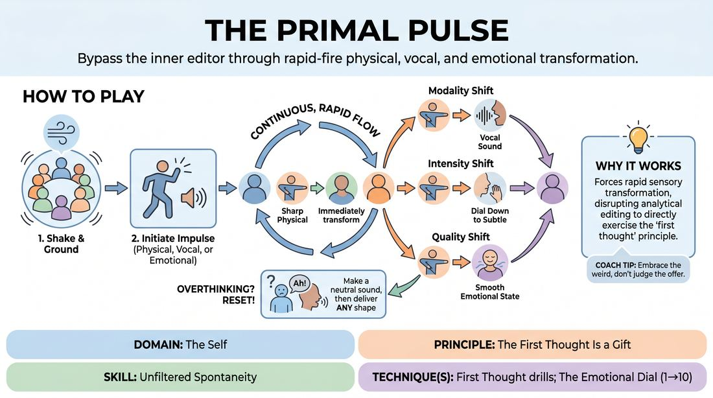

# Resonance and Shift

{ .game-hero }

> Bypass the inner editor through rapid-fire physical, vocal, and emotional transformation.

## Overview
A fast-paced, non-narrative circle exercise where players pass a continuous chain of raw, physical, vocal, or emotional impulses. Each player must instantly absorb the previous player's expression and transform it by altering its medium, volume, or texture. The experience is visceral and kinetic, training performers to trust their immediate instincts without intellectualizing.

## What It Trains
- **Domain:** D1 — The Self
- **Principle(s):** Commit 100%; Fail Joyfully; Vulnerability; The First Thought Is a Gift; Yes, And; Group Mind
- **Skill(s):** Unfiltered Spontaneity; Emotional Fluidity; Physicality & Space Work; Vocal Craft; Silence & Stillness; Self-Recovery; Active Listening; Offer Reception
- **Technique(s):** First Thought drills; The Emotional Dial (1→10); Gibberish; Projection & breath support
- **Focus:** skill_drill

**Objective:** To cultivate unfiltered spontaneity and emotional fluidity by training players to bypass cognitive filtering, accept their first instinct as a gift, and rapidly translate internal impulses into distinct physical, vocal, or emotional expressions.

## Setup
Players stand in a shoulder-to-shoulder circle in a clear, open space. No props are required. Before starting, the facilitator leads a brief physical shake-out and vocal sigh to release tension and establish a supportive, non-judgmental group agreement.

## How to Play
1. Form a circle facing inward and begin with a brief, collective physical shake-out and deep breath to ground the group.
2. The first player initiates the chain by delivering a single, clear, non-verbal impulse using one of three modes: Physical (a gesture or posture), Vocal (a sound or gibberish), or Emotional (an embodied feeling state).
3. The player immediately to their left must instantly absorb this impulse and respond with their own first-thought reaction, changing exactly one element: the mode, the intensity, or the physical quality.
4. To change the mode (Modality Shift), translate a physical posture into a vocal sound, a vocal sound into an emotional state, or an emotional state into a physical gesture.
5. To change the intensity (Intensity Shift), take the essence of the previous offer and dial it up to an extreme level or dial it down to a subtle, quiet whisper.
6. To change the quality (Quality Shift), alter the texture or speed of the offer, such as transforming a sharp, jerky movement into a smooth, heavy vocalization.
7. If a player freezes or overthinks, they must immediately make a simple, neutral sound (like 'Ah!') to reset, and then deliver whatever physical or vocal shape their body naturally takes next.
8. Continue the chain rapidly around the circle without pausing, aiming for a seamless, rhythmic flow of continuous transformation.

## Facilitation Notes
- Side-coach to maintain speed: Keep the tempo high. Remind players that the goal is speed over cleverness; if they think, they are too late.
- Address the 'planning' pitfall: Watch for players who prepare their response while waiting for their turn. Coach them to keep their eyes and ears locked on the immediate sender and only react once the offer lands.
- Clarify the Quality Shift: If players struggle with 'quality,' prompt them with physical textures like 'heavy,' 'light,' 'sharp,' 'fluid,' or 'brittle' to help them alter the physical or vocal delivery.
- Encourage vocal variety: Remind players that vocal offers do not need to be words; encourage sighs, clicks, growls, and gibberish to bypass linguistic processing.
- Normalize failure: If a transformation is messy or doesn't make logical sense, celebrate it. Side-coach with 'Yes, perfect, keep it moving!' to reinforce that there are no mistakes.

## Variations
- Focus Rounds: Run a round where players can only use one specific mode (e.g., physical gestures only) to build comfort before mixing them.
- Thematic Seed: Introduce an abstract word (e.g., 'friction' or 'buoyancy') to inspire the very first impulse, while keeping all subsequent transformations reactive.
- Progressive Escalation: Instruct the circle to collectively increase the physical and vocal volume with each successive turn, building to a peak before resetting.

## Debrief
- How did it feel to react instantly without having time to plan or judge your response?
- What strategies helped you recover quickly when your mind went blank or you felt blocked?
- How did changing the physical or vocal quality of an offer affect the emotion you felt internally?

## Safety & Inclusion
Establish a clear boundary agreement before playing: players are encouraged to explore high-energy physical and vocal expressions but must remain in their personal space without making physical contact with others. Encourage players to self-regulate physical intensity to accommodate any personal physical limitations or injuries.

## Why It Works
By forcing a rapid, mandatory transformation of a sensory input, the game disrupts the brain's analytical editing loop. Players cannot rely on pre-planned jokes or narrative logic, which directly exercises the 'first thought' principle. Translating an impulse across different physical and vocal channels builds a highly responsive mind-body connection, making emotional and physical choices more accessible and fluid in scene work.
