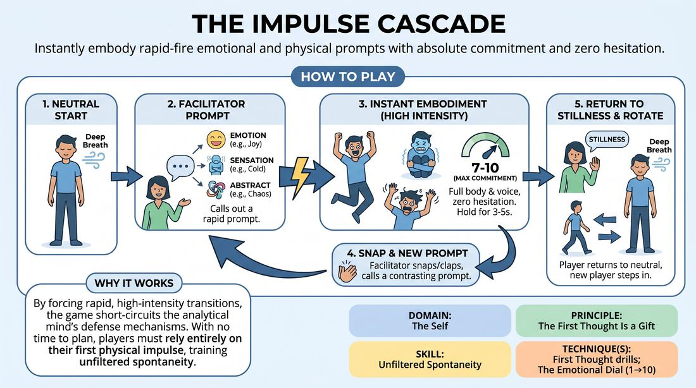

# Impulse Cascade

{ .game-hero }

> Instantly embody rapid-fire emotional and physical prompts with absolute commitment and zero hesitation.

## Overview
This high-energy drill challenges players to instantly and fully embody a rapid succession of physical, emotional, and abstract prompts. Standing before the group, a single player receives fast-paced cues from a facilitator, immediately transforming their entire body, voice, and internal state to match each prompt. The experience is a thrilling, fast-paced ride that forces players to bypass their analytical minds and trust their immediate physical impulses.

## What It Trains
- **Domain:** D1 — The Self
- **Principle(s):** Commit 100%; Fail Joyfully; Vulnerability; The First Thought Is a Gift
- **Skill(s):** Unfiltered Spontaneity; Emotional Fluidity; Physicality & Space Work; Vocal Craft; Self-Recovery
- **Technique(s):** First Thought drills; The Emotional Dial (1→10); Emotional substitution; Character Walks/Centers; Vocal characterization; Gibberish
- **Focus:** skill_drill

**Objective:** To cultivate unfiltered spontaneity and emotional fluidity by training players to immediately trust and fully commit to their first physical and vocal impulses without cognitive filtering.

## Setup
Clear a moderate-sized playing space. Have the group stand in a semi-circle. One player (the Reactor) steps forward to the center, facing the rest of the group and the facilitator (the Conductor). No props are required.

## How to Play
1. The active player (the Reactor) stands in the center of the space in a neutral, silent, and grounded posture, taking a deep breath to center themselves.
2. The facilitator calls out an evocative prompt, which can be an emotion, a physical sensation, or an abstract concept.
3. The Reactor must instantly—with zero transition time or hesitation—fully embody the prompt using their entire body (posture, gesture, facial expression) and voice (non-verbal sounds, gibberish, or breath).
4. The Reactor aims for maximum commitment, projecting the state at a high intensity (7 to 10 on an emotional dial) for three to five seconds.
5. Without warning, the facilitator claps or snaps and calls out a new, contrasting prompt.
6. The Reactor must immediately drop the previous state and instantly snap into the new embodiment, leaving no in-between or recovery phase.
7. After a rapid sequence of three to five prompts, the facilitator calls stillness, and the Reactor returns to a neutral, calm state to regulate their breathing.
8. The Reactor steps back into the semi-circle, and a new player steps forward to repeat the process.

## Facilitation Notes
- Use active side-coaching cues like 'No transition time—flip the switch!' or 'Use your voice immediately, even just a breath!'
- Pitfall: Players 'warm up' into the emotion, starting small and building. Fix: Coach them to hit the state at a level 10 instantly on the very first microsecond of the prompt.
- Pitfall: Players get stuck in their heads trying to find the 'correct' physicalization. Fix: Remind them that there is no wrong answer; the first physical shape their body takes is the perfect gift.
- Encourage moments of 'charged silence' as a prompt (e.g., 'silent fury' or 'breathless anticipation') to train control and internal tension without vocalization.

## Variations
- Use highly metaphorical or poetic prompts (e.g., 'the weight of a secret,' 'melting iron,' 'the edge of a cliff') to stretch abstract thinking.
- Restrict all vocalizations to pure gibberish, forcing players to express complex emotional states without recognizable words.
- Two players stand in the center and must instantly embody the prompt together, reacting to the prompt and each other's physical presence simultaneously.

## Debrief
- How did it feel to transition instantly between contrasting states without any preparation time?
- What happened to your internal critic when the prompts came too fast to analyze?
- How did physicalizing the prompt first help you access the corresponding emotional state?

## Safety & Inclusion
Because this game demands high physical and emotional intensity, remind players they are in control of their physical boundaries. If a prompt triggers genuine distress, they can use a pre-established pass word or step back to neutral. Ensure the space is clear of tripping hazards, and offer seated modifications for players with mobility limitations.

## Why It Works
By forcing rapid, high-intensity transitions, the game short-circuits the analytical mind's defense mechanisms. When there is no time to plan, the player must rely entirely on their first physical impulse (The First Thought Is a Gift). This rapid-fire commitment builds muscle memory for emotional fluidity and teaches players to fail joyfully, as any imperfect transition is immediately swept away by the next prompt.
