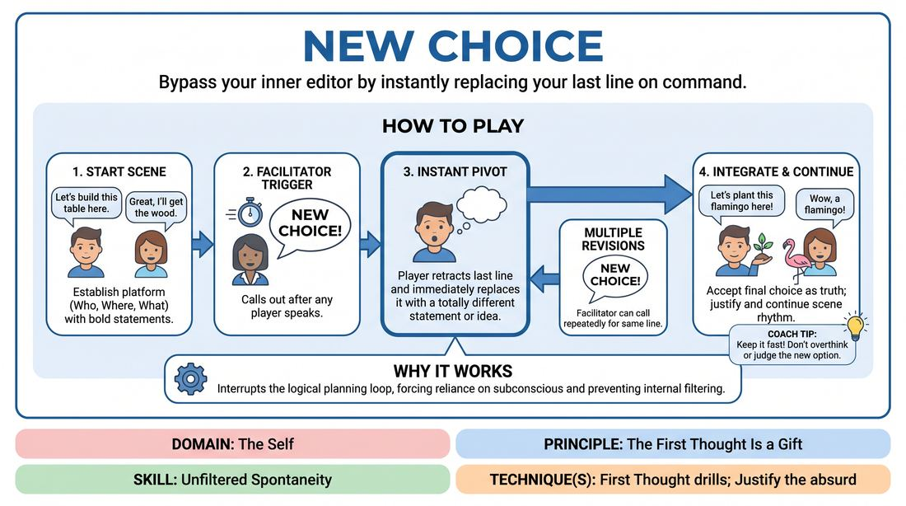

# New Choice

{ .game-hero }

> Bypass your inner editor by instantly replacing your last line on command.

## Overview
Two players improvise a scene while a facilitator calls out a trigger word to force immediate, spontaneous revisions of their last line or action. This high-energy exercise disrupts pre-planning, pushes players past safe choices, and demands rapid justification of the unexpected.

## What It Trains
- **Domain:** D1 — The Self
- **Principle(s):** The First Thought Is a Gift; Fail Joyfully; Yes, And
- **Skill(s):** Unfiltered Spontaneity; Offer Reception; Justification
- **Technique(s):** First Thought drills; Justify the absurd
- **Focus:** mixed

**Objective:** To develop unfiltered spontaneity and rapid justification by forcing players to abandon their initial plans, embrace their immediate next thoughts, and treat every sudden pivot as a gift.

## Setup
Two players stand in the performance space. The remaining players sit as the audience. The facilitator stands nearby, ready to call out the trigger word ('Change!' or 'New Choice!'). No props or special staging are required.

## How to Play
1. Select two players to begin a standard, relationship-focused scene based on a simple suggestion.
2. Instruct the players to establish a clear platform (who they are, where they are, and what they are doing) using bold, definitive statements.
3. At any point during the dialogue, the facilitator can call out 'New Choice!' immediately after a player speaks.
4. The player who just spoke must instantly retract their last sentence and replace it with a completely different statement or idea.
5. The facilitator may call 'New Choice!' multiple times in rapid succession for the same line, forcing the player to dig deeper into their subconscious for successive alternatives.
6. Once the facilitator allows a line to stand by not calling for another change, both players must accept the final choice as absolute truth and immediately justify it.
7. Continue the scene, maintaining a steady rhythm of dialogue and sudden pivots, until a natural, satisfying conclusion is reached.

## Facilitation Notes
- Vary the timing of your prompts: sometimes call 'New Choice!' on mundane details to elevate them, and other times call it on emotional declarations to shift the scene's dynamic.
- Avoid letting players stall. If a player hesitates or says 'uh,' call 'New Choice!' again instantly to force them past their analytical mind.
- Pitfall: Players making safe, incremental changes (e.g., changing 'apple' to 'pear'). Fix: Side-coach them to make lateral leaps rather than logical steps.
- Encourage players to celebrate the absurdity of their forced choices rather than trying to steer the scene back to their original plan.

## Variations
- Physical Pivot: Apply the trigger to physical actions instead of spoken words, forcing players to instantly change their body language or object work.
- Peer-to-Peer: Allow the active players in the scene to call 'New Choice!' on each other, sharing the editorial control.
- Audience Trigger: Give the observing group a noisemaker or a specific word to call out, transferring the facilitation role to the audience.

## Debrief
- How did it feel to have your planned trajectory constantly interrupted?
- What did you notice about the quality of your choices the third or fourth time you were forced to change them?
- How does this game illustrate the concept of 'the first thought is a gift' even when that thought is forced upon you?

## Safety & Inclusion
Ensure players feel safe making absurd or vulnerable choices by establishing a supportive, low-stakes environment where 'mistakes' are celebrated. If a forced choice accidentally touches on a sensitive topic, players can use a pre-established check-in signal or simply call 'New Choice' on themselves to pivot away.

## Why It Works
By interrupting the brain's logical planning loop, this game forces players to rely entirely on their subconscious. The rapid-fire nature of the prompts prevents the internal editor from filtering ideas, proving that any spontaneous offer—no matter how bizarre—can be successfully justified and integrated into a narrative.
