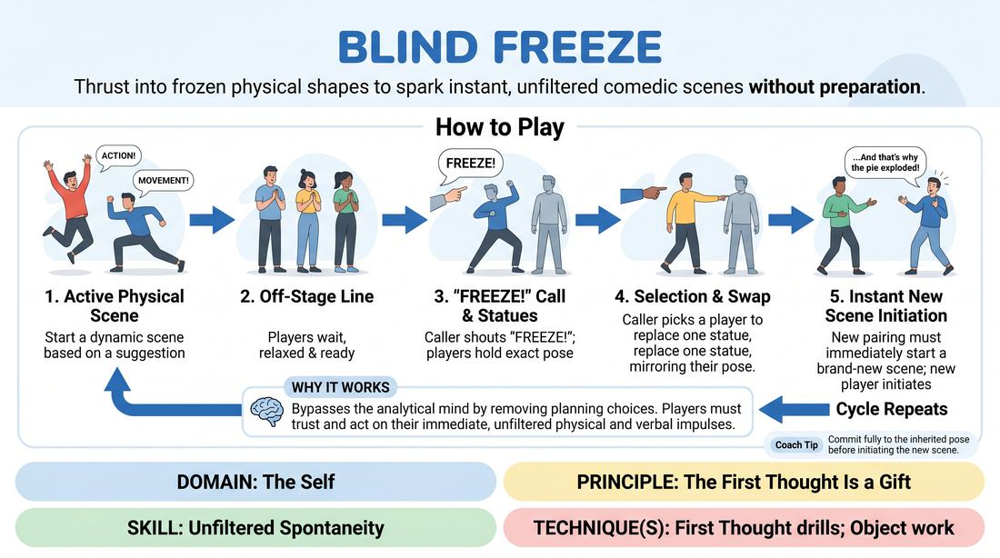

# Blind Freeze

{ .game-hero }

> Thrust into frozen physical shapes to spark instant, unfiltered comedic scenes without preparation.

## Overview
A high-energy physical game where players are unexpectedly sent into an active scene to replace a frozen performer. Because players cannot choose when they enter or which pose they inherit, they must bypass planning and immediately trust their very first instinct.

## What It Trains
- **Domain:** D1 — The Self
- **Principle(s):** The First Thought Is a Gift; Fail Joyfully; Yes, And; Follow the Follower
- **Skill(s):** Unfiltered Spontaneity; Physicality & Space Work; Offer Reception; Support Work
- **Technique(s):** First Thought drills; Object work; Endowment-acceptance; Tap-ins
- **Focus:** comedy_game

**Objective:** To develop unfiltered spontaneity and physical responsiveness by forcing players to instantly justify an inherited physical posture without any pre-planning or anticipation.

## Setup
An open playing space with a clear stage area. The remaining players stand in a semi-circle or line off-stage, facing the playing area. One person acts as the Facilitator or Caller to manage the transitions.

## How to Play
1. Two players step into the performance space and begin an active, highly physical scene based on a simple suggestion.
2. The off-stage players stand in a line, watching the scene but remaining physically relaxed and ready.
3. At a moment of high physical dynamism, the Facilitator or an off-stage player designated as the Caller shouts Freeze!
4. The two active players must instantly freeze like statues, holding their exact physical postures, facial expressions, and gaze.
5. The Caller immediately taps or points to an off-stage player and directs them to replace one of the frozen actors, specifying which one to swap out.
6. The selected player must quickly walk on stage, assume the exact physical pose of the player they are replacing, and tap that player on the shoulder to dismiss them.
7. The remaining original player and the new player must instantly initiate a brand-new scene, with the entering player delivering the first line or action to justify their inherited physical pose.
8. The cycle repeats with the Caller freezing the new scene and sending in another unprepared player.

## Facilitation Notes
- Encourage players off-stage to stay out of their heads; they should not try to plan a scene before they are called in, as they won't know which pose they will inherit.
- Side-coach active players to keep their physical movement dynamic and varied, avoiding static talking head scenes so that the frozen poses are interesting.
- If an entering player hesitates, coach them to make a sound or a physical adjustment first to bypass intellectual blocking.
- Ensure the transition is rapid; the fun lies in the sudden jolt of being thrown into the spotlight.

## Variations
- Blind Choice: Instead of the Facilitator choosing, the off-stage players stand with their backs turned to the stage, and the Caller taps one on the shoulder to enter, meaning they don't even see the pose until they turn around.
- Double Blind: The Caller freezes the scene and sends two new players in simultaneously to replace both actors, forcing an entirely fresh dynamic from two inherited poses.

## Debrief
- How did it feel to be forced into a scene without any time to plan your character or premise?
- What strategies helped you instantly justify a physical pose that you didn't choose?
- How does physicalizing a character first make finding their voice or objective easier?

## Safety & Inclusion
Ensure the playing space is clear of tripping hazards. Remind players to be mindful of physical boundaries when tapping out frozen players, using a gentle shoulder tap or verbal cue if physical contact is uncomfortable.

## Why It Works
By removing the player's agency over when they enter and which pose they take, the game completely bypasses the analytical mind. Players cannot plan, so they must rely entirely on their immediate physical and verbal impulses, proving that their first thought is always enough to build a scene.
