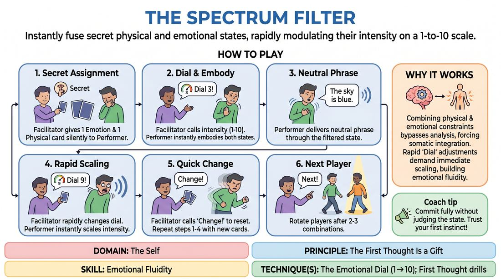

# The Somatic Impulse Dial

{ .game-hero }

> Instantly fuse secret physical and emotional states, rapidly modulating their intensity on a 1-to-10 scale.

## Overview
A high-energy, spotlight-style drill where a single performer is secretly assigned an emotion and a physical center, then immediately expresses a neutral phrase through this combined filter. A facilitator dynamically calls out intensity levels from 1 to 10, forcing the player to rapidly scale their physical and vocal commitment. This exercise challenges performers to bypass intellectualization, trust their immediate physical impulses, and build extreme emotional agility.

## What It Trains
- **Domain:** D1 — The Self
- **Principle(s):** Commit 100%; Fail Joyfully; Vulnerability; The First Thought Is a Gift
- **Skill(s):** Unfiltered Spontaneity; Emotional Fluidity; Physicality & Space Work; Vocal Craft; Self-Recovery
- **Technique(s):** First Thought drills; The Emotional Dial (1→10); Character Walks/Centers; Projection & breath support; Vocal characterization
- **Focus:** skill_drill

**Objective:** To develop rapid emotional fluidity and physical commitment by instantly embodying complex, counter-intuitive combinations of feeling and posture, and modulating their intensity without losing authenticity.

## At a Glance
| Aspect | Detail |
|---|---|
| Players | 5–10 (ideal 5-10) |
| Time | ~15 min |
| Complexity | 3/5 |
| Skill level | competent |
| Energy | high |
| Physicality | high |
| Modality | in_person |
| Space | moderate |
| Props | Index cards with Emotions, Index cards with Physical Characteristics |
| Audience | not required |

## Setup
Gather 5 to 10 players in a semi-circle facing a designated performance space. Prepare two decks of index cards: one deck containing distinct emotions (e.g., awe, paranoia, grief, ecstasy, disgust) and another containing physical centers or characteristics (e.g., leaden feet, chest-forward, floating crown, twisted spine, trembling knees). Establish a single, neutral, one-sentence phrase that will remain constant for the entire session (e.g., 'The package has arrived').

## How to Play
1. Select one player to step into the performance space as the active Performer, while the remaining players act as supportive observers.
2. The facilitator silently draws one card from the Emotion deck and one card from the Physical Characteristic deck, showing them only to the Performer.
3. The facilitator immediately calls out an initial intensity level on a scale of 1 to 10 (e.g., 'Dial 3!').
4. Without hesitation, the Performer must instantly embody both the physical characteristic and the emotion at the specified intensity, using their entire body and posture.
5. Once fully committed to the physical and emotional state, the Performer delivers the designated neutral phrase, filtering its vocal tone, pace, and energy through their current physicalized state.
6. The facilitator rapidly calls out a new dial number (e.g., 'Dial 9!'), prompting the Performer to instantly scale up or down their physical and emotional expression of the same combination, then repeat the phrase.
7. After two or three rapid dial adjustments, the facilitator calls out 'Change!', signaling the Performer to instantly drop the current state, shake it off, and look at two newly drawn cards.
8. The facilitator calls out a new starting dial number, and the Performer immediately embodies this fresh combination, repeating the neutral phrase under the new parameters.
9. After the Performer has cycled through two or three distinct card combinations, the facilitator calls 'Next!', rotating a new player into the spotlight to repeat the process with a different set of cards.

## Facilitation Notes
- Side-coaching cue: 'Don't think, just let the body lead!' Encourage players to move their bodies first rather than trying to intellectually figure out how the emotion looks.
- Common Pitfall: Players tend to drop the physical characteristic when scaling up the emotional intensity. Remind them that a 'Dial 10' means both the emotion and the physical center are at maximum expression.
- Side-coaching cue: 'Isolate the dial!' If a player struggles to find the difference between a 4 and an 8, have them jump directly from a 2 to a 10 to feel the extreme contrast.
- Common Pitfall: The performer tries to turn the exercise into a guessing game for the audience. Remind them that the secrecy of the cards is to remove external validation, allowing them to focus entirely on their internal somatic experience.

## Variations
- Gibberish Delivery: Replace the neutral English phrase with a short line of gibberish, forcing the performer to rely entirely on non-verbal vocalization, pitch, and physical resonance to convey the state.
- Compound States: Draw two emotion cards simultaneously (e.g., 'Grief' and 'Ecstasy') along with a physical characteristic, requiring the player to find a complex, layered emotional blend.
- Continuous Morphing: Eliminate the 'Change!' reset cue. The facilitator calls out new cards and the player must fluidly morph their current physical and emotional state into the new one without stopping.

## Debrief
- How did having a secret prompt change your focus compared to when the audience knows what you are trying to portray?
- Which was harder: scaling an emotion down to a 1 or ramping it up to a 10? Why?
- How did the physical characteristic card influence or unlock the emotional state, even when they seemed contradictory?
- What did you notice about your voice when your physical center changed?

## Safety & Inclusion
Ensure the physical characteristics deck does not contain terms that mimic or caricature specific physical disabilities. Encourage players to scale physical intensity safely, avoiding movements that strain joints or cause physical pain, especially at Dial 10.

## Why It Works
By combining a physical constraint with an emotional state, the game bypasses the analytical mind and forces somatic integration. The rapid-fire 'Dial' adjustments demand immediate vocal and physical scaling, which builds emotional fluidity. Keeping the cards secret removes the pressure of 'performing' a recognizable character for the audience, allowing the player to focus purely on their authentic, unfiltered internal impulses.
