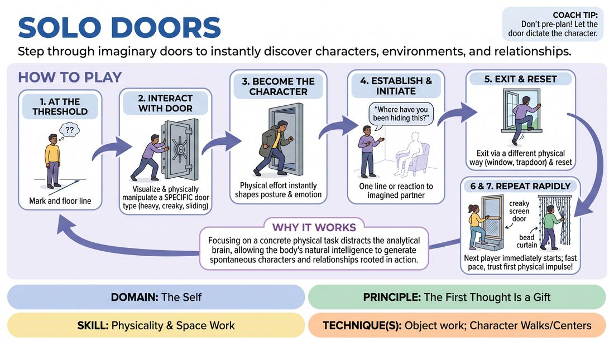

# Solo Thresholds

{ .game-hero }

> Step through imaginary doors to instantly discover characters, environments, and relationships.

## Overview
A fast-paced solo physical drill where players repeatedly enter and exit an imaginary room through distinct doors. By committing to the physical weight, mechanism, and location of each door, players instantly discover a character, establish a base reality, and initiate a silent or spoken relationship before exiting.

## What It Trains
- **Domain:** D1 — The Self
- **Principle(s):** The First Thought Is a Gift; Base Reality First
- **Skill(s):** Physicality & Space Work; Unfiltered Spontaneity; World-Building
- **Technique(s):** Object work; Character Walks/Centers; C.R.O.W. (Character, Relationship, Objective, Where)
- **Focus:** skill_drill

**Objective:** To develop immediate physical commitment and trust in one's first instinct. Players learn to let their physical environment (specifically object work with a door) dictate their character's status, emotion, and relationship, bypassing intellectual planning.

## Setup
A clear playing area representing the stage, with the rest of the group sitting or standing as active observers. No physical props are used.

## How to Play
1. A single player steps up to the edge of the playing space, which represents the threshold of an imaginary room.
2. The player immediately visualizes and physically interacts with a specific type of door (e.g., a heavy vault door, a creaky screen door, a sliding bead curtain).
3. As they pass through the threshold, the physical effort of opening the door must instantly inform their character's physical state, posture, and emotional attitude.
4. Once inside the space, the player delivers a single line of dialogue or a clear physical reaction directed at an imagined second character who is already in the room.
5. The player then immediately exits the space through a different physical exit (e.g., climbing out a window, slipping through a trapdoor, or bursting back out the entrance) as dictated by the unfolding moment.
6. The player resets, steps back to the line, and the next player immediately steps up to repeat the process with a completely different door and character.
7. Run the drill rapidly so players do not have time to pre-plan their doors or characters, forcing them to rely on their first physical impulse.

## Facilitation Notes
- Coaching cue: 'Let the door tell you who you are! If it's heavy, feel the weight in your spine.'
- Coaching cue: 'Don't think about the line of dialogue before you touch the door. Let the touch spark the voice.'
- Pitfall: Players often use a standard, generic doorknob every time. Fix: Challenge them to use different mechanisms: sliding doors, hatches, bead curtains, automatic sensors, or heavy iron gates.
- Pitfall: Players linger too long trying to build a full scene. Fix: Remind them this is a rapid-fire drill: Enter, react, exit. Keep each turn under 15-20 seconds.

## Variations
- The Double-Take: The player enters as Character A, delivers a line to an imagined Character B, then instantly switches physical positions to play Character B's reaction before exiting.
- Atmospheric Pressure: The facilitator calls out an environmental condition (e.g., 'underwater,' 'zero gravity,' 'extreme heat') right before the player touches the door.
- Emotional Echo: The player must exit using the exact opposite emotional state they entered with, triggered by their brief interaction inside.

## Debrief
- How did the physical weight or mechanism of the door change your posture and voice before you even spoke?
- When you didn't plan your character in advance, what did you notice about the choices you made?
- How does establishing a clear physical environment (the 'base reality') make it easier to find a character and relationship?

## Safety & Inclusion
Ensure the physical space is clear of actual obstacles. Encourage players to adapt the physical movements to their own mobility levels (e.g., a 'door' can be opened with a nod, a button, or a simple gesture; exits can be walked or rolled through safely).

## Why It Works
By focusing the brain on a concrete physical task (manipulating an imaginary door), the analytical 'editor' is distracted. This allows the body's natural intelligence to take over, generating spontaneous characters and relationships rooted in physical reality rather than intellectual concepts.
