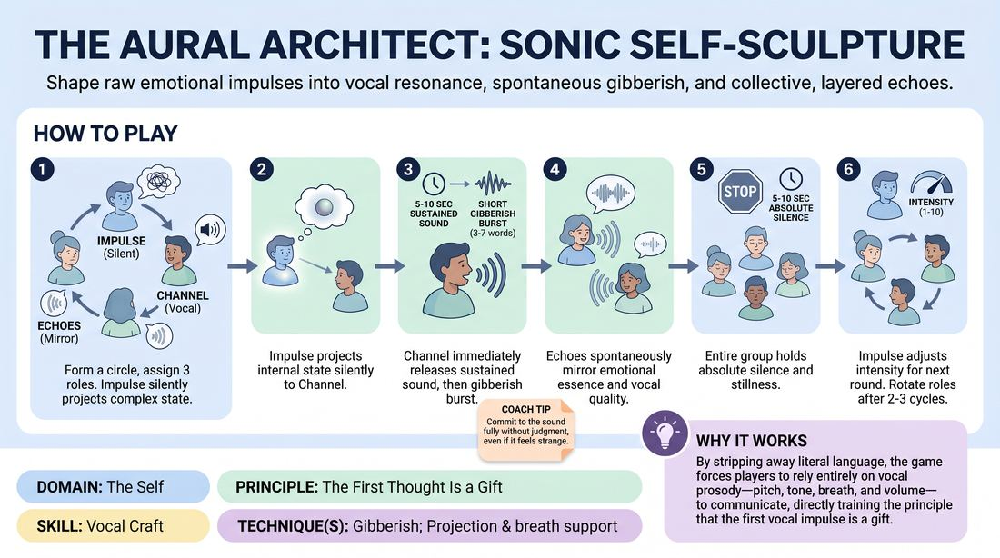

# Sonic Self-Sculpture

{ .game-hero }

> Shape raw emotional impulses into vocal resonance, spontaneous gibberish, and collective, layered echoes.

## Overview
In this deep vocal exploration, players translate silent, abstract internal states into physical sound and gibberish. One player projects a silent emotional impulse, a second player channels it into a sustained vocalization, and the group echoes the emotional essence before settling into shared silence. It is an intimate, highly focused exercise that builds vocal commitment, active listening, and somatic connection.

## What It Trains
- **Domain:** D1 — The Self
- **Principle(s):** Commit 100%; Fail Joyfully; Vulnerability; The First Thought Is a Gift
- **Skill(s):** Unfiltered Spontaneity; Emotional Fluidity; Vocal Craft; Silence & Stillness; Self-Recovery; Active Listening
- **Technique(s):** Projection & breath support; Vocal characterization; Gibberish; The Emotional Dial (1→10); Do nothing exercises; And that's exactly what I meant
- **Focus:** skill_drill

**Objective:** To develop vocal craft, breath control, and emotional spontaneity by bypassing cognitive filters, allowing raw somatic impulses to directly shape tone, resonance, and gibberish without intellectual planning.

## At a Glance
| Aspect | Detail |
|---|---|
| Players | 4–8 (ideal 4-8) |
| Time | ~15 min |
| Complexity | 3/5 |
| Skill level | competent |
| Energy | medium |
| Physicality | low |
| Modality | in_person |
| Space | moderate |
| Props | none |
| Audience | not required |

## Setup
Players stand in a comfortable, spacious circle in a quiet room with clear acoustics. Before starting, the facilitator leads a brief physical and vocal warm-up (humming, gentle sighing, and shoulder rolls) to prepare the body and voice.

## How to Play
1. Form a circle of four to eight players and assign three distinct roles: the Impulse (the silent sender), the Channel (the vocal translator), and the Echoes (the remaining group members).
2. The Impulse silently selects a complex, abstract internal state (e.g., quiet anticipation, heavy nostalgia) and projects this feeling to the Channel using only eye contact, posture, and presence.
3. The Channel receives this silent prompt and immediately, without planning, releases a single, sustained, non-linguistic sound for 5 to 10 seconds, supporting the sound from the diaphragm to avoid vocal strain.
4. The Channel instantly transitions that sustained sound into a short, unfiltered burst of gibberish (3 to 7 nonsense words) that carries the distinct emotional character and vocal texture of the initial sound.
5. The Echoes immediately and spontaneously mirror the emotional essence and vocal quality of the Channel's gibberish, using their own unique nonsense words to create a collective, resonant response for 5 to 10 seconds.
6. Once the echo naturally fades, the entire group holds absolute silence and physical stillness for 5 to 10 seconds, allowing the somatic and emotional resonance of the sound to settle.
7. The Impulse, still silent, adjusts the emotional intensity of their state (using an internal dial from 1 to 10) or introduces a subtle emotional shift, signaling this change to the Channel.
8. Repeat the cycle with the adjusted intensity, allowing the Channel to refine their vocal choices and practice self-recovery if the first attempt felt disconnected.
9. After two or three rounds of adjustment, rotate roles so that every player has the opportunity to experience being the Impulse, the Channel, and an Echo.

## Facilitation Notes
- Side-coaching cue: 'Breathe deeply into your lower abdomen. Support the sound from your core, not your throat, to protect your vocal cords from strain.'
- Pitfall: The Channel overthinks the gibberish, trying to make it sound like a real language or a planned joke. Fix: Coach them to treat gibberish as pure emotional music, letting the mouth move freely without cognitive control.
- Side-coaching cue: 'Embrace the silence. The quiet after the sound is just as active as the noise. Do nothing, but feel everything.'
- Pitfall: The Echoes delay their response, waiting to analyze the Channel's sound. Fix: Remind the Echoes to respond instantly on instinct, treating their voice as a physical reflex to the Channel's vibration.
- Side-coaching cue: 'If a sound feels wrong, commit to it anyway. Lean into the mistake and let it evolve in the next phase.'

## Variations
- Online Latency Adaptation: To play over video calls, replace simultaneous echoing with a sequential 'vocal pass.' The Channel vocalizes, then passes the impulse to Echo 1, who passes to Echo 2, creating a cascading chain of sound that bypasses audio lag.
- Blind Impulse: The Impulse closes their eyes, relying entirely on the Channel's vocalizations to gauge if their internal state was successfully received, adjusting their internal dial based solely on what they hear.
- Environmental Resonance: The Impulse silently projects not just an emotion, but an imagined environment (such as fear in a vast, echoing cavern or joy in a cramped, quiet closet) to shape the Channel's projection and breath.
- Large Group Scaling: For groups larger than 8, split into multiple smaller circles of 4, or have two Channels translate the same Impulse simultaneously, creating a dueling duet of emotional resonance.

## Debrief
- How did it feel to let a sound emerge purely from a silent, non-verbal prompt without planning your vocal delivery?
- What physical sensations did you notice when supporting your voice from your core versus your throat?
- How did the period of absolute silence and stillness affect your readiness for the next emotional shift?
- For the Echoes, how did it feel to mirror an emotional essence rather than copying the exact sounds?

## Safety & Inclusion
Because this game involves intense eye contact and vulnerable vocal expression, players should be reminded that they can adjust the level of eye contact to their comfort level (e.g., looking at the forehead or collarbone). To prevent vocal strain or fatigue, players must warm up beforehand, use diaphragmatic breathing, and are explicitly permitted to drop their volume or pitch at any time to protect their vocal cords.

## Why It Works
By stripping away literal language, the game forces players to rely entirely on vocal prosody—pitch, tone, breath, and volume—to communicate. This bypasses the analytical brain, directly training the principle that the first vocal impulse is a gift. The structured cycle of sound, gibberish, collective echo, and silence creates a safe container for deep vulnerability, allowing players to practice emotional fluidity and self-recovery in real-time.
