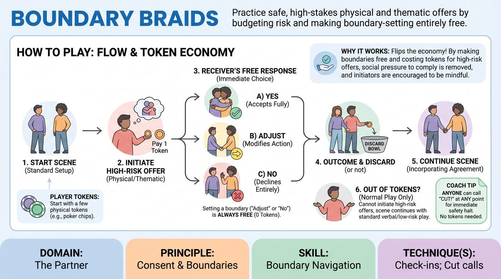

# Consent Currency

{ .game-hero }

> Practice safe, high-stakes physical and thematic offers by budgeting risk and making boundary-setting entirely free.

## Overview
A structured scene-work game where players use physical tokens to budget high-risk physical or thematic offers. By requiring initiators to pay a token to propose high-proximity or sensitive choices, the game makes asserting boundaries completely free and effortless. This shifts the social pressure away from the defender and onto the initiator, fostering a highly supportive and safe creative environment.

## What It Trains
- **Domain:** D2 — The Partner
- **Principle(s):** Consent & Boundaries; Yes, And; Truth Over Pandering; Vulnerability
- **Skill(s):** Boundary Navigation; Offer Reception; Active Gifting; Justification; Stage Presence & Clarity
- **Technique(s):** Check-ins; Cut calls; Negotiating physical contact; Yes, And… sentence games; Justify the absurd
- **Focus:** skill_drill

**Objective:** To develop practical boundary navigation and real-time check-in techniques, ensuring that setting limits is frictionless while making high-risk offers is a conscious, budgeted choice.

## At a Glance
| Aspect | Detail |
|---|---|
| Players | 4–10 (ideal 4-10) |
| Time | ~20 min |
| Complexity | 3/5 |
| Skill level | advanced_beginner |
| Energy | low |
| Physicality | medium |
| Modality | in_person |
| Space | moderate |
| Props | yes |
| Audience | not required |

## Setup
Players sit in a circle. Each player is given 3 physical tokens (such as poker chips, coins, or beads). Two players step into the center to perform a scene based on a simple relationship prompt, while the rest observe.

## How to Play
1. Begin a standard two-person scene, establishing a clear relationship and environment.
2. To initiate a high-risk offer—such as physical contact, entering close personal space (under two feet), or introducing a sensitive thematic topic—the initiating player must pause, hold out a token, and state their intent clearly (e.g., 'I want to hug you').
3. The receiving player must respond immediately using one of three simple, free options: 'Yes' (accepts fully), 'Adjust' (accepts the intent but modifies the action, e.g., 'Adjust to a high-five'), or 'No' (declines the action entirely).
4. Setting a boundary ('Adjust' or 'No') is always completely free and costs the receiving player zero tokens.
5. Once the response is given, the initiator places their spent token into a central discard bowl, and the scene immediately continues incorporating the agreed-upon action.
6. If an initiator runs out of tokens, they can no longer initiate high-risk physical or thematic offers, but the scene continues normally using standard verbal and low-risk choices.
7. At any point, any player (onstage or offstage) can call 'Cut!' to immediately halt the scene for safety reasons, with no tokens or explanations required.

## Facilitation Notes
- Ensure players understand that running out of tokens is not a failure or a scene-ender; it simply transitions the scene into a standard, low-risk verbal space.
- Actively coach the three simplified responses ('Yes', 'Adjust', 'No') to keep cognitive load low during active play.
- Watch for initiators who try to bypass the token system by making 'stealth' physical offers; gently pause and remind them to pay the toll.
- Reinforce that saying 'No' or 'Adjust' requires no justification or apology; the scene must immediately pivot without awkwardness.

## Variations
- Online Adaptation: In a video-call setting, players hold up a physical object (like a pen or card) to the camera to represent spending a token, using the same simplified 'Yes', 'Adjust', 'No' responses.
- Thematic Tolls: Restrict token usage strictly to high-stakes emotional or narrative secrets (e.g., bringing up a character's tragic past) to practice narrative consent.

## Debrief
- How did it feel knowing that setting a boundary ('No' or 'Adjust') was completely free and carried no penalty?
- As an initiator, how did having a limited budget of tokens change how mindfully you made physical or thematic offers?
- How did the simplified three-word response system ('Yes', 'Adjust', 'No') affect the pacing and flow of the scene?

## Safety & Inclusion
This game is explicitly designed to protect player autonomy. Asserting boundaries is structurally free. The 'Cut!' command is absolute and immediately ends all action. Participation is entirely voluntary, and players may pass on any turn without explanation.

## Why It Works
By flipping the token economy, the game removes the systemic penalty for self-advocacy. Making boundaries free eliminates the social pressure to comply, while charging initiators a token encourages mindful, deliberate choices. The simplified three-option response system reduces cognitive load, allowing players to maintain theatrical flow while staying safe.
